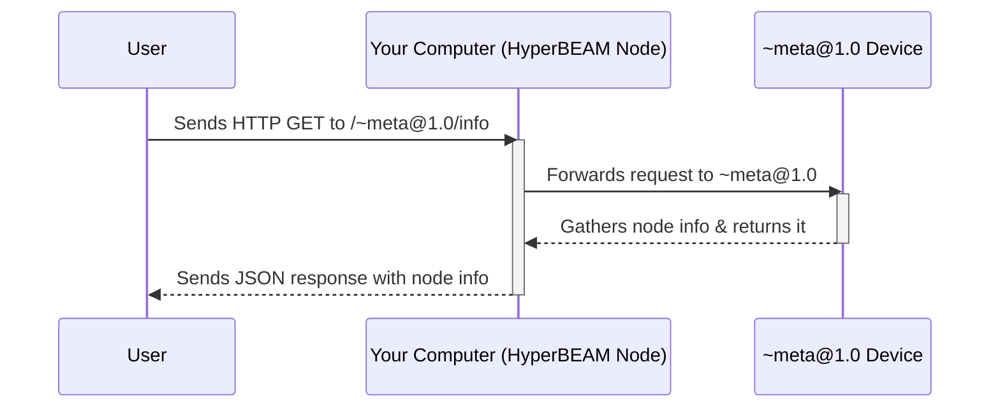

# Chapter 1: HyperBEAM Node

Welcome to the world of HyperBEAM! This is the very first step on your journey to understanding how decentralized applications and services come to life on the AO network.

Imagine you want to be part of a global, community-powered supercomputer. You have a computer, and you want to lend its power to this network, allowing it to run small pieces of programs, store bits of data, or help pass information along. How do you connect your machine and make it a useful part of this system? That's where the **HyperBEAM Node** comes in.

## What is a HyperBEAM Node?

At its heart, a **HyperBEAM Node** is simply an actual instance of the HyperBEAM software running on a computer. Think of it like this:

*   If the entire AO network is a vast, interconnected web of computers, a HyperBEAM Node is **one specific computer** in that web.
*   It's like an **individual server** or a **participant** in the larger AO network.

When you run the HyperBEAM software on your machine, you're firing up your very own HyperBEAM Node. This node then becomes an active part of the AO ecosystem.

Each HyperBEAM Node has several key jobs:

1.  **Listens for "Messages":** It keeps an ear out for incoming tasks or data, which in AO are called [Messages](03_messages_.md).
2.  **Uses "Devices" to process them:** It has a toolkit of special programs called [Devices](04_devices_.md) that it uses to understand and work on these messages.
3.  **Can store data:** If a task requires remembering something, the node can store that information.
4.  **Communicates with other nodes:** It talks to other HyperBEAM Nodes to share information, pass tasks along, or work together.

By running a HyperBEAM node, operators (that's you!) contribute their machine's resources (like processing power and storage) to the network. This is what enables decentralized applications and services to run without relying on a single, central company.

The behavior and capabilities of your specific node – what it can do, how it does it, and what resources it offers – are primarily configured through a special built-in device called `~meta@1.0`. We'll touch on this more later!

**Analogy Time!**

Think of the AO network as a massive, digital city.
*   Each **HyperBEAM Node** is like an individual **building** in this city.
*   Some buildings might be small homes, others giant factories, and some might be communication towers.
*   Each building (node) has a purpose, can receive things (mail/deliveries, which are like [Messages](03_messages_.md)), has tools or machinery inside ([Devices](04_devices_.md)), and can interact with other buildings.
*   By setting up your "building" (running a node), you become part of this bustling digital metropolis!

## Running Your First HyperBEAM Node

Let's get hands-on and see how to start your very own HyperBEAM Node. It's easier than you might think! We'll start a basic node on your local machine.

**Prerequisites:**

Before you begin, you'll need a few tools installed on your computer. Don't worry too much about the details of these for now; just know they are necessary to build and run HyperBEAM:

*   The Erlang runtime (specifically OTP 27, which is the environment HyperBEAM runs in)
*   Rebar3 (a build tool for Erlang projects)
*   Git (for downloading the HyperBEAM code)
*   A wallet and its keyfile (for identifying your node on the network; you can generate one at [Wander](https://www.wander.app))

*(For detailed installation instructions for these tools, you can refer to the "Getting Started" section in the main [HyperBEAM README](https://github.com/permaweb/HyperBEAM/blob/main/README.md) or the [Running a HyperBEAM Node](./running-a-hyperbeam-node.md) guide.)*

**1. Get the Code:**

First, you need to download the HyperBEAM software. Open your terminal or command prompt and run:

```bash
git clone https://github.com/permaweb/HyperBEAM.git
cd HyperBEAM
```

This command downloads the latest HyperBEAM code into a folder named `HyperBEAM` and then moves you into that folder.

**2. Compile the Software:**

Next, tell Rebar3 to build the HyperBEAM software from the source code:

```bash
rebar3 compile
```

This might take a few minutes as it downloads necessary components and compiles everything.

**3. Start Your Node!**

Now for the exciting part! To start a basic HyperBEAM node with default settings, run:

```bash
rebar3 shell
```

You'll see a lot of text scroll by, which is your node starting up. If all goes well, you'll be dropped into an Erlang shell (it looks like `Eshell V... (abort with ^G)` followed by `(hb@yourcomputername)1>`). Your HyperBEAM node is now running!

**What does `rebar3 shell` do?**
This command tells Rebar3 to:
*   Start the Erlang virtual machine (BEAM).
*   Load all the compiled HyperBEAM code.
*   Initialize a HyperBEAM node with default configurations (usually listening on port 10000 for HTTP requests).
*   Give you an interactive Erlang shell to potentially interact with the running node (we won't use this much for now).

**4. Verify Your Node is Running:**

To make sure your node is up and running correctly, open a *new* terminal window (leave the one running `rebar3 shell` as is) and type the following command:

```bash
curl http://localhost:10000/~meta@1.0/info
```

**Expected Output:**

If your node is working, you should see a JSON response that looks something like this (the exact values will differ):

```json
{
  "node_version": "somenodeversionstring",
  "identity": "your-node-arweave-address",
  "port": 10000,
  "protocol_version": "1.0.0",
  "owner": "your-node-arweave-address",
  "host": "localhost",
  "ao_core_version": "someaocoreversion",
  "name": "HyperBEAM Node"
  // ... and more information
}
```

Receiving this JSON output means your HyperBEAM node is alive, listening for requests, and the `~meta@1.0` [Device](04_devices_.md) successfully provided information about itself!

## What Just Happened? A Peek Under the Hood

When you ran `rebar3 shell` and then used `curl`, a few things happened:

1.  **Ignition:** The HyperBEAM software started on your computer, becoming an active "node."
2.  **Configuration:** It used default settings (defined in `hb_opts.erl` internally) to set itself up. This includes which network port to listen on (default is 10000).
3.  **Listening:** Your node began listening for incoming HTTP requests on port 10000.
4.  **Request Arrives:** Your `curl` command sent an HTTP GET request to `http://localhost:10000/~meta@1.0/info`.
5.  **Routing to Device:** The node saw the `~meta@1.0` part of the URL and knew that this request was for the special `~meta@1.0` [Device](04_devices_.md). This device is responsible for providing information about the node itself.
6.  **Processing:** The `~meta@1.0` device gathered various details about your running node.
7.  **Response:** The device packaged this information into a JSON format and sent it back as an HTTP response, which `curl` then displayed in your terminal.

Here's a simplified diagram of that interaction:



The `hb_app.erl` and `hb_sup.erl` files in HyperBEAM's source code are responsible for managing the overall application startup and supervision of different parts of the node, ensuring everything starts correctly. The `hb.erl` module, as described in its comments, orchestrates much of the node's core logic, including how it handles [Messages](03_messages_.md) and interacts with [Devices](04_devices_.md).

## The Node's Role in the AO Network

Now that you have a node running, it's a tiny part of the potential AO network. Every HyperBEAM Node, big or small, plays a role by:

*   **Contributing Resources:** It offers its computing power, storage, and network bandwidth.
*   **Executing Computations:** Nodes run code (often WebAssembly) encapsulated within [Messages](03_messages_.md), using various [Devices](04_devices_.md) like `~wasm64@1.0`.
*   **Relaying Information:** Sometimes, a node's job is simply to pass [Messages](03_messages_.md) to other nodes, helping data flow through the decentralized network. This is often handled by [Devices](04_devices_.md) like `~relay@1.0`.
*   **Participating in Processes:** Nodes can host and execute [AO Processes (`~process@1.0`)](06_ao_processes____process_1_0___.md), which are like ongoing, shared applications.

## The Node's Control Panel: `~meta@1.0`

We've already interacted with the `~meta@1.0` [Device](04_devices_.md) to get information about our node. But its role is much bigger:

*   **Configuration Hub:** The `~meta@1.0` device is the primary interface for configuring almost everything about your node. This includes setting its identity (using your wallet keyfile), specifying which other [Devices](04_devices_.md) it should run, managing how it charges for services, and much more.
*   **Network Discovery:** Other nodes or users can query your node's `~meta@1.0` device to learn about its capabilities and how to interact with it.

While our `rebar3 shell` command used default settings, in more advanced setups, you'd use a configuration file (often `config.flat`) or environment variables to tell the `~meta@1.0` device how your node should behave. You can read more about this in the [Configuring Your HyperBEAM Node](./configuring-your-machine.md) guide.

## Conclusion

Congratulations! You've taken your first step into the HyperBEAM ecosystem. You now understand that a **HyperBEAM Node** is your personal instance of the HyperBEAM software, acting as your computer's gateway to the AO network. You've even run a basic node and seen it respond!

This node is the foundation upon which everything else in HyperBEAM and AO is built. It listens, processes, stores, and communicates, all orchestrated by its configuration and the [Devices](04_devices_.md) it employs.

Now that you know what a node is, you might be wondering: how do these nodes, and the AO system in general, agree on the rules of communication and computation? That's where the core set of rules comes in.

In the next chapter, we'll explore the fundamental communication rules that all participants in the AO network follow: the [AO-Core Protocol](02_ao_core_protocol_.md).

---

Generated by [AI Codebase Knowledge Builder](https://github.com/The-Pocket/Tutorial-Codebase-Knowledge)