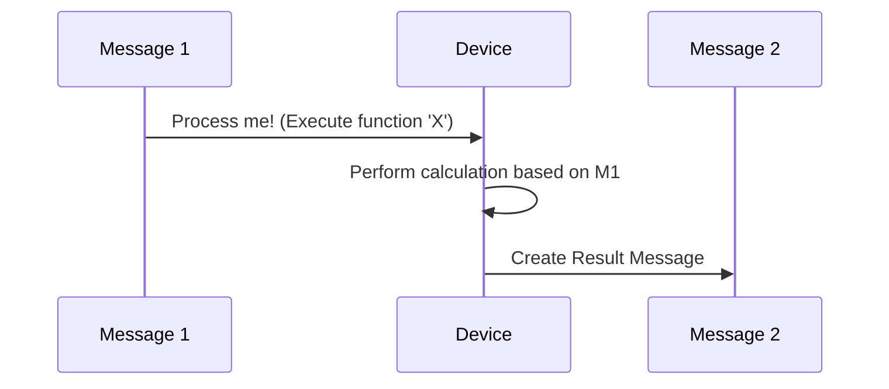

# Chapter 1: Message

Welcome to the HyperBEAM tutorial! Imagine you're building a complex machine with many different parts. How do these parts talk to each other? How does one part tell another part what to do, or send it some information it needs? In the world of HyperBEAM and the underlying [AO-Core Protocol](02_ao_core_protocol_.md), the answer is: **Messages**.

Think about how you communicate using computers today. You might send an email, make an API call to a web service, or even just send a text message. Messages in HyperBEAM are similar – they are the fundamental way different components of the system exchange information and trigger computations.

## What is a Message? The Digital Envelope

At its core, a **Message** is the basic unit of data and computation within HyperBEAM. It's like a digital envelope that can carry either simple data (like a piece of text) or instructions (like "run this calculation").

Messages allow different parts of the HyperBEAM network, potentially running on different computers operated by different people ([HyperBEAM Node](03_hyperbeam_node_.md)), to interact securely and reliably.

## What's Inside a Message?

A Message can be surprisingly flexible. It can be:

1.  **Simple Binary Data:** Just a raw sequence of bytes. This could be anything – an image, a document, or just plain text.
    *   *Analogy:* Like attaching a single file to an email without any other text.
2.  **A Map (like a Dictionary):** A collection of named pieces of data or functions. Think of it like a structured email with fields like "To:", "From:", "Subject:", and "Body:". In HyperBEAM, these named items are often called "keys".
    *   *Analogy:* An email where you have specific fields for the recipient, sender, subject, and the main content.

Here's a very simple conceptual example of a message structured as a map:

```
# A message carrying a greeting
{
  "Greeting": "Hello from HyperBEAM!",
  "Sender": "Node_XYZ"
}
```

This message has two pieces of information (keys): "Greeting" and "Sender".

## Messages Trigger Actions: The Computation Chain

Messages aren't just passive containers for data. They are often used to *trigger* actions. This is where [Device](04_device_.md)s come in (we'll cover them in detail later).

A Message *can* specify which [Device](04_device_.md) should process it. A [Device](04_device_.md) is like a specialized tool or mini-program designed to handle certain kinds of Messages.

*   *Analogy:* Sending an email with a `.docx` attachment. Your computer knows to use Microsoft Word (the "device") to open and process that specific file type.

When a [Device](04_device_.md) processes a Message (often by executing a function named within that message), the result is usually *another* Message.



This leads to a powerful concept: **computation chains or graphs**. One message triggers an action, which produces a new message, which might trigger another action, producing yet another message, and so on. This is how complex computations are built up step-by-step in HyperBEAM.

*   *Analogy:* An email conversation thread. You send an email (Message 1), someone replies (Message 2), you reply to their reply (Message 3), forming a chain.

**What if no Device is specified?** If a message doesn't explicitly name a [Device](04_device_.md), a default one called `message@1.0` is used. This default device is very simple: if you ask it for the value of a specific key (like "Greeting" in our example above), it just returns that value. It doesn't perform complex computations.

## Key Features of Messages

*   **Fundamental Unit:** Everything revolves around sending and receiving Messages.
*   **Data & Computation:** They carry data *and* can trigger computations.
*   **Cryptographically Verifiable:** Messages are designed to be secure. You can mathematically verify their origin and integrity (we'll touch on how [Hashpath](07_hashpath_.md)s help with this later). This is crucial in a decentralized system where you can't implicitly trust all participants.
*   **Lightweight:** They are designed to be small and efficient.
*   **Potentially Lazy:** Sometimes, not all parts of a complex message need to be computed immediately. HyperBEAM allows for parts of messages to be evaluated only when needed ("lazily"), saving computational resources.

## How are Messages Handled Internally?

While you often interact with messages conceptually, under the hood, HyperBEAM needs concrete ways to represent and manage them.

The core Erlang module responsible for handling message formats and conversions is `hb_message.erl`. A key concept here is **TABM (Type Annotated Binary Messages)**.

Think of TABM as HyperBEAM's internal "universal translator" for messages. Messages can come in various formats (like simple text, structured data like JSON, or even Arweave transactions). `hb_message.erl` converts these different formats *into* a standard TABM representation. This TABM format is efficient for internal processing. When data needs to be sent out or displayed, it's converted *from* TABM back into the required format.

```mermaid
graph LR
    A[Arweave TX / ANS-104] --> B(hb_message / dev_codec_ans104);
    C[HTTP Signed Message] --> D(hb_message / dev_codec_httpsig_conv);
    E[JSON / Flat Map] --> F(hb_message / dev_codec_flat);

    B --> G[TABM (Internal Format)];
    D --> G;
    F --> G;

    G --> H(hb_message / dev_codec_structured);
    H --> I[Rich AO-Core Message];

    G --> J(hb_message / dev_codec_ans104);
    J --> K[Arweave TX / ANS-104];
    G --> L(hb_message / dev_codec_httpsig_conv);
    L --> M[HTTP Signed Message];
    G --> N(hb_message / dev_codec_flat);
    N --> O[JSON / Flat Map];

    style G fill:#f9f,stroke:#333,stroke-width:2px
```

This conversion process allows HyperBEAM to handle diverse message types consistently.

The `dev_message.erl` module implements the default `message@1.0` [Device](04_device_.md). Its primary job is simple lookups within a message map. For example, its `get` function retrieves the value associated with a requested key:

```erlang
%% Simplified concept from dev_message.erl

%% Get the value for a Key from a Message map
%% (Ignores private keys and handles case-insensitivity)
get(Key, MsgMap) ->
    % 1. Check if the key is private (e.g., starts with "priv")
    case is_private(Key) of
        true ->
            % Don't return private keys
            {error, not_found};
        false ->
            % 2. Try finding the key directly
            case maps:get(Key, MsgMap, not_found) of
                not_found ->
                    % 3. If not found, try finding case-insensitively
                    case_insensitive_get(Key, MsgMap);
                Value ->
                    % Found it!
                    {ok, Value}
            end
    end.
```

This snippet shows the basic logic: check if the key is allowed, try to find it directly, and if not found, try a case-insensitive search before giving up.

## Conclusion

You've learned that Messages are the lifeblood of HyperBEAM. They are versatile digital envelopes carrying data or instructions, forming the basis for communication and computation across the decentralized network. They can be simple or structured, trigger actions via [Device](04_device_.md)s, and form chains of computation, all while being cryptographically secure.

Understanding Messages is the first step to grasping how work gets done in HyperBEAM. Now that we know about the basic unit, let's zoom out a bit and look at the overall rules of the road – the protocol that governs how these messages interact within the system.

Next up: [AO-Core Protocol](02_ao_core_protocol_.md)

---

Generated by [AI Codebase Knowledge Builder](https://github.com/The-Pocket/Tutorial-Codebase-Knowledge)