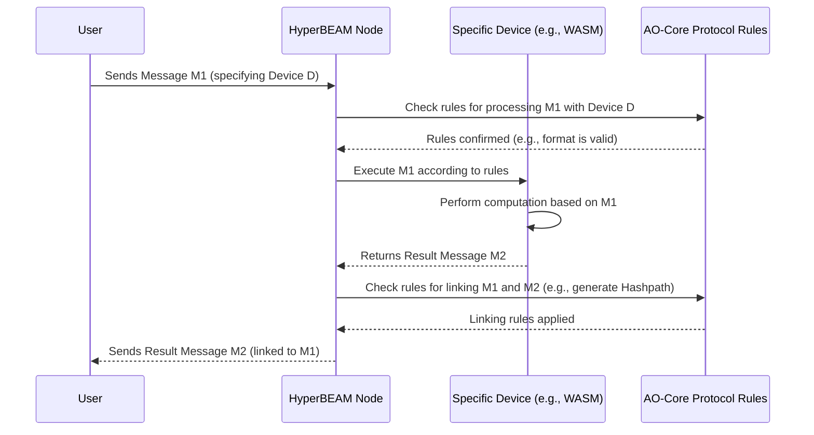

# Chapter 2: AO-Core Protocol

In [Chapter 1: Message](01_message_.md), we learned about **Messages** – the digital envelopes that carry data and instructions in the HyperBEAM world. They are the fundamental way different parts of the system talk to each other.

But how do all these different parts, potentially running on different computers, agree on *how* to interpret these messages? How do they know what rules to follow when performing computations or sharing data? This is where the **AO-Core Protocol** comes in.

## What is the AO-Core Protocol? The Rulebook of HyperBEAM

Imagine you're playing a game with friends. Before you start, you need to agree on the rules. What counts as a turn? How do you score points? What actions are allowed? Without agreed-upon rules, the game would be chaos!

The **AO-Core Protocol** is like the official rulebook for the HyperBEAM universe. It's the fundamental set of rules and basic building blocks (primitives) that HyperBEAM follows.

Think of it as:

*   **The Constitution:** It lays down the basic laws governing how things work.
*   **The Blueprint:** It provides the design for the decentralized operating system that AO (the broader system HyperBEAM is part of) enables.

This protocol defines essential things like:

1.  **How computations happen:** Primarily driven by sending and receiving [Message](01_message_.md)s.
2.  **How data is represented:** Using standard [Message](01_message_.md) structures.
3.  **How results are linked:** Using concepts like [Hashpath](07_hashpath_.md)s (which we'll explore later) to track computation history.
4.  **How different tools interact:** Providing a framework where various computational modules, called [Device](04_device_.md)s, can plug in and cooperate.

## Why Do We Need a Protocol? Enabling Flexible Cooperation

The main goal of the AO-Core Protocol is to allow many different computational systems ([Device](04_device_.md)s) to work together reliably in a decentralized way, without forcing everyone to use the exact same rigid system.

*   **Use Case:** Imagine you want to build a decentralized application. Part of it might need to run complex calculations (like analyzing scientific data using WebAssembly), another part might just need to store user preferences, and another part might need to schedule tasks to run later.

Instead of building one giant, inflexible program, the AO-Core Protocol lets you use specialized [Device](04_device_.md)s for each task:

*   A [WASM Execution (BEAMR)](06_wasm_execution__beamr__.md) device for the calculations.
*   A simple storage device for preferences.
*   A scheduling device for tasks.

The AO-Core Protocol provides the common language and rules so these different devices can understand each other's [Message](01_message_.md)s and work together seamlessly, even if they run on different [HyperBEAM Node](03_hyperbeam_node_.md)s across the network.

## Core Principles of AO-Core

Let's break down the key ideas defined by the protocol:

1.  **Everything is a Message:** As we saw in Chapter 1, [Message](01_message_.md)s are the universal container for data and computation triggers. The protocol defines the standard structure for these messages.
2.  **Messages Trigger Devices:** A [Message](01_message_.md) can (optionally) specify which [Device](04_device_.md) should process it. If no device is specified, a default `message@1.0` device is used (which mainly just reads data from the message).
3.  **Computation Creates Messages:** When a [Device](04_device_.md) processes a [Message](01_message_.md) (e.g., by running a function named in the message), the result is *always* another [Message](01_message_.md). This creates chains or graphs of computation.
    ```
    Message1(Input for Message2) => Message3
    ```
    This means applying one message to another results in a new message.
4.  **Computations are Tracked:** The protocol defines ways to link messages together cryptographically, creating a verifiable history of computation. [Hashpath](07_hashpath_.md)s are a key primitive here, acting like a fingerprint of the entire computation sequence leading to a specific result message.
5.  **Meta-VM Framework:** This is a fancy way of saying AO-Core doesn't force one specific type of virtual machine or computation style. It provides a flexible framework (like a universal adapter) where different computational models ([Device](04_device_.md)s – like WASM executors, data codecs, schedulers) can plug in.

## How it Works: A Conceptual Flow

Let's visualize how the protocol guides interactions within a [HyperBEAM Node](03_hyperbeam_node_.md):



The AO-Core Protocol acts as the referee, ensuring every step follows the agreed-upon rules, from how messages are structured to how results are generated and linked.

## Inside HyperBEAM: Implementing the Protocol

The AO-Core Protocol itself is a *specification* – a set of rules written down (you can find the technical details in `docs/misc/ao-core-protocol.md`). The [HyperBEAM Node](03_hyperbeam_node_.md) software is an *implementation* of that specification.

The core logic for handling message processing according to the protocol rules resides in the `hb_ao.erl` module within HyperBEAM. It orchestrates the process described above: taking incoming messages, figuring out the correct [Device](04_device_.md) and function to call based on the protocol, executing it, and handling the result.

Here's a highly simplified conceptual view of what `hb_ao.erl` does:

```erlang
%% Simplified Conceptual Logic in src/hb_ao.erl

%% Apply Msg2 to Msg1 according to AO-Core rules
resolve(Msg1, Msg2, Opts) ->
    % 1. Find the right Device based on Msg1 (or use default)
    %    (Checks the 'Device' tag in Msg1, loads the module)
    Device = find_device(Msg1, Opts),

    % 2. Find the specific function (Key) requested by Msg2's Path
    %    (Looks at the 'Path' tag in Msg2, like "/calculate_sum")
    Key = get_path_key(Msg2, Opts),
    Function = find_function(Device, Key, Opts), % Find matching function in Device module

    % 3. Execute the function using the Device module
    Result = execute_function(Function, Msg1, Msg2, Opts), % e.g., Device:calculate_sum(Msg1, Msg2, Opts)

    % 4. Link the result (e.g., update Hashpath) according to protocol rules
    FinalResult = link_result(Msg1, Msg2, Result, Opts),

    % Return the final result message
    FinalResult.
```

This `resolve` function is the heart of computation in HyperBEAM. It takes two messages, consults the AO-Core rules (implicitly, through its logic and the device implementations), performs the computation, and produces a new, linked message.

## Conclusion

You've now learned about the AO-Core Protocol – the foundational rulebook for HyperBEAM. It's not a specific piece of software you run directly, but rather the set of principles and definitions that govern how decentralized computation happens within the system.

Key takeaways:

*   It defines the "laws" for messages, devices, and computations.
*   It enables flexibility, allowing different computational modules ([Device](04_device_.md)s) to cooperate.
*   It ensures computations are structured, linked ([Hashpath](07_hashpath_.md)), and verifiable.
*   HyperBEAM is an implementation of this protocol, with `hb_ao.erl` playing a central role in enforcing its rules.

Now that we understand the basic unit ([Message](01_message_.md)) and the overall rules (AO-Core Protocol), let's look at the actual software that runs these rules on a computer.

Next up: [Chapter 3: HyperBEAM Node](03_hyperbeam_node_.md)

---

Generated by [AI Codebase Knowledge Builder](https://github.com/The-Pocket/Tutorial-Codebase-Knowledge)