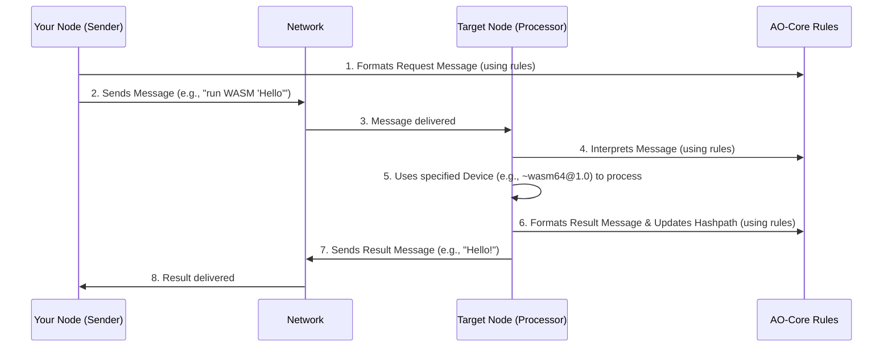

# Chapter 2: AO-Core Protocol

In [Chapter 1: HyperBEAM Node](01_hyperbeam_node_.md), we learned that a HyperBEAM Node is your personal computer joining the AO network, ready to do work. But if you have many such nodes, all wanting to work together, how do they communicate? How do they agree on how tasks are defined, processed, and recorded? They need a common language and a set of rules, like an operating system for the entire decentralized network. This is where the AO-Core Protocol comes in.

## What is the AO-Core Protocol? The Network's Rulebook

Imagine you and a friend want to build a complex LEGO model together, but you live in different cities. You need a clear set of rules:
*   How will you describe the pieces you need from each other? (e.g., "a red 2x4 brick")
*   How will you give instructions for building a section? (e.g., "take two red 2x4 bricks and attach them to the blue 4x8 plate")
*   How will you confirm that a section is built correctly before moving on?

The **AO-Core Protocol** is exactly this kind of rulebook for the AO network. It's the foundational set of rules that all [HyperBEAM Nodes](01_hyperbeam_node_.md) (and other parts of the AO ecosystem) follow. Think of it as the **operating system for decentralized computation**.

It doesn't dictate *what* computations should be done, but rather *how* these computations are requested, performed, and tracked in a standardized way. As the `README.md` for HyperBEAM states:
> AO-Core is a protocol built to enable decentralized computations, offering a series of universal primitives to achieve this end. Instead of enforcing a single, monolithic architecture, AO-Core provides a framework into which any number of different computational models... can be attached.

This means AO-Core provides a flexible base that can support many different kinds of computing tasks.

## Why Do We Need a Protocol? A Simple Example

Let's say your HyperBEAM Node (Node A) wants another node on the network (Node B) to run a very simple program for you – perhaps a tiny WebAssembly program that just says "Hello!" Node A needs to tell Node B:
1.  "I have a job for you."
2.  "Here's the program I want you to run."
3.  "Please use your WebAssembly-running tool to execute it."
4.  "Tell me the result."
5.  "And I need a way to be sure you did exactly what I asked and the result is genuine."

Without a common protocol like AO-Core:
*   Node A might send its request in a format Node B doesn't understand.
*   Node B might not know which of its tools to use for a "WebAssembly program."
*   The result from Node B might be in a strange format Node A can't read.
*   There'd be no standard way to prove the computation happened correctly.

AO-Core solves this by defining clear rules for these interactions.

## The Three Pillars of AO-Core

The AO-Core protocol is built on a few key concepts that work together:

1.  **[Messages](03_messages_.md): The "What" - Digital Postcards**
    *   At its heart, all communication and data in AO are packaged as **Messages**.
    *   Think of a [Message](03_messages_.md) as a digital postcard. It can carry simple information (like "Hello!"), a piece of data (like your WebAssembly program code), or instructions for a task.
    *   AO-Core defines how these "postcards" should be structured so everyone can read them.
    *   We'll dive deep into [Messages](03_messages_.md) in the next chapter.

2.  **[Devices](04_devices_.md): The "How" - Specialized Tools**
    *   When a [Message](03_messages_.md) arrives at a node with a task, how does the node know what to do with it? It uses a **Device**.
    *   A [Device](04_devices_.md) is like a specialized tool or a mini-program designed for a specific kind of job. For our example, Node B would have a "WebAssembly [Device](04_devices_.md)" (like `~wasm64@1.0`) that knows how to run WebAssembly programs.
    *   AO-Core defines how [Messages](03_messages_.md) can specify which [Device](04_devices_.md) should be used, and how [Devices](04_devices_.md) should interpret and process these [Messages](03_messages_.md).
    *   We'll explore [Devices](04_devices_.md) in detail in Chapter 4.

3.  **Hashpaths: The "Proof" - Secure Receipts**
    *   How can we trust that computations happened as claimed and that the history is accurate? AO-Core uses **Hashpaths**.
    *   Imagine every time something happens – like a [Message](03_messages_.md) is sent or a [Device](04_devices_.md) performs a calculation – we create a unique, fingerprint-like code for that action (this is a "hash"). This code depends on the "fingerprint" of the previous action and the details of the new action.
    *   This creates a chain of these cryptographic fingerprints, forming a **Hashpath**. It's like a secure, tamper-proof receipt or logbook that records the entire history of computations. If anyone tries to secretly change a past event or result, the fingerprints in the Hashpath will no longer match up, and the tampering will be obvious.
    *   This ensures the integrity and verifiability of computations across the network.

The official AO-Core protocol specification draft (`docs/misc/ao-core-protocol.md`) describes these:
> AO-Core's protocol offers a framework for decentralized computations, built upon the following fundamental primitives:
> 1. Hashpaths: A mechanism for referencing locations in a program's state-space prior to execution...
> ...
> 4. A meta-VM that allows any number of different virtual machines and computational models (`devices`) to be executed inside the AO-Core protocol...

In simpler terms, AO-Core gives us the "what" ([Messages](03_messages_.md)), the "how" ([Devices](04_devices_.md)), and the "proof" (Hashpaths).

## AO-Core in Action: Our "Hello!" Program Example

Let's revisit our example of Node A asking Node B to run a "Hello!" WebAssembly program:

1.  **Crafting the Message (AO-Core Rule 1):**
    *   Node A creates a [Message](03_messages_.md). AO-Core rules dictate this [Message](03_messages_.md) should clearly state:
        *   The *task*: "Execute this WebAssembly code."
        *   The *data*: The actual "Hello!" WebAssembly program code.
        *   The *target Device*: "Use your `~wasm64@1.0` [Device](04_devices_.md)."

2.  **Processing with a Device (AO-Core Rule 2):**
    *   Node B receives the [Message](03_messages_.md). Following AO-Core, it inspects the [Message](03_messages_.md) and sees it's meant for its `~wasm64@1.0` [Device](04_devices_.md).
    *   The `~wasm64@1.0` [Device](04_devices_.md) takes the WebAssembly code from the [Message](03_messages_.md) and runs it. The program outputs "Hello!"

3.  **Returning the Result (AO-Core Rule 1 again):**
    *   Node B now needs to send the result back. It crafts another [Message](03_messages_.md), again following AO-Core's structure. This [Message](03_messages_.md) contains the output: "Hello!"

4.  **Ensuring Verifiability (AO-Core Rule 3):**
    *   Throughout this process, Hashpaths are updated.
        *   A Hashpath is associated with Node A's initial request [Message](03_messages_.md).
        *   When Node B processes it and generates the result, a new Hashpath is created that links to the original request's Hashpath and includes a fingerprint of the computation performed by the `~wasm64@1.0` [Device](04_devices_.md) and the result "Hello!".
    *   This means Node A (and anyone else) can cryptographically verify the chain of events: Node A sent *this specific program*, it was processed by Node B's WebAssembly [Device](04_devices_.md), and it produced *this specific result*.

This standardized interaction, governed by AO-Core, allows diverse nodes with different capabilities to work together seamlessly and securely.

## A Universal Framework

The beauty of AO-Core is that it doesn't force one specific way to compute. Instead, it provides a universal framework. Different types of [Devices](04_devices_.md) can be created for various computational models (like WebAssembly, Lua, or even specialized AI models). As long as they "speak AO-Core" – meaning they understand its [Messages](03_messages_.md) and integrate with its Hashpath system – they can plug into the AO network. This enables a diverse, scalable, and evolving ecosystem of decentralized computation.

## Under the Hood: How HyperBEAM Follows the Rules

AO-Core is a protocol – a set of rules and specifications. It's not a single piece of software you run, but rather a design that software (like HyperBEAM) implements.

*   **The Blueprint:** The detailed specification of the AO-Core protocol can be found in documents like `docs/misc/ao-core-protocol.md` within the HyperBEAM project. This document outlines the technical details of [Messages](03_messages_.md), [Devices](04_devices_.md), Hashpaths, and how they interact. For instance, it defines a [Message](03_messages_.md) like this (in more technical terms):
    > Every item on the permaweb is described as a `Message`. Each `Message` is interpretable by AO-Core as a `map` of named functions, or as a concrete binary term.
    This means a [Message](03_messages_.md) can be simple data or a more structured set of operations.

*   **The Enforcer in HyperBEAM:** In the HyperBEAM software itself, modules like `src/hb_ao.erl` are responsible for implementing these AO-Core rules. The comments in `hb_ao.erl` state:
    > This module is the root of the device call logic of the AO-Core protocol in HyperBEAM. ... `AO-Core(Message1, Message2)` leads to the evaluation of `DeviceMod:PathPart(Message1, Message2)`, which defines the user compute to be performed.
    This shows that `hb_ao.erl` handles how [Messages](03_messages_.md) are processed using the specified [Devices](04_devices_.md), a core part of the AO-Core protocol.

Let's visualize a simplified interaction based on AO-Core:

This diagram shows how both nodes rely on the AO-Core rules to communicate and process the task effectively.

## Conclusion: The Common Ground

The AO-Core Protocol is the essential "common ground" for the AO network. It's the operating system that defines:
*   How **[Messages](03_messages_.md)** (the data and tasks) are structured and exchanged.
*   How **[Devices](04_devices_.md)** (the tools for computation) should interpret and process these [Messages](03_messages_.md).
*   How the history of computations can be securely tracked using **Hashpaths**.

By providing this universal framework, AO-Core allows many different types of computational services to exist and interact within a single, scalable, decentralized ecosystem. It's the blueprint that ensures all parts of the AO network can speak the same language and work together harmoniously.

Now that we understand the overall rulebook, let's take a closer look at its most fundamental component. In the next chapter, we'll zoom in on [Messages](03_messages_.md) and see how they are structured and used.

---

Generated by [AI Codebase Knowledge Builder](https://github.com/The-Pocket/Tutorial-Codebase-Knowledge)