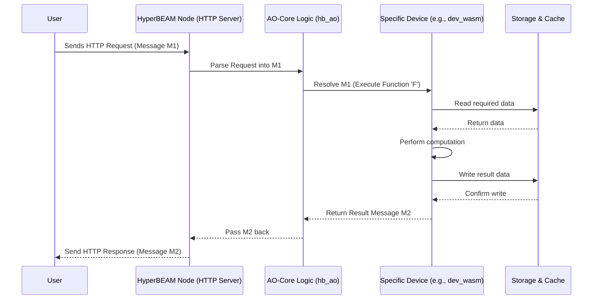

# Chapter 3: HyperBEAM Node

In the previous chapters, we explored the basic unit of communication, the [Message](01_message_.md), and the overall set of rules governing interactions, the [AO-Core Protocol](02_ao_core_protocol_.md). Now, let's talk about the actual software that runs these rules and handles these messages – the **HyperBEAM Node**.

## What is a HyperBEAM Node? The Engine of the Network

Imagine the AO network as a massive, decentralized data center spread across the globe. This data center doesn't belong to one company; instead, it's made up of many individual computers contributed by different people or organizations.

A **HyperBEAM Node** is the software running on *one* of those individual computers. It's the primary software implementation of the [AO-Core Protocol](02_ao_core_protocol_.md), written in a programming language called Erlang/OTP.

Think of it like this:

*   **The Server Software:** It's the actual program you download and run on your machine to participate in the AO network.
*   **An Individual Computer:** In our decentralized data center analogy, each HyperBEAM node acts like a single server rack, offering its resources.
*   **The Engine:** It's the core "machine" that does the work – processing [Message](01_message_.md)s, running computations, managing data, and talking to other nodes.

## Why Do We Need Nodes? Powering Decentralized Computation

The whole point of AO is to create a decentralized computing environment. This means computations aren't run by a single, central authority but by a distributed network.

**Use Case:** Alice wants to contribute her powerful server to the AO network. She wants to offer its processing power (CPU) and storage space to others who need to run computations or store data, potentially earning rewards for doing so.

To do this, Alice needs to install and run the HyperBEAM Node software on her server. By running the node, her server becomes part of the AO network, ready to receive tasks ([Message](01_message_.md)s) from users and other nodes.

Without individual nodes run by operators like Alice, there would be no network and no computational power!

## What Does a HyperBEAM Node Do?

A HyperBEAM node is a busy piece of software with several key responsibilities:

1.  **Implementing AO-Core:** It follows the rules defined by the [AO-Core Protocol](02_ao_core_protocol_.md) for everything it does.
2.  **Managing Processes:** It handles the lifecycle of computations, which are often organized as persistent [Process](05_process_.md)es (we'll cover these later).
3.  **Routing Messages:** It receives incoming [Message](01_message_.md)s and figures out where they need to go – maybe to a specific [Device](04_device_.md) running on the *same* node, or maybe relayed to *another* node in the network.
4.  **Coordinating Devices:** Nodes can run various specialized tools called [Device](04_device_.md)s (like a WASM executor or a data storage tool). The node manages these devices and directs messages to the correct one.
5.  **Interacting with Arweave:** It communicates with the underlying Arweave network, often for storing permanent data or retrieving information.
6.  **Managing Resources:** It utilizes the host machine's CPU, memory, and [Storage & Cache](08_storage___cache_.md) to perform its tasks.
7.  **Configuration:** It allows the operator (like Alice) to configure its settings, such as which [Device](04_device_.md)s to run, pricing information, and network details. This is often done via a special device called [Meta Device (~meta@1.0)](09_meta_device___meta_1_0__.md).

## Running a Node (Conceptual)

While the detailed steps for installing and running a node are covered in the "Getting Started" section of the main documentation, the basic idea is:

1.  **Install:** Get the necessary software (Erlang, Rebar3, the HyperBEAM code).
2.  **Configure:** Set up a configuration file (like `config.flat`) or use command-line arguments to tell the node how to behave (e.g., which network port to listen on, where your Arweave key file is). This configuration populates the node's [Meta Device (~meta@1.0)](09_meta_device___meta_1_0__.md).
3.  **Run:** Start the software using a command like `rebar3 shell`.

Once running, the node starts listening for incoming connections (usually over HTTP) and becomes an active participant in the AO network.

## Inside the Engine: How a Node Works

Let's peek under the hood. What happens when Alice starts her node and a user sends it a message?

**Step-by-Step Walkthrough:**

1.  **Startup:** Alice runs the command to start HyperBEAM.
    *   The main application (`hb_app.erl`) starts.
    *   A supervisor process (`hb_sup.erl`) starts, which in turn starts other essential parts like the HTTP server and storage managers.
    *   Configuration (`hb_opts.erl`) is loaded from files or environment variables.
2.  **Listening:** The HTTP server (`hb_http_server.erl`) starts listening on the configured port (e.g., 10000) for incoming requests.
3.  **Message Received:** A user sends an HTTP request to Alice's node. This request represents an AO [Message](01_message_.md).
4.  **Request Handling:** The HTTP server (`hb_http_server.erl`) receives the request, parses it into the internal HyperBEAM [Message](01_message_.md) format (TABM).
5.  **AO-Core Logic:** The core AO logic module (`hb_ao.erl`, which we saw in Chapter 2) takes the message. It uses the [AO-Core Protocol](02_ao_core_protocol_.md) rules to determine:
    *   Which [Device](04_device_.md) should handle this message?
    *   What specific function (key) within that device needs to be executed?
6.  **Device Execution:** The appropriate [Device](04_device_.md) module (e.g., `dev_wasm.erl` for WASM execution) is called to process the message.
7.  **Resource Interaction:** During execution, the device might need to:
    *   Read or write data using the [Storage & Cache](08_storage___cache_.md) system (`hb_cache.erl`, `hb_store.erl`).
    *   Send a message to another node via the network module (`hb_http.erl`).
    *   Interact with the Arweave network (`ar*.erl` modules).
8.  **Result Generation:** The device finishes its work and produces a resulting [Message](01_message_.md).
9.  **Response:** The core logic (`hb_ao.erl`) might perform final linking steps (like updating [Hashpath](07_hashpath_.md)s). The result message is then passed back to the HTTP server (`hb_http_server.erl`).
10. **Sending Reply:** The HTTP server converts the result message back into an HTTP response and sends it back to the original user.

**Sequence Diagram Example:**

Here's a simplified view of a message arriving and being processed:



**Code Snippets (Simplified Concepts):**

*   **Application Start (`src/hb_app.erl`)**: This is the main entry point when the node starts.

    ```erlang
    %% Simplified concept from hb_app.erl
    start(_StartType, _StartArgs) ->
        % Initialize core systems
        hb:init(),
        % Start the main supervisor
        hb_sup:start_link(),
        % Start other specific services like the scheduler registry
        ok = dev_scheduler_registry:start(),
        % Start the HTTP server to listen for requests
        {ok, _} = hb_http_server:start().
    ```
    This code shows the basic sequence: initialize things, start the supervisor (which starts other parts), and finally start the web server.

*   **Supervisor (`src/hb_sup.erl`)**: Manages starting and stopping different parts (children) of the node.

    ```erlang
    %% Simplified concept from hb_sup.erl
    init(Opts) ->
        SupFlags = #{strategy => one_for_all}, % If one child fails, restart all
        % Define children to start:
        % - HTTP client for making outgoing requests
        GunChild = #{id => hb_http_client, start => {hb_http_client, start_link, [Opts]}},
        % - Storage system children (based on config in Opts)
        StoreChildren = store_children(hb_opts:get(store, [], Opts)),
        % List all children the supervisor should manage
        Children = [GunChild | StoreChildren],
        {ok, {SupFlags, Children}}.
    ```
    This sets up the supervisor strategy and defines the list of components (like the HTTP client and storage) it needs to launch and monitor.

*   **HTTP Server Request Handling (`src/hb_http_server.erl`)**: This part takes an incoming web request and turns it into an AO computation.

    ```erlang
    %% Simplified concept from hb_http_server.erl handle_request
    handle_request(RawReq, Body, ServerID) ->
        % Get node's configuration
        NodeMsg = get_opts(#{ http_server => ServerID }),
        % Parse the HTTP request (RawReq + Body) into an AO Message (ReqSingleton)
        ReqSingleton = hb_http:req_to_tabm_singleton(RawReq, Body, NodeMsg),
        % Find the right output format based on 'Accept' header
        CommitmentCodec = hb_http:accept_to_codec(ReqSingleton, NodeMsg),
        % --- Pass the message to the core AO processing ---
        % (This eventually calls hb_ao:resolve)
        {ok, Res} = dev_meta:handle(
                        NodeMsg#{ commitment_device => CommitmentCodec },
                        ReqSingleton
                    ),
        % --- Send the result message (Res) back as HTTP response ---
        hb_http:reply(RawReq, ReqSingleton, Res, NodeMsg).
    ```
    This snippet shows receiving an HTTP request, converting it into an internal message (`ReqSingleton`), sending it for processing via `dev_meta:handle` (which acts as an entry point to the core AO logic), and then sending the result (`Res`) back.

*   **Configuration Loading (`src/hb_opts.erl`)**: How the node accesses its settings.

    ```erlang
    %% Simplified concept from hb_opts.erl get/3
    get(Key, Default, Opts) ->
        % Check if the setting 'Key' is present in the local options 'Opts'
        case maps:find(Key, Opts) of
            {ok, Value} ->
                % Found it locally, use this value
                Value;
            error ->
                % Not found locally, try finding it in global settings
                % (e.g., from config file or environment variables)
                case global_get(Key, hb_opts_not_found) of
                    hb_opts_not_found ->
                        % Not found globally either, use the Default value
                        Default;
                    GlobalValue ->
                        % Found it globally
                        GlobalValue
                end
        end.
    ```
    This function shows how other parts of the code can ask for a configuration value (like `port` or `priv_key_location`). It first checks any specific options passed in (`Opts`), then looks at global settings, and finally uses a default if needed.

## Conclusion

You've now learned that the **HyperBEAM Node** is the core software engine that powers the AO network. It's the server application run by operators to contribute resources, implement the [AO-Core Protocol](02_ao_core_protocol_.md), manage computations ([Message](01_message_.md)s, [Process](05_process_.md)es), coordinate specialized tools ([Device](04_device_.md)s), and interact with Arweave and other nodes. It's the fundamental building block that makes decentralized computation possible in AO.

Understanding the node sets the stage for looking at the specialized tools it uses to perform different kinds of tasks.

Next up: [Chapter 4: Device](04_device_.md)

---

Generated by [AI Codebase Knowledge Builder](https://github.com/The-Pocket/Tutorial-Codebase-Knowledge)