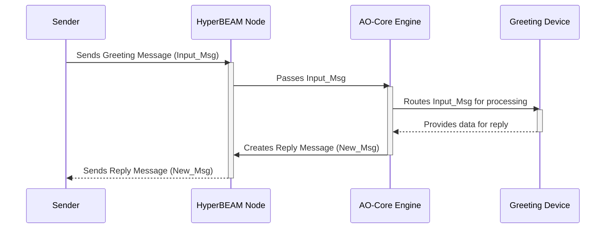

# Chapter 3: Messages

In [Chapter 2: AO-Core Protocol](02_ao_core_protocol_.md), we learned that the AO-Core Protocol is like the "rulebook" or "operating system" for the AO network. It defines how different parts of the system, like [HyperBEAM Nodes](01_hyperbeam_node_.md), communicate and work together. Now, let's zoom in on the most fundamental piece of that communication: **Messages**.

## What's a Message and Why Do We Need It?

Imagine you want to send a note to a friend. That note carries your thoughts or instructions. In the digital world of HyperBEAM and AO, **Messages** are like those notes.

**Messages are the fundamental units of data and computation in HyperBEAM.**

Think of them as:
*   **Digital letters:** They carry information from one place to another.
*   **Instructions:** They can tell a [HyperBEAM Node](01_hyperbeam_node_.md) what to do.
*   **Data packets:** They can hold any kind of data, like text, numbers, or even small programs.

Everything that happens in AO-Core involves messages. If a user wants to run a program, they send a message. If a [HyperBEAM Node](01_hyperbeam_node_.md) finishes a task, it sends back a message with the result.

As the HyperBEAM `README.md` explains:
> HyperBEAM describes every piece of data as a `message`, which can be interpreted as a binary term or as collection of named functions aka. a `Map` of functions.

This means a message can be simple raw data (like a picture file) or a more structured piece of information with different parts (like an email with a "To" field, "Subject" field, and "Body").

## The Core Idea: Message In, Message Out

One of the most important concepts about messages in AO-Core is this:

**When a message is processed, it *always* results in a new message.**

This is like having a conversation:
1.  You send a text message (Input Message).
2.  Your friend reads it and replies (Output Message).

This creates a continuous chain or "conversation" of computations. Your friend's reply might then prompt you to send another message, and so on.

The `README.md` for HyperBEAM puts it this way:
> Executing a named function within a message, providing a map of arguments, results in another `message`. In this way, `messages` in AO-Core always _beget_ further `messages`...

This "message in, message out" pattern is how all work gets done. It's a bit like how web servers work: you send a request (a message) to a website, and the server sends back a response (another message, which is the webpage). HyperBEAM generalizes this idea for all sorts of computations.

## What Can a Message Carry?

A message is very flexible. It can contain:

1.  **Data:** This is the actual information being sent or worked on. For example:
    *   The text "Hello, HyperBEAM!"
    *   A number, like `42`.
    *   A list of items: `["apple", "banana", "cherry"]`.
    *   More complex structured data.

2.  **Action / Target [Device](04_devices_.md):** This tells the system what to do with the data, or which "tool" ([Device](04_devices_.md)) should handle the message.
    *   For example, a message might implicitly say "store this data" or explicitly say "use the `~wasm64@1.0` [Device](04_devices_.md) to run this program."

The `ao-core-protocol.md` draft states:
> Every item on the permaweb is described as a `Message`. Each `Message` is interpretable by AO-Core as a `map` of named functions, or as a concrete binary term.

This technical description means a message can be:
*   A simple piece of data (a "concrete binary term").
*   A structured collection of items, like a dictionary or "map" where each item has a name (key) and a value. These "named functions" can be thought of as fields in the message.

## A Simple Example: Sending a Greeting

Let's say you want to send a greeting to a [HyperBEAM Node](01_hyperbeam_node_.md) and get a reply.

**Step 1: You create an Input Message.**
This message might look conceptually like this (we'll use a JSON-like format for readability):

```json
// Input Message (What you send)
{
  "To": "HyperBEAM-Node-123", // Where the message is going
  "From": "BeginnerUser",      // Who sent it
  "Greeting": "Hello, Node!",  // The data/content
  "Action": "PleaseRespond"    // What you want the node to do
}
```
*This is a simplified representation. Actual messages have specific formats defined by the [AO-Core Protocol](02_ao_core_protocol_.md).*

**Step 2: The Node processes your Message.**
The [HyperBEAM Node](01_hyperbeam_node_.md) receives your message. It looks at the "Action" or might have a default way to handle simple greetings using a specific [Device](04_devices_.md).

**Step 3: The Node creates an Output Message.**
Because processing a message *always* results in a new message, the node will generate a response:

```json
// Output Message (What the Node sends back)
{
  "To": "BeginnerUser",
  "From": "HyperBEAM-Node-123",
  "OriginalGreeting": "Hello, Node!", // It might include what it received
  "Response": "Hi BeginnerUser! I got your message."
}
```

You sent a message, and you got a new message back! This is the fundamental flow.

### What if a Message Doesn't Specify an Action?

The `README.md` mentions something interesting:
> If a `message` does not explicitly specify a `device`, its implied `device` is a `message@1.0`, which simply returns the binary or `message` at a given named function.

This means if you send a message that just contains data, like:
```json
// Input Message
{
  "MyData": "This is a secret code.",
  "AnotherField": 12345
}
```
And you ask the node (using the default `message@1.0` [Device](04_devices_.md)) for the value of `"MyData"`, the resulting output message would effectively give you back `"This is a secret code."`. The `message@1.0` [Device](04_devices_.md) is like a librarian for the message itself; it helps you look up parts of it. We'll learn more about [Devices](04_devices_.md) in the next chapter.

## How Messages Flow: A Peek Under the Hood

Let's visualize the greeting example:

1.  **You (Sender)** prepare your greeting message.
2.  You send this **Input Message** to a **HyperBEAM Node**.
3.  Inside the Node, the **[AO-Core Resolution Engine (`hb_ao`)](07_ao_core_resolution_engine___hb_ao___.md)** (the part of HyperBEAM that understands AO-Core rules) gets the message.
4.  The Engine might figure out which **[Device](04_devices_.md)** (a specialized tool) should handle this greeting (e.g., an "echo" device or the default `message@1.0` device).
5.  The chosen **[Device](04_devices_.md)** processes the Input Message.
6.  The **[Device](04_devices_.md)** (or the Engine on its behalf) then creates a **New Message** (the Output Message) containing the reply.
7.  The **HyperBEAM Node** sends this **Output Message** back to you.

Here's a diagram of that flow:



## Message Formats and Structure (A Glimpse)

While we've used JSON-like examples for clarity, actual messages in HyperBEAM can take various forms. The module `hb_message.erl` in HyperBEAM's code is responsible for handling these different formats. Its documentation (`docs/resources/source-code/hb_message.md`) states:

> This module acts an adapter between messages, as modeled in the AO-Core protocol, and their uderlying binary representations and formats.
> ...
> `hb_message` ... can interact with multiple different types of message formats:
> - Richly typed AO-Core structured messages.
> - Arweave transations.
> - ANS-104 data items.
> - HTTP Signed Messages.
> - Flat Maps.
>
> This module is responsible for converting between these formats. It does so by normalizing messages to a common format: `Type Annotated Binary Messages` (TABM). TABMs are deep Erlang maps with keys than only contain either other TABMs or binary values.

For a beginner, the key takeaway is that messages are structured data. "TABM" being "deep Erlang maps" means they are often like nested dictionaries (maps within maps), where each piece of information has a name (a "key") and a value.

For example, our greeting message might internally be structured with keys like `Greeting`, `From`, `To`, etc., each holding their respective data.

The `dev_message.erl` module ([docs/resources/source-code/dev_message.md](docs/resources/source-code/dev_message.md)) implements the default `message@1.0` [Device](04_devices_.md). This device is fundamental for interacting with messages themselves:
> The identity device: For non-reserved keys, it simply returns a key from the message as it is found in the message's underlying Erlang map.

This means if you have a message and want to get a specific piece of data out of it (like the value of the "Greeting" key), the `message@1.0` [Device](04_devices_.md) helps you do that.

## Why is the "Message In, Message Out" Design So Powerful?

This seemingly simple rule has big benefits:

*   **Uniformity:** Everything is an interaction between messages. This simplifies how different parts of the system talk to each other.
*   **Composability (Building Blocks):** The output message from one computation can become the input message for another. This lets you chain operations together to build complex applications, like LEGO® bricks!
*   **Traceability:** As we touched upon in [Chapter 2: AO-Core Protocol](02_ao_core_protocol_.md), this chain of messages can be tracked using Hashpaths, creating a verifiable history of computations.
*   **Decentralization:** Nodes can operate independently by reacting to incoming messages and producing new ones, without needing to know the entire state of the universe.

## Conclusion

Messages are the atoms of HyperBEAM and the AO-Core world. They are the digital packets that carry data and instructions. Remember the golden rule: **every processed message results in a new message.** This creates an ongoing "conversation" of computations that allows complex tasks to be performed in a decentralized way.

We've seen that messages can contain data and specify actions. But what actually *does* the work when a message arrives? What are these "tools" or "specialized programs" we've hinted at?

In the next chapter, we'll explore exactly that: the concept of **[Devices](04_devices_.md)**. These are the workhorses that interpret and act upon the messages we send.

---

Generated by [AI Codebase Knowledge Builder](https://github.com/The-Pocket/Tutorial-Codebase-Knowledge)