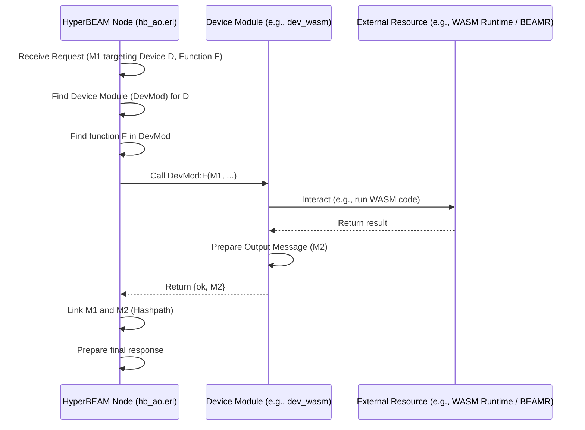

# Chapter 4: Device

In the last chapter, [Chapter 3: HyperBEAM Node](03_hyperbeam_node_.md), we learned about the HyperBEAM node – the core software engine that runs on individual computers to power the AO network. We saw it's responsible for processing messages, managing computations, and interacting with the network.

But how does a single node handle all the *different kinds of tasks* it might need to perform? Imagine you want your node to be really good at complex math calculations, but also capable of handling simple payment requests, and maybe relaying messages to other nodes. Building all this specialized logic into the core node software would make it huge, complicated, and inflexible.

This is where **Devices** come in!

## What are Devices? The Node's Specialized Tools

Think of a [HyperBEAM Node](03_hyperbeam_node_.md) like a smartphone. Your phone's operating system provides the basic functions, but the real power comes from the apps you install. You have a calculator app for math, a banking app for payments, a messaging app for communication, etc. Each app has a specific purpose and knows how to handle certain types of information or requests.

**Devices** in HyperBEAM are very similar:

*   **Modular Components:** They are like plug-ins or apps specifically designed for a HyperBEAM node.
*   **Encapsulated Functionality:** Each Device contains the code and logic needed to perform a specific task or handle a particular type of computation.
*   **Specialized Logic:** A Device knows how to interpret and process certain kinds of [Message](01_message_.md)s according to its own rules.

**Use Case:** Let's say you want your node to:

1.  Execute complex algorithms written in WebAssembly (WASM), a standard format for code that can run anywhere.
2.  Manage its own configuration settings, like its network address or pricing information.

Instead of cramming all this into the main node code, HyperBEAM uses separate Devices for these jobs.

## How Do Devices Work?

Remember from [Chapter 1: Message](01_message_.md) that messages can carry data *and* instructions? One crucial piece of instruction a [Message](01_message_.md) can carry is the *name* of the Device that should process it. This is usually done using a special tag or field within the message, often named `Device`.

*   *Analogy:* When you double-click a `.docx` file on your computer, the file itself tells the operating system, "Hey, I need the 'Microsoft Word' app (device) to open me!"

If a [Message](01_message_.md) arrives at a [HyperBEAM Node](03_hyperbeam_node_.md) and specifies a `Device`, the node's core logic looks for that specific Device among the ones it has loaded. If found, it hands the message over to that Device for processing.

**What if no Device is specified?** As mentioned before, if a message *doesn't* specify a device, the node uses a default, very basic device called `message@1.0`. This device mainly just knows how to look up data within the message itself (like reading fields from our "digital envelope"). It doesn't perform complex computations.

**Device Actions:** When a Device receives a message, it usually looks for another tag within the message (often `Path` or a specific function name) that tells it *what specific action* to perform. The Device then executes its internal logic based on the message content and the requested action.

*   *Analogy:* Sending an email (the message) to your "Photo Editor" app (the device) with the subject line (the path/key) "Resize Image to 50%". The app knows exactly what function to run based on that subject.

Just like in the core AO model, when a Device processes a [Message](01_message_.md), the result is always *another* [Message](01_message_.md).

## Examples of Devices

HyperBEAM comes with several pre-loaded devices, and node operators can choose which ones to run. Each device has a unique name, often including a version number (like `@1.0`). Here are a few important examples:

*   `~wasm64@1.0`: Executes WebAssembly (WASM) code. This is the device our use case needs for running complex algorithms. (Covered in detail in [Chapter 6: WASM Execution (BEAMR)](06_wasm_execution__beamr__.md)).
*   `~meta@1.0`: Manages the node's own configuration and provides information about the node. This is the device our use case needs for managing settings. (Covered in detail in [Chapter 9: Meta Device (~meta@1.0)](09_meta_device___meta_1_0__.md)).
*   `~relay@1.0`: Relays messages to other nodes or the wider internet.
*   `~p4@1.0` / `~simple-pay@1.0`: Handle payment processing and pricing for node services.
*   `~process@1.0`: Manages persistent, shared computations called Processes. (Covered in detail in [Chapter 5: Process](05_process_.md)).
*   `message@1.0` (default): Handles basic message data lookups (implemented by `dev_message.erl`).

**Flexibility:** Because devices are modular, a node operator can customize their node. A powerful server might run the `~wasm64@1.0` device to offer computation services, while a smaller node might only run `~relay@1.0` to help pass messages along.

## Solving the Use Case with Devices

Let's revisit our use case: running WASM code and managing node configuration.

1.  **Running WASM:** A user wants to execute a piece of WASM code on our node. They send a [Message](01_message_.md) like this (simplified concept):

    ```json
    {
      "Device": "~wasm64@1.0", // Target the WASM device
      "Path": "/compute",     // Ask the device to run its 'compute' function
      "InputData": "...",     // Data for the WASM code
      "WasmCodeID": "...",    // ID of the WASM code to run
      "FunctionToCall": "calculate_pi", // Specific WASM function
      "Parameters": [10000]             // Parameters for the WASM function
    }
    ```
    When the node receives this, its core logic sees `Device: ~wasm64@1.0`. It loads the `dev_wasm.erl` module (the implementation of `~wasm64@1.0`) and calls its function corresponding to the `/compute` path, passing along the message details. The `dev_wasm` module then uses the WASM runtime (BEAMR) to execute the `calculate_pi` function with the given parameters and input data, eventually returning a result message.

2.  **Managing Configuration:** We want to check our node's current settings. We send a [Message](01_message_.md) like this:

    ```json
    {
      "Device": "~meta@1.0", // Target the Meta device
      "Path": "/info"        // Ask the device for its 'info'
    }
    ```
    The node sees `Device: ~meta@1.0`, loads the `dev_meta.erl` module, and calls its function corresponding to `/info`. This function gathers the node's configuration (like supported devices, operator address, etc.) and packages it into a result message.

Devices allow the node to cleanly separate these different tasks using specialized tools.

## How Devices are Implemented (Under the Hood)

So, how does the node actually find and run the code for a specific device?

**Walkthrough:**

1.  **Message Arrives:** A [Message](01_message_.md) (let's call it M1) arrives at the [HyperBEAM Node](03_hyperbeam_node_.md)'s HTTP server.
2.  **Core Logic:** The request handler passes M1 to the core AO logic module (`hb_ao.erl`).
3.  **Device Identification:** `hb_ao.erl` looks for a `Device` tag inside M1.
    *   If found (e.g., `~wasm64@1.0`), it uses this identifier.
    *   If not found, it defaults to `message@1.0`.
4.  **Module Loading:** `hb_ao.erl` maps the device identifier to an Erlang module name (e.g., `~wasm64@1.0` maps to `dev_wasm`). It tries to load this module. (See `hb_ao.erl`'s `load_device/2`).
5.  **Function Identification:** `hb_ao.erl` looks at the calling message (let's say M2 is calling a function on M1, so it looks at M2's `Path` tag, e.g., `/compute`) to determine which function *within the device module* to execute. It translates the path into a function name (e.g., `/compute` might become the Erlang function `compute/3`). (See `hb_ao.erl`'s `message_to_fun/3`).
6.  **Execution:** `hb_ao.erl` calls the identified function (e.g., `dev_wasm:compute(M1, M2, Opts)`).
7.  **Device Logic:** The device module (`dev_wasm.erl` in this case) executes its specific logic. This might involve:
    *   Reading data from M1 or M2.
    *   Interacting with external resources (like the WASM runtime via `hb_beamr.erl`).
    *   Using node resources like [Storage & Cache](08_storage___cache_.md).
8.  **Result:** The device function completes and returns a result, typically `{ok, ResultMessage}` or `{error, ErrorMessage}`.
9.  **Linking & Response:** `hb_ao.erl` receives the result. If successful, it performs cryptographic linking (updating the [Hashpath](07_hashpath_.md)) and prepares the final response message to be sent back to the original caller.

**Sequence Diagram:**



**Code Structure:**

Each device is typically implemented as an Erlang module, often following a naming convention like `dev_*.erl`. For example:

*   `src/dev_wasm.erl`: Implements the `~wasm64@1.0` device.
*   `src/dev_meta.erl`: Implements the `~meta@1.0` device.
*   `src/dev_relay.erl`: Implements the `~relay@1.0` device.
*   `src/dev_message.erl`: Implements the default `message@1.0` device.

A typical device module exports functions that correspond to the "keys" or actions that messages can call on it.

Here's a *highly* simplified conceptual structure for `dev_wasm.erl`:

```erlang
%% Simplified Concept: src/dev_wasm.erl
-module(dev_wasm).
% These exported functions become callable 'keys' for the device
-export([info/2, init/3, compute/3, snapshot/3, ...]).

% Provides metadata about the device
info(_Msg1, _Opts) ->
    #{ exports => [init, compute, snapshot, ...] }. % List exported keys

% Implements the 'init' key/action
% Loads WASM code specified in Msg1
init(Msg1, _Msg2, Opts) ->
    % 1. Find WASM code ID (e.g., in Msg1/image)
    % 2. Read WASM code from cache/storage
    % 3. Start WASM instance using hb_beamr:start()
    WASMInstance = ...,
    % 4. Store instance handle in Msg1's private data
    UpdatedMsg1 = hb_private:set(Msg1, #{ <<"instance">> => WASMInstance }),
    {ok, UpdatedMsg1}. % Return the updated state message

% Implements the 'compute' key/action
% Executes a function within the loaded WASM code
compute(Msg1, Msg2, Opts) ->
    % 1. Get WASM instance handle from Msg1's private data
    WASMInstance = hb_private:get(<<"instance">>, Msg1),
    % 2. Get function name & params from Msg2 (e.g., Msg2/function, Msg2/parameters)
    FuncName = ...,
    Params = ...,
    % 3. Call hb_beamr:call(WASMInstance, FuncName, Params, ...)
    {ResultType, WASMResult, StateAfterWASM} = ...,
    % 4. Package result into an output message
    ResultMsg = #{ <<"results/type">> => ResultType, <<"results/output">> => WASMResult },
    {ok, ResultMsg}. % Return the result message

% Implements the 'snapshot' key (gets WASM memory state)
snapshot(Msg1, _Msg2, Opts) ->
    % 1. Get WASM instance handle
    % 2. Call hb_beamr:serialize()
    % 3. Return state in a message
    ... {ok, #{ <<"body">> => SerializedState }}.

% ... other functions for imports, termination etc. ...
```

This simplified view shows how different functions within the `dev_wasm.erl` module handle specific actions (`init`, `compute`, `snapshot`) requested via messages targeting the `~wasm64@1.0` device. The core AO logic in `hb_ao.erl` acts as the router, directing incoming requests to the correct function within the appropriate device module.

You can find a list of preloaded devices and their basic descriptions in the project's `README.md` file and more detailed setup guidance in `docs/misc/setting-up-selecting-devices.md`.

## Conclusion

You've now learned about **Devices** – the modular, specialized tools that give [HyperBEAM Node](03_hyperbeam_node_.md)s their power and flexibility.

Key takeaways:

*   Devices are like plug-ins or apps for a node.
*   They encapsulate specific functionalities (e.g., running WASM, handling payments, configuration).
*   [Message](01_message_.md)s can target specific Devices using a `Device` tag.
*   Each Device interprets messages and executes actions according to its own logic, usually implemented in a dedicated Erlang module (e.g., `dev_wasm.erl`).
*   Nodes can choose which Devices to run, allowing for network specialization.

Understanding Devices is key to seeing how nodes can perform diverse tasks. But what happens when we want a computation involving these devices to be persistent over time, allowing multiple users to interact with it?

Next up: [Chapter 5: Process](05_process_.md)

---

Generated by [AI Codebase Knowledge Builder](https://github.com/The-Pocket/Tutorial-Codebase-Knowledge)