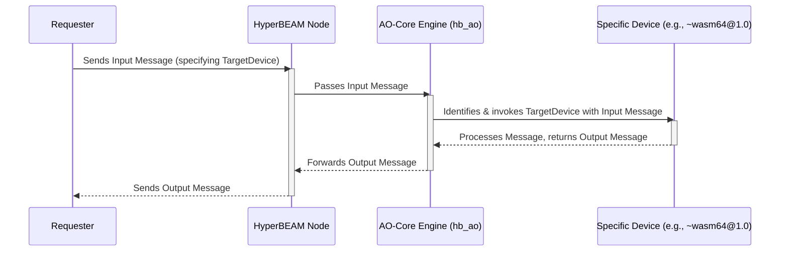

# Chapter 4: Devices

In [Chapter 3: Messages](03_messages_.md), we learned that **Messages** are the fundamental way data and instructions are packaged in HyperBEAM. They are like digital postcards carrying tasks or information. But once a [HyperBEAM Node](01_hyperbeam_node_.md) receives a Message, how does it actually *do* anything with it? If a Message contains a small program, what runs it? If a Message asks for settings, what provides them? This is where **Devices** come into play.

## What Problem Do Devices Solve?

Imagine you have a smartphone. You use it for many different things: taking photos, browsing the web, checking the weather, sending messages. Your phone doesn't have one giant program that does all of this. Instead, it has specialized applications (apps): a camera app, a web browser app, a weather app, and a messaging app. Each app is designed for a specific function.

HyperBEAM works in a similar way. A single [HyperBEAM Node](01_hyperbeam_node_.md) might need to perform many different kinds of tasks based on the [Messages](03_messages_.md) it receives. It needs specialized tools for these different jobs.

## Introducing Devices: The Node's Toolkit

**Devices** are modular components within a [HyperBEAM Node](01_hyperbeam_node_.md), each acting like a specialized tool or application designed for a specific function. They are the "engines" or "mini-programs" that process [Messages](03_messages_.md).

Think of a HyperBEAM Node as a workshop.
*   [Messages](03_messages_.md) are like job orders that come into the workshop.
*   **Devices** are the specialized tools in that workshop: a saw, a drill, a computer, a 3D printer, etc.

Each Device has its own unique logic for handling [Messages](03_messages_.md) meant for it. This "plug-and-play" nature is a core strength of HyperBEAM, making it flexible and capable of supporting many different kinds of computations and services.

As the HyperBEAM `README.md` explains:
> AO-Core provides a framework into which any number of different computational models, encapsulated as primitive `devices`, can be attached.

This means we can "plug in" new tools (Devices) to add new capabilities to our HyperBEAM node.

## Examples of Devices

HyperBEAM comes with several pre-loaded Devices. Here are a few key examples:

1.  **`~wasm64@1.0` (The Code Runner):**
    *   **Purpose:** This Device is designed to execute WebAssembly (WASM) code. WebAssembly is a way to run code written in languages like Rust, C++, or Go very efficiently.
    *   **How it works:** When a [Message](03_messages_.md) arrives containing WASM code and instructions to run it (and specifies the `~wasm64@1.0` Device), this Device takes over. It runs the code and produces a result.
    *   **Input (Simplified):** A [Message](03_messages_.md) saying, "Use `~wasm64@1.0` to run this WASM program: `[...WASM code...]` with this input: `X`."
    *   **Output (Simplified):** A new [Message](03_messages_.md) saying, "The result of running the WASM program with `X` is `Y`."

2.  **`~meta@1.0` (The Node's Control Panel):**
    *   **Purpose:** This Device manages your [HyperBEAM Node's](01_hyperbeam_node_.md) settings and provides information about the node itself.
    *   **How it works:** Remember in [Chapter 1: HyperBEAM Node](01_hyperbeam_node_.md) when we ran `curl http://localhost:10000/~meta@1.0/info`? That request was a [Message](03_messages_.md) (sent via HTTP) specifically for the `~meta@1.0` Device. This Device then gathered information about our running node and sent it back.
    *   **Input (Example):** An HTTP request (a type of [Message](03_messages_.md)) to the path `/~meta@1.0/info`.
    *   **Output (Example):** A JSON [Message](03_messages_.md) containing details like the node's version, identity, and port.
    *   **Superpower:** The `~meta@1.0` device is also responsible for configuring *which other Devices* your node will run and support!

3.  **`~scheduler@1.0` (The Task Organizer):**
    *   **Purpose:** This Device helps manage how computations are scheduled or ordered, especially for more complex, ongoing tasks called [AO Processes (`~process@1.0`)](06_ao_processes____process_1_0___.md).
    *   **How it works:** It ensures that [Messages](03_messages_.md) for a particular shared task are processed in a consistent order. (We'll learn more about this when we discuss Processes).

4.  **`message@1.0` (The Default Helper):**
    *   **Purpose:** What if a [Message](03_messages_.md) arrives that *doesn't* specify a particular Device? The `message@1.0` Device often acts as a default.
    *   **How it works:** As mentioned in the `README.md`: "If a `message` does not explicitly specify a `device`, its implied `device` is a `message@1.0`, which simply returns the binary or `message` at a given named function." This means it can help you access parts of the [Message](03_messages_.md) itself.

These are just a few examples. HyperBEAM supports many other Devices for tasks like relaying [Messages](03_messages_.md) to other nodes (`~relay@1.0`), handling JSON data (`~json@1.0`), or running Lua scripts (`~lua@5.3a`). You can find more details in the `docs/introduction/ao-devices.md` and `docs/devices/index.md` files.

## How Does a Node Know Which Device to Use?

Usually, the [Message](03_messages_.md) itself (or how it's sent to the node) contains information that directs it to the correct Device.

For example, when you make an HTTP request like `curl http://localhost:10000/~wasm64@1.0/some_function`, the `~wasm64@1.0` part of the URL is a big hint to the [HyperBEAM Node](01_hyperbeam_node_.md) that the `~wasm64@1.0` Device should handle this request. We'll dive much deeper into this URL structure, called HyperPATHs, in the [next chapter](05_http_layer___hyperpaths_.md).

The core idea is: **Message arrives -> Node identifies target Device -> Target Device processes Message.**

## Under the Hood: How Devices are Called

Let's peek at what happens when a [Message](03_messages_.md) arrives for a specific Device.

1.  **Message Arrival:** A [Message](03_messages_.md) (e.g., an HTTP request) reaches your [HyperBEAM Node](01_hyperbeam_node_.md).
2.  **Device Identification:** The node's core logic, particularly a component we'll later know as the [AO-Core Resolution Engine (`hb_ao`)](07_ao_core_resolution_engine___hb_ao___.md), examines the Message. It looks for indicators (like a specific path in a URL or a "Device" field within the Message) to determine which Device is the intended recipient.
3.  **Locating the Device Code:** The node knows where the code for each of its active Devices is located. For instance, the logic for `~wasm64@1.0` is primarily in a file called `src/dev_wasm.erl`, and for `~meta@1.0` it's in `src/dev_meta.erl`.
4.  **Execution:** The [AO-Core Resolution Engine (`hb_ao`)](07_ao_core_resolution_engine___hb_ao___.md) then "calls" or "invokes" the appropriate function within the target Device's code, passing the incoming [Message](03_messages_.md) (and potentially other relevant information) to it.
5.  **Device Processing:** The Device executes its specialized logic. For `~wasm64@1.0`, this means setting up the WebAssembly environment and running the code. For `~meta@1.0`, it means gathering node information.
6.  **Output Message:** As we learned in [Chapter 3: Messages](03_messages_.md), processing a Message always results in a new Message. The Device constructs this output Message (e.g., the result of the WASM computation or the JSON with node info).
7.  **Response:** This new output Message is then sent back to whoever sent the original Message.

Here's a simplified diagram of this flow:

The `src/hb_ao.erl` module plays a crucial role in this orchestration. Its comments state:
> This module is the root of the device call logic of the AO-Core protocol in HyperBEAM. ... `AO-Core(Message1, Message2)` leads to the evaluation of `DeviceMod:PathPart(Message1, Message2)`, which defines the user compute to be performed.

Here, `Message1` can be thought of as the current state or context, `Message2` as the incoming request/instruction, and `DeviceMod` refers to the specific Device module (like `dev_wasm` or `dev_meta`) being called. `PathPart` suggests that part of the "path" (like in a URL) helps select the exact function within the Device.

## Why Devices are a Big Deal

The concept of Devices offers several powerful advantages:

*   **Flexibility & Extensibility:** Need HyperBEAM to do something new? You can create a new Device for that specific functionality and "plug it in" without overhauling the entire system.
*   **Modularity:** Each Device is self-contained. This makes the system easier to understand, develop, and maintain. If there's an issue with how WebAssembly code runs, developers can focus on the `~wasm64@1.0` Device.
*   **Specialization:** [HyperBEAM Node](01_hyperbeam_node_.md) operators can choose which Devices to run. One node might specialize in heavy computation by running `~wasm64@1.0` and other compute-intensive Devices, while another might focus on storage or relaying messages. The `~meta@1.0` device, as mentioned in the `README.md` and `docs/misc/setting-up-selecting-devices.md`, is key to configuring these supported devices on a node.
*   **Ecosystem Growth:** The Device model encourages community contributions. Others can develop and share new Devices, expanding the capabilities of the entire AO network.

## Conclusion

Devices are the specialized workers within your [HyperBEAM Node](01_hyperbeam_node_.md). They take [Messages](03_messages_.md) as input, use their unique logic to perform specific tasks – like running code with `~wasm64@1.0` or providing node info with `~meta@1.0` – and produce new [Messages](03_messages_.md) as output. This modular, plug-and-play system is what gives HyperBEAM its power and flexibility.

You've now seen that [Messages](03_messages_.md) carry the "what" and Devices provide the "how." But how exactly do we tell a [HyperBEAM Node](01_hyperbeam_node_.md) which Device to use, especially when we're interacting with it from the outside world, like through a web browser or a `curl` command?

In the next chapter, we'll explore the [HTTP Layer & HyperPATHs](05_http_layer___hyperpaths_.md), which explain how HyperBEAM nodes listen for requests over the internet and how these requests are routed to the correct Devices using special URLs.

---

Generated by [AI Codebase Knowledge Builder](https://github.com/The-Pocket/Tutorial-Codebase-Knowledge)