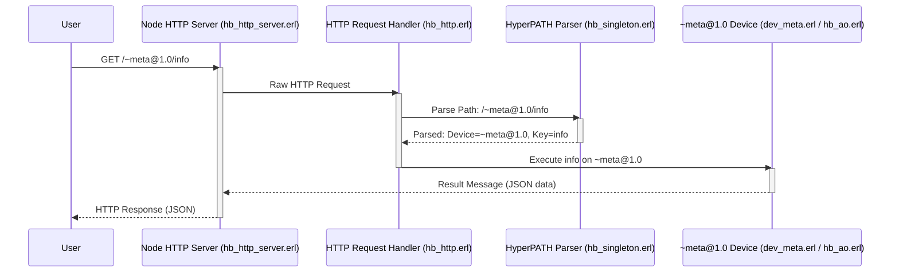

# Chapter 5: HTTP Layer & HyperPATHs

In [Chapter 4: Devices](04_devices_.md), we learned about **Devices** – the specialized tools within a [HyperBEAM Node](01_hyperbeam_node_.md) that do the actual work, like running code or managing settings. But how do we, from the outside world (like our web browser or a command line), tell our HyperBEAM Node *which* Device to use and *what* to do with it? How does our node even listen for our requests?

That's where the **HTTP Layer** and **HyperPATHs** come in!

## The Problem: Talking to Your Node from the Web

Imagine your [HyperBEAM Node](01_hyperbeam_node_.md) is running, and it has a cool [Device](04_devices_.md), say `~calculator@1.0`, that can add two numbers. You want to send it "5" and "7" and get back "12". How do you do this using standard web tools, like the `curl` command we used in [Chapter 1: HyperBEAM Node](01_hyperbeam_node_.md), or even just by typing something into your web browser's address bar?

You need two things:
1.  A way for your node to "listen" to web requests – like a mini web server. This is the **HTTP Layer**.
2.  A special kind of web address (URL) that not only points to your node but also tells it exactly which [Message](03_messages_.md) to start with (if any), which [Device](04_devices_.md) to use, and what specific function (or "key") on that [Device](04_devices_.md) to run, along with any data. These are **HyperPATHs**.

As the concept description states: "This system makes complex decentralized computations accessible through standard web tools and browsers, as if you were just browsing a website or calling a familiar web API."

## The HTTP Layer: Your Node's Public Web Address

When your [HyperBEAM Node](01_hyperbeam_node_.md) starts, it can open up a "listening post" on your computer, typically on a specific network port (like port `10000` by default). This is its **HTTP Layer**.

Think of it like this:
*   Your node runs a small, specialized web server.
*   This server listens for incoming HTTP requests – the same kind of requests your web browser makes when you visit a website.
*   This HTTP Layer acts as the public "front door" or API (Application Programming Interface) for your node.

So, when you typed `curl http://localhost:10000/...` in Chapter 1, you were talking to your node's HTTP Layer! The `http://localhost:10000` part was the address of this front door.

## HyperPATHs: The Special URLs

Now, when you send a request to your node's HTTP Layer, you can't just use any regular web URL. You need to use a **HyperPATH**.

**HyperPATHs** are special URLs that are much more than just web addresses. They are powerful instructions that tell the [HyperBEAM Node](01_hyperbeam_node_.md) exactly:
*   What [Message](03_messages_.md) to start with (often a unique ID, but sometimes the request itself is the starting point).
*   Which [Device](04_devices_.md) to use for the computation.
*   What specific function or "key" on that [Device](04_devices_.md) to execute.
*   Any input data (parameters) needed for that function.

Let's break down the structure of a HyperPATH. It looks like a normal URL, but its components have special meanings in HyperBEAM.

A general HyperPATH might look like:
`http://<node_address>:<port>/<InitialMessage_OR_Device>/<Key1>/<Key2>...?param1=value1`

1.  **Node Address & Port:** `http://localhost:10000`
    *   This is the standard web address of your HyperBEAM node's HTTP Layer.

2.  **Path Segment 1: Initial [Message](03_messages_.md) ID or [Device](04_devices_.md) Identifier**
    *   This is the first part after the `/`.
    *   It can be a 43-character unique ID (a "Hashpath") representing an existing [Message](03_messages_.md) to act upon.
    *   Or, importantly, it can directly specify a [Device](04_devices_.md) using a tilde `~`, like `~meta@1.0`. If a [Device](04_devices_.md) is specified here, the request itself is considered the base [Message](03_messages_.md).

3.  **Subsequent Path Segments: Keys / Functions**
    *   Parts like `/info` or `/add`.
    *   These tell the chosen [Device](04_devices_.md) (or the [Device](04_devices_.md) acting on the initial [Message](03_messages_.md)) which specific operation (function or "key") to perform. Each key is applied to the result of the previous one, forming a chain.

4.  **Device Specifier in Path (Advanced):**
    *   You can also specify or change the [Device](04_devices_.md) for a particular step in the path using `~DeviceName@Version`, for example: `/<MessageID>~process@1.0/now`. Here, `~process@1.0` is the [Device](04_devices_.md) to use on the [Message](03_messages_.md) identified by `<MessageID>`.

5.  **Query Parameters: Input Data**
    *   Anything after a `?`, like `?name=Alice&age+integer=30`.
    *   These provide input values to the [Device](04_devices_.md) and its function.
    *   Notice `age+integer=30`. HyperPATHs support **type casting**, where `+integer` tells HyperBEAM to treat `30` as a number, not just text. Other types include `+list`, `+map`, etc. (This is detailed in `docs/introduction/pathing-in-ao-core.md`).

## Revisiting Our First `curl` Command

Remember this from [Chapter 1: HyperBEAM Node](01_hyperbeam_node_.md)?
```bash
curl http://localhost:10000/~meta@1.0/info
```
Let's break this HyperPATH down:
*   `http://localhost:10000/`: This is your node's HTTP Layer address.
*   `~meta@1.0`: This is the first path segment. The `~` tells HyperBEAM this is a direct [Device](04_devices_.md) specification. So, we're targeting the `~meta@1.0` [Device](04_devices_.md) (the node's control panel).
*   `/info`: This is the second path segment. It's a "key" or "function" that the `~meta@1.0` [Device](04_devices_.md) understands. It means "give me information about the node."

So, this HyperPATH is an instruction: "Hey HyperBEAM node, use your `~meta@1.0` [Device](04_devices_.md) and call its `info` function." And the node responds with a JSON [Message](03_messages_.md) containing its details.

## Example: A Hypothetical Greeter Device

Let's imagine we have a [Device](04_devices_.md) called `~greeter@1.0` installed on our node. This [Device](04_devices_.md) has a function (a "key") called `sayHello` that takes one piece of input: a `name`.

To make it say "Hello, HyperBEAMFan!", we could use `curl` with the following HyperPATH:

```bash
curl "http://localhost:10000/~greeter@1.0/sayHello?name=HyperBEAMFan"
```

Let's dissect this HyperPATH:
*   `http://localhost:10000/`: Our node's address.
*   `~greeter@1.0`: We're telling the node to use the `~greeter@1.0` [Device](04_devices_.md).
*   `/sayHello`: We're telling the `~greeter@1.0` [Device](04_devices_.md) to execute its `sayHello` function/key.
*   `?name=HyperBEAMFan`: We're providing input. The `sayHello` function will receive `name` with the value `"HyperBEAMFan"`.

**Expected Output:**
If our `~greeter@1.0` [Device](04_devices_.md) is set up to return a simple text message, we might see:
```
Hello, HyperBEAMFan!
```
Or it might return a JSON [Message](03_messages_.md):
```json
{
  "greeting": "Hello, HyperBEAMFan!"
}
```
The exact output format depends on how the `~greeter@1.0` [Device](04_devices_.md) is programmed. The key is that the HyperPATH successfully delivered the instruction and data!

## Under the Hood: How a HyperPATH Request is Processed

What happens inside your [HyperBEAM Node](01_hyperbeam_node_.md) when it receives a HyperPATH request like `curl http://localhost:10000/~meta@1.0/info`?

Here's a simplified step-by-step:

1.  **Listening Post (HTTP Server):** Your node's HTTP Layer, managed by code in `hb_http_server.erl`, is constantly listening on the configured port (e.g., 10000). When your `curl` command sends the HTTP request, this server picks it up.
    *   The `init/2` function in [`hb_http_server.erl`](docs/resources/source-code/hb_http_server.md) is often the first entry point for an incoming HTTP connection.

2.  **HTTP to Internal [Message](03_messages_.md):** The raw HTTP request (the URL path `/~meta@1.0/info`, method `GET`, headers, etc.) needs to be translated into a format HyperBEAM's core logic understands. This is handled by code in `hb_http.erl`. It packages the request details into a structured internal [Message](03_messages_.md) (specifically, a "TABM Singleton").
    *   The function `req_to_tabm_singleton/3` in [`hb_http.erl`](docs/resources/source-code/hb_http.md) is responsible for this conversion.

3.  **Decoding the HyperPATH (Parsing):** Now that the request is an internal [Message](03_messages_.md), the HyperPATH itself (`/~meta@1.0/info`) needs to be carefully parsed to understand the instructions. This is where `hb_singleton.erl` comes in. It's like HyperBEAM's URL instruction decoder.
    *   It looks at `~meta@1.0` and knows the target is the `~meta@1.0` [Device](04_devices_.md).
    *   It sees `/info` and identifies `info` as the key/function.
    *   If there were query parameters like `?name=HyperBEAMFan`, it would extract those too, paying attention to type hints like `+integer`.
    *   The `from/1` function in [`hb_singleton.erl`](docs/resources/source-code/hb_singleton.md) orchestrates this parsing, breaking the path into a sequence of operations.

4.  **Calling the [Device](04_devices_.md):** The `~meta@1.0` [Device](04_devices_.md) (whose code is mainly in `dev_meta.erl`) is then invoked by the system. It receives the parsed instructions (target key: `info`). `dev_meta.erl` might handle some requests itself or pass them through the [AO-Core Resolution Engine (`hb_ao`)](07_ao_core_resolution_engine___hb_ao___.md) for more general processing. The engine ensures the correct function within the `~meta@1.0` [Device](04_devices_.md) is called.

5.  **[Device](04_devices_.md) Does Its Work:** The `~meta@1.0` [Device](04_devices_.md) executes its `info` logic, gathering details about the running node.

6.  **Result [Message](03_messages_.md) to HTTP Response:** The `~meta@1.0` [Device](04_devices_.md) produces a result – in this case, a [Message](03_messages_.md) containing the node's information in JSON format. This result [Message](03_messages_.md) is handed back to `hb_http.erl`.
    *   The `reply/4` function in [`hb_http.erl`](docs/resources/source-code/hb_http.md) takes this result [Message](03_messages_.md) and transforms it into a proper HTTP response that `curl` (or your browser) can understand (e.g., setting the `Content-Type` header to `application/json` and putting the JSON data in the response body).

7.  **Response Sent:** The HTTP server (`hb_http_server.erl`) sends this HTTP response back to your `curl` command, which then displays it in your terminal.

Let's visualize this:


The details of HyperPATH syntax can be quite rich, allowing for complex interactions. You can find more in-depth information in the `docs/misc/ao-http-api.md` and `docs/introduction/pathing-in-ao-core.md` files within the HyperBEAM project. For now, understanding the basic structure `/<Device_or_ID>/<Key>?params` is a great start!

## Why HyperPATHs Are So Useful

*   **Web Accessibility:** They make complex decentralized computations feel like using a regular website or web API. You can use tools you already know, like `curl` or your web browser.
*   **Standardization:** They provide a common way to "talk" to any [Device](04_devices_.md) on any [HyperBEAM Node](01_hyperbeam_node_.md).
*   **Composability:** The output of one HyperPATH interaction can conceptually be used as an input to another, allowing you to chain operations. (This is more advanced, but the design supports it).
*   **Clarity:** They clearly express the target, the action, and the data in a single, human-readable (and machine-readable) string.

## Conclusion

The **HTTP Layer** turns your [HyperBEAM Node](01_hyperbeam_node_.md) into a responsive participant on the web, listening for your commands. **HyperPATHs** are the special "URLs" you use to send those commands, precisely telling your node which [Device](04_devices_.md) to use, what function to run, and what data to use. This powerful combination makes interacting with decentralized services surprisingly straightforward.

You've now seen how [Messages](03_messages_.md) carry data, [Devices](04_devices_.md) perform actions, and HyperPATHs let you trigger these actions from the outside. What if you want to create more complex, ongoing applications that multiple users can interact with over time, where the state is shared and evolves? For that, we need another powerful concept.

In the next chapter, we'll explore [AO Processes (`~process@1.0`)](06_ao_processes____process_1_0___.md), which are like long-running, stateful applications built on the AO network, often interacted with using these very HyperPATHs!

---

Generated by [AI Codebase Knowledge Builder](https://github.com/The-Pocket/Tutorial-Codebase-Knowledge)