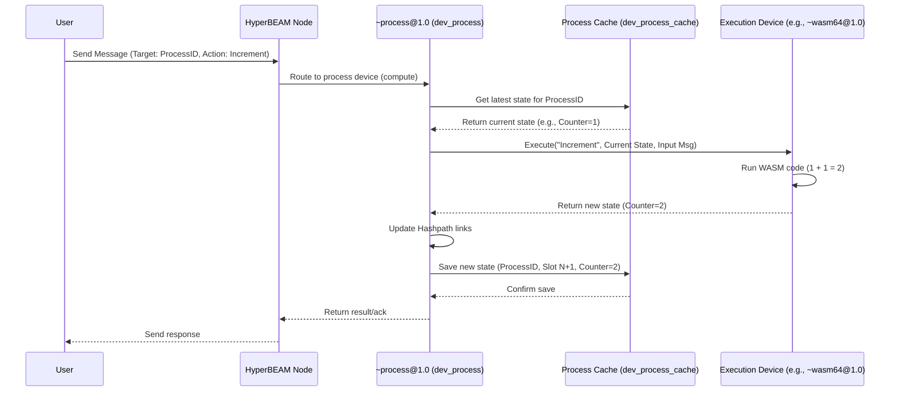

# Chapter 5: Process

In [Chapter 4: Device](04_device_.md), we learned about Devices – the specialized tools a [HyperBEAM Node](03_hyperbeam_node_.md) uses to perform different tasks, like running calculations or managing configurations. Devices handle individual [Message](01_message_.md)s.

But what if we want to build something more like a traditional application or a service? Something that remembers information over time (has *state*) and can be used by many different people, all interacting with the *same* instance? Think of a shared whiteboard where anyone can draw, or a simple counter that anyone can increment.

This is where the concept of a **Process** comes in.

## What Problem Does a Process Solve? Building Shared, Stateful Apps

Imagine you want to build a very simple application on AO: a **Shared Counter**. Anyone should be able to send a message to increment the counter, and anyone should be able to send a message to see its current value.

*   If Alice sends "increment", the counter goes from 0 to 1.
*   If Bob then sends "increment", the counter goes from 1 to 2.
*   If Carol then asks "what's the value?", she should get back 2.

How do we build this? A single [Message](01_message_.md) and [Device](04_device_.md) interaction isn't enough. Each interaction is usually independent. We need a way to:

1.  **Persist State:** Remember the counter's value (0, then 1, then 2) between messages.
2.  **Share Execution:** Ensure Alice, Bob, and Carol are all interacting with the *same* counter, not separate copies.

This is exactly what Processes enable.

## What is a Process? A Running Application Instance

Think of a **Process** in HyperBEAM as a running application or a smart contract instance on the AO network. It's a persistent, shared execution environment.

Key characteristics:

*   **Persistent:** It maintains its own state over time. When you send it a message, it performs a computation, updates its state, and remembers that new state for the next message.
*   **Shared:** Multiple users can send messages to the *same* Process instance. Everyone interacts with the same underlying state.
*   **Identifiable:** Each Process has a unique ID (like a web address or a contract address) that you use to send messages to it.
*   **Managed by a Device:** The lifecycle and coordination of Processes are handled by a specific [Device](04_device_.md) called `~process@1.0`.

*Analogy:* Think of a Google Doc. It's persistent (it saves your changes), it's shared (multiple people can edit the *same* document), and it has a unique URL (its identifier). The `~process@1.0` device is like the Google Docs service managing all these documents.

## How Processes Work: Messages, State, and Hashpaths

1.  **Creation:** You start by creating a Process. This involves sending a specific [Message](01_message_.md) that defines the Process, including what code it should run (e.g., using the [WASM Execution (BEAMR)](06_wasm_execution__beamr__.md) device) and potentially which scheduling mechanism it uses. This creation message results in a unique Process ID.
2.  **Interaction:** Users send [Message](01_message_.md)s to the Process ID.
3.  **Execution:** The `~process@1.0` [Device](04_device_.md) receives the message. It retrieves the *current state* of the Process. It then uses the Process's defined execution logic (e.g., the WASM code) to process the incoming message using the current state.
4.  **New State:** The execution results in a *new state* for the Process.
5.  **Linking:** Critically, this new state is cryptographically linked to the previous state and the incoming message using [Hashpath](07_hashpath_.md)s. This creates a verifiable history of all interactions.
6.  **Persistence:** The new state is saved (often in the node's [Storage & Cache](08_storage___cache_.md)), ready for the next incoming message.

```mermaid
graph LR
    A[State 0 (Counter=0)] -- Message 1 (Increment) --> B(Compute);
    B --> C[State 1 (Counter=1)];
    C -- Message 2 (Increment) --> D(Compute);
    D --> E[State 2 (Counter=2)];
    E -- Message 3 (Read Value) --> F(Compute);
    F --> G[Result: 2];
    G --> E; %% Read doesn't change state

    style A fill:#f9f
    style C fill:#f9f
    style E fill:#f9f
```

Each message triggers a computation that transitions the Process from one state to the next, forming a chain linked by [Hashpath](07_hashpath_.md)s.

## Solving the Use Case: The Shared Counter

Let's see how we'd build our Shared Counter using a Process.

**1. Define the Process (Conceptual)**

We'd send a message to create the Process. This message tells AO: "Create a new Process using the `~process@1.0` device. Its execution logic will be handled by the `~wasm64@1.0` [Device](04_device_.md), using this specific WASM code (which knows how to handle 'increment' and 'read' commands and store a counter value)."

(Simplified conceptual definition message):

```json
{
  "Device": "~process@1.0", // Use the process manager device
  "Path": "/init",           // Initialize a new process
  "Execution-Device": "~wasm64@1.0", // Use WASM for logic
  "Wasm-Image-ID": "CounterWasmCodeID", // ID of our counter code
  "Initial-State": { "counter": 0 } // Start the counter at 0
}
```

This would return a unique `ProcessID` (e.g., `MySharedCounterProcessID`).

**2. Alice Increments the Counter**

Alice sends a message *to the ProcessID*:

```json
{
  "Target": "MySharedCounterProcessID", // The Process to talk to
  "Action": "Increment"                 // Command for the WASM code
  // Maybe authentication tags...
}
```

The `~process@1.0` device finds the Process, gets its current state (`{counter: 0}`), runs the WASM code's "Increment" logic, gets the new state (`{counter: 1}`), saves it, and links it via [Hashpath](07_hashpath_.md).

**3. Bob Increments the Counter**

Bob sends a similar message:

```json
{
  "Target": "MySharedCounterProcessID",
  "Action": "Increment"
}
```

The `~process@1.0` device finds the Process, gets its *latest* state (`{counter: 1}`), runs the WASM code's "Increment" logic, gets the new state (`{counter: 2}`), saves it, and links it.

**4. Carol Reads the Counter**

Carol sends a message to read the value:

```json
{
  "Target": "MySharedCounterProcessID",
  "Action": "ReadValue"
}
```

The `~process@1.0` device finds the Process, gets its latest state (`{counter: 2}`), runs the WASM code's "ReadValue" logic, which simply returns the current counter value. This usually doesn't change the state. The device returns the value (e.g., 2) to Carol.

Now, multiple users have interacted with the same persistent state, all managed by the Process.

## Under the Hood: How `~process@1.0` Manages Things

When a [HyperBEAM Node](03_hyperbeam_node_.md) receives a message targeting a Process ID, here's a simplified flow involving the `~process@1.0` device (implemented mainly in `src/dev_process.erl`):

**Walkthrough:**

1.  **Message Arrival:** A message (like Alice's "Increment") arrives at the node, targeting `MySharedCounterProcessID`.
2.  **Routing:** The node's core logic recognizes the target is likely a Process ID (it might not know *for sure* yet). Often, messages intended for processes are explicitly sent to the `~process@1.0` device initially, perhaps via a path like `/MySharedCounterProcessID/compute`.
3.  **Device Invocation:** The request is routed to the `dev_process.erl` module (implementing `~process@1.0`). Let's say the `compute` function is called.
4.  **Process Lookup:** `dev_process.erl` uses the Process ID (`MySharedCounterProcessID`) to find the Process definition (which specified using `~wasm64@1.0` for execution).
5.  **State Retrieval:** `dev_process.erl` needs the *current* state. It interacts with the process cache (`src/dev_process_cache.erl`) to find the latest saved state for this Process ID. If the state isn't in active memory, the cache might load it from persistent [Storage & Cache](08_storage___cache_.md). If this is the very first message, it might use the `Initial-State`.
6.  **Delegation:** `dev_process.erl` prepares to run the actual logic. It takes the current state and the incoming message ("Increment"). It then calls the appropriate function on the designated *execution* device (`~wasm64@1.0` in our case), effectively saying: "Run your logic using this state and this input message."
7.  **Execution:** The `~wasm64@1.0` device (using [WASM Execution (BEAMR)](06_wasm_execution__beamr__.md)) executes the counter's WASM code ("Increment" function). The WASM code reads the state (`{counter: 1}`), calculates the new value (2), and produces the new state (`{counter: 2}`).
8.  **Result Handling:** The `~wasm64@1.0` device returns the new state (`{counter: 2}`) back to `dev_process.erl`.
9.  **Linking & Caching:** `dev_process.erl` takes the new state. It updates the [Hashpath](07_hashpath_.md) to link this state transition. It then tells the process cache (`dev_process_cache.erl`) to save this new state, associating it with the Process ID and the current interaction step (often called a "slot" or sequence number).
10. **Response:** `dev_process.erl` might return the new state or a specific result message back to the original caller (Alice).

**Sequence Diagram:**



**Code Snippets (Simplified Concepts):**

*   **`src/dev_process.erl` - The Router/Manager:** This module handles incoming messages for processes. Its `compute` function is central.

    ```erlang
    %% Simplified Concept: src/dev_process.erl compute/3
    compute(ProcessMsg, InputMsg, Opts) ->
        ProcID = get_process_id(ProcessMsg),
        TargetSlot = get_target_slot(InputMsg),

        % 1. Try reading the target state directly from cache
        case dev_process_cache:read(ProcID, TargetSlot, Opts) of
            {ok, CachedResult} ->
                {ok, CachedResult}; % Found it! Return cached state.
            not_found ->
                % 2. Need to compute it. Load the *latest known* state.
                {ok, CurrentState, CurrentSlot} = load_latest_state_or_init(ProcID, Opts),

                % 3. Loop: Compute step-by-step from CurrentSlot up to TargetSlot
                compute_loop(ProcID, CurrentState, CurrentSlot, TargetSlot, Opts)
        end.

    %% Simplified Concept: compute_loop (called by compute/3)
    compute_loop(ProcID, CurrentState, CurrentSlot, TargetSlot, Opts) ->
        if CurrentSlot == TargetSlot ->
            {ok, CurrentState}; % Reached target!
        true ->
            % Get next input from scheduler for slot (CurrentSlot + 1)
            {ok, NextInputMsg, StateAfterSchedule} = get_next_scheduled_input(CurrentState),

            % Delegate execution to the process's designated Execution-Device
            {ok, NewStateRaw} = run_as(<<"execution">>, StateAfterSchedule, NextInputMsg, Opts),

            % Update internal slot counter
            NewState = set_slot(NewStateRaw, CurrentSlot + 1),

            % Save the new state to the cache
            store_result(ProcID, CurrentSlot + 1, NewState, Opts),

            % Continue the loop
            compute_loop(ProcID, NewState, CurrentSlot + 1, TargetSlot, Opts)
        end.

    %% Simplified Concept: run_as (called by compute_loop)
    %% Temporarily sets the 'Device' tag to the execution device and calls hb_ao:resolve
    run_as(ExecutionKey, ProcessState, InputMsg, Opts) ->
        ExecutionDevice = get_execution_device(ProcessState, Opts),
        % Prepare msg with ExecutionDevice set as the active device
        TempState = set_device(ProcessState, ExecutionDevice),
        % Call the main AO computation logic
        Result = hb_ao:resolve(TempState, InputMsg, Opts),
        % (Maybe restore original device tag before returning)
        Result.
    ```
    This shows how `dev_process` orchestrates computation: checking the cache, loading state, looping through computation steps, delegating to the execution device (`run_as`), and storing results.

*   **`src/dev_process_cache.erl` - State Persistence:** This module handles saving and loading process states.

    ```erlang
    %% Simplified Concept: src/dev_process_cache.erl write/4
    write(ProcID, Slot, StateMsg, Opts) ->
        % Calculate the storage path (e.g., /computed/ProcessID/slot/SlotNumber)
        StoragePath = path(ProcID, Slot, Opts),
        % Write the state message to the underlying cache/store
        hb_cache:write(StateMsg, StoragePath, Opts).

    %% Simplified Concept: src/dev_process_cache.erl read/3
    read(ProcID, SlotRef, Opts) ->
        % Calculate the storage path (e.g., /computed/ProcessID/slot/SlotNumber)
        StoragePath = path(ProcID, SlotRef, Opts),
        % Read from the underlying cache/store
        hb_cache:read(StoragePath, Opts).

    %% Simplified Concept: src/dev_process_cache.erl latest/4
    %% Finds the highest slot number saved for a process (maybe with constraints)
    latest(ProcID, RequiredPath, Limit, Opts) ->
        % List saved slots for the process
        AllSlots = hb_cache:list_numbered(path(ProcID, slot_root, Opts), Opts),
        % Filter slots <= Limit
        FilteredSlots = filter(AllSlots, Limit),
        % Find the highest slot in FilteredSlots that has the RequiredPath
        find_best_slot(ProcID, RequiredPath, reverse(sort(FilteredSlots)), Opts).
    ```
    This shows the cache module providing simple functions to `write`, `read`, and find the `latest` saved state for a given Process ID and slot number/reference.

*   **`src/dev_process_worker.erl` - Optional Optimization:** For frequently used processes, a node might keep the process state loaded in memory using a dedicated Erlang process (managed by `dev_process_worker.erl`) instead of constantly loading/saving from the cache. This is an optimization we won't detail here, but it helps speed things up.

## Conclusion

You've learned that a **Process** is a fundamental concept in HyperBEAM and AO for building stateful, shared applications.

Key takeaways:

*   Processes are like running application instances or smart contracts.
*   They have persistent state that updates with each interaction.
*   Multiple users can interact with the same Process instance via its unique ID.
*   The `~process@1.0` [Device](04_device_.md) (implemented in `dev_process.erl`) manages process execution, state transitions, and caching (`dev_process_cache.erl`).
*   Each state transition is linked via [Hashpath](07_hashpath_.md)s, creating a verifiable history.
*   Processes often delegate their core logic to other devices, commonly the [WASM Execution (BEAMR)](06_wasm_execution__beamr__.md) device.

Processes are the building blocks for creating complex, interactive services on AO. Now that we understand how Processes manage stateful execution, let's dive deeper into how one of the most common execution devices works.

Next up: [Chapter 6: WASM Execution (BEAMR)](06_wasm_execution__beamr__.md)

---

Generated by [AI Codebase Knowledge Builder](https://github.com/The-Pocket/Tutorial-Codebase-Knowledge)