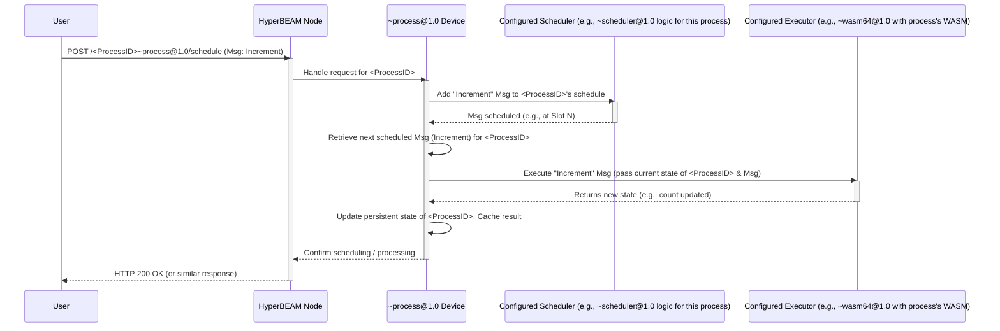

# Chapter 6: AO Processes (`~process@1.0`)

In [Chapter 5: HTTP Layer & HyperPATHs](05_http_layer___hyperpaths_.md), we saw how we can use web-like addresses (HyperPATHs) to send instructions and data to specific [Devices](04_devices_.md) on our [HyperBEAM Node](01_hyperbeam_node_.md). This is great for one-off tasks or getting information. But what if we want to build something more like an application – a program that remembers things over time (has "state") and that many people can interact with?

Imagine you want to create a shared digital guestbook where anyone can leave a message, and everyone can see all the messages left so far. Or a simple online game where players' scores are saved and updated. These applications need a persistent "backend" that stores data and runs logic. How do we build such things in the decentralized world of AO?

This is where **AO Processes** come in!

## What Are AO Processes? Your Own Mini-Servers on AO

**AO Processes** are persistent, shared computational environments within the AO network. You can think of them as individual, long-running applications or stateful services. They are somewhat similar to "smart contracts" you might have heard about in other blockchain systems, but they are generally more flexible in AO.

Here's what makes an AO Process special:

*   **It's like a mini-server:** Each Process runs independently, like its own little server dedicated to a specific task or application (like our guestbook).
*   **Persistent:** It "lives" on the network and remembers its data (its "state") even if you disconnect. When you interact with it again, it picks up where it left off.
*   **Shared:** Multiple users or other programs can send [Messages](03_messages_.md) to the same Process to interact with it.
*   **Unique ID:** Every Process has its own unique address, like a personal web address, so you know exactly which one you're talking to.
*   **Internal State:** It maintains its own private data. For our guestbook, this would be the list of all messages. For a game, it might be player scores.
*   **Message-Driven:** All interactions with a Process happen by sending [Messages](03_messages_.md) to its unique ID. These [Messages](03_messages_.md) might tell it to update its state (e.g., "add this new entry to the guestbook") or to provide some data (e.g., "show me all guestbook entries").
*   **Defined Logic:** The behavior of a Process – what it does when it receives a [Message](03_messages_.md) – is defined by code, often written in WebAssembly (WASM) or Lua.

The primary [Device](04_devices_.md) responsible for managing and orchestrating these Processes is called `~process@1.0`.

## The Core Idea: Defining and Interacting with a Process

Think of creating and using an AO Process in two main stages:

1.  **Defining the Process:**
    *   You first create a special "Process Definition [Message](03_messages_.md)". This [Message](03_messages_.md) is like a blueprint.
    *   It tells the `~process@1.0` [Device](04_devices_.md) how this new Process should work. For example, it might specify:
        *   "This Process will use that specific WASM program over there to handle its logic."
        *   "This Process will use this particular [Device](04_devices_.md) to decide the order of incoming messages."
    *   When you send this definition [Message](03_messages_.md) to a [HyperBEAM Node](01_hyperbeam_node_.md), the `~process@1.0` [Device](04_devices_.md) uses it to "spawn" (create) your new Process. The node then gives you back a unique **Process ID**. This ID is now the address for your new application.

2.  **Interacting with the Process:**
    *   Once your Process is live and has an ID, anyone can interact with it by sending [Messages](03_messages_.md) to that Process ID.
    *   These [Messages](03_messages_.md) are typically instructions like "add this item," "calculate this," or "get current value."
    *   The `~process@1.0` [Device](04_devices_.md) ensures these [Messages](03_messages_.md) are delivered to your Process.
    *   Your Process's defined logic (e.g., your WASM code) runs, processes the [Message](03_messages_.md), potentially updates its internal state, and can optionally send back a reply [Message](03_messages_.md).

## Use Case: A Simple Shared Counter

Let's imagine we want to create a very simple AO Process: a **Shared Counter**.
*   Anyone can send a [Message](03_messages_.md) to tell it to "increment."
*   Anyone can send a [Message](03_messages_.md) to ask for the "current count."

Here's how we'd conceptually do this:

1.  **Define the Counter's Logic (e.g., as WASM):**
    First, we'd need a small piece of code (let's say a WebAssembly module) that knows how to:
    *   Store a number (the count).
    *   Increment that number when asked.
    *   Return the current number when asked.
    This WASM module would be uploaded to Arweave, giving it its own unique Arweave Transaction ID (let's call this `WASM_CODE_ID`).

2.  **Define the Counter Process:**
    Next, we'd craft a Process Definition [Message](03_messages_.md). Conceptually, it would say:

    ```text
    // This is a conceptual representation of the Process Definition Message
    // (Actual format is a structured Erlang map or similar)
    Device: process@1.0             // Use the process device
    Execution-Device: wasm64@1.0     // Use WASM for logic
    WASM-Image: WASM_CODE_ID         // Here's the WASM code to use
    Scheduler-Device: scheduler@1.0  // Use the standard scheduler
    // ... other configurations ...
    ```
    This definition tells HyperBEAM: "Create a new Process. It will use the `~process@1.0` [Device](04_devices_.md) to manage itself. Its core logic will be run by the `~wasm64@1.0` [Device](04_devices_.md), using the WASM code found at `WASM_CODE_ID`. Use the standard `~scheduler@1.0` [Device](04_devices_.md) to handle incoming messages."

3.  **Spawn the Process:**
    We'd send this definition [Message](03_messages_.md) to our [HyperBEAM Node](01_hyperbeam_node_.md) (e.g., by POSTing it to a special endpoint, or using a tool like `aos`). The node processes this, and our `~process@1.0` [Device](04_devices_.md) creates the Counter Process. We get back a unique ID for our new counter, let's say `MyCounterProcessID`.

4.  **Interact with the Counter:**
    Now anyone can use `MyCounterProcessID` to interact with our counter using HyperPATHs, similar to what we saw in [Chapter 5: HTTP Layer & HyperPATHs](05_http_layer___hyperpaths_.md).

    *   **To tell the counter to increment:**
        We need to send a [Message](03_messages_.md) to its "inbox" (schedule). The [Message](03_messages_.md) itself would instruct the WASM code to perform the "increment" action.

        ```bash
        # We send a POST request. The body of the request is the Message for the counter.
        # The exact format of this Message depends on what our WASM_CODE_ID expects.
        # Let's assume it expects a JSON message with an "Action" field.
        curl -X POST \
             -H "Content-Type: application/json" \
             -d '{"Action": "Increment"}' \
             http://your-node-address:10000/MyCounterProcessID~process@1.0/schedule
        ```
        *   `http://your-node-address:10000/`: Our HyperBEAM node.
        *   `MyCounterProcessID`: The ID of our specific counter process.
        *   `~process@1.0`: We're interacting via the `~process@1.0` [Device](04_devices_.md).
        *   `/schedule`: This "key" tells the `~process@1.0` [Device](04_devices_.md) to add the [Message](03_messages_.md) from our `-d` payload into the counter's incoming message queue.
        *   `-d '{"Action": "Increment"}'`: This is the actual [Message](03_messages_.md) being sent to the counter process. Our WASM code inside the process will receive this.

    *   **To get the current count:**
        We want to read the latest state or result from the process.

        ```bash
        curl http://your-node-address:10000/MyCounterProcessID~process@1.0/now
        ```
        *   `/now`: This "key" tells the `~process@1.0` [Device](04_devices_.md) to compute the process up to its latest scheduled message and return the "result" part of its state.
        *   The output might be a JSON message like `{"Count": 5}` if our WASM code is designed to output the count this way.

Each time we send an "Increment" message, the counter process receives it, its WASM logic runs, its internal count goes up, and this new count is saved as part of its state.

## Under the Hood: How `~process@1.0` Manages It All

The `~process@1.0` [Device](04_devices_.md) is like a sophisticated manager or orchestrator for your Process. It doesn't typically run the application logic (like counting) itself. Instead, it delegates tasks based on the Process Definition.

Let's simplify what happens when the "Increment" [Message](03_messages_.md) arrives for `MyCounterProcessID`:

1.  **Request Arrives:** Your `curl` command sends the HTTP POST request to `/MyCounterProcessID~process@1.0/schedule` with the `{"Action": "Increment"}` [Message](03_messages_.md) in its body.
2.  **`~process@1.0` Takes Over:** The [HyperBEAM Node](01_hyperbeam_node_.md) routes this to the `~process@1.0` [Device](04_devices_.md) because the HyperPATH specifies it. The `~process@1.0` [Device](04_devices_.md) knows this request is for the process `MyCounterProcessID`.
3.  **Consults Definition & Schedules:** It looks up the definition for `MyCounterProcessID`. It sees that the `Scheduler-Device` is `scheduler@1.0`. So, it uses the `~scheduler@1.0` [Device](04_devices_.md) (or rather, invokes the scheduling logic defined *for this process*) to add our `{"Action": "Increment"}` [Message](03_messages_.md) to `MyCounterProcessID`'s queue of pending messages. This might assign it a slot number, say "Slot 5".
4.  **Execution Time:** When it's time to process "Slot 5" (this could be immediate or later depending on network activity and scheduler logic):
    *   The `~process@1.0` [Device](04_devices_.md) retrieves the `{"Action": "Increment"}` [Message](03_messages_.md).
    *   It again consults the definition for `MyCounterProcessID` and sees the `Execution-Device` is `wasm64@1.0` and the `WASM-Image` is `WASM_CODE_ID`.
    *   It fetches the current state of `MyCounterProcessID` (e.g., the count is 4).
    *   It then effectively tells the `~wasm64@1.0` [Device](04_devices_.md): "Run the `WASM_CODE_ID` program. Give it the current state (count=4) and this new message (`{"Action": "Increment"}`)."
5.  **Logic Runs:** The `~wasm64@1.0` [Device](04_devices_.md) executes our counter WASM code. The WASM code sees the "Increment" action, adds 1 to 4, resulting in 5. It outputs this new state (count=5).
6.  **State Update & Caching:**
    *   The `~process@1.0` [Device](04_devices_.md) receives the new state (count=5) from the `~wasm64@1.0` [Device](04_devices_.md).
    *   It updates the persistent state for `MyCounterProcessID` to reflect that the count is now 5.
    *   It also caches this result. This is important! If someone immediately asks for the current count (`/now`), the system can often return the cached result quickly without re-running everything. (`dev_process_cache.erl` is involved here).

Here's a visual summary:



**Key Code Modules Involved:**

*   `dev_process.erl`: This is the heart of the `~process@1.0` [Device](04_devices_.md). Its main job, as described in its source code documentation (`docs/resources/source-code/dev_process.md`), is "routing' requests for different functionality (scheduling, computing, and pushing messages) to the appropriate device." It uses a function called `run_as/4` to temporarily "become" the scheduler or executor device to perform those specific tasks for the process.
*   `dev_process_cache.erl`: As per `docs/resources/source-code/dev_process_cache.md`, this module helps "read the result of a process at a given slot or message ID" and write results to the cache. This avoids costly re-computation.
*   `dev_process_worker.erl`: For processes that are actively being used, this module (`docs/resources/source-code/dev_process_worker.md`) helps manage their state in memory for faster access: "A long-lived process worker that keeps state in memory between calls."

## Why Are AO Processes So Powerful?

*   **Stateful Applications:** They let you build decentralized applications that have memory and evolve over time, just like traditional web applications.
*   **Shared Digital Spaces:** Multiple users and programs can interact with the same Process, leading to collaborative applications or shared utilities.
*   **Composability (Building Bigger Things):** One AO Process can send [Messages](03_messages_.md) to another AO Process! This means you can build complex systems by combining smaller, specialized Processes. The `~process@1.0` [Device](04_devices_.md) even has a `push` key to facilitate sending messages from one process's "outbox" to another process's schedule (see `docs/devices/process-at-1-0.md`).
*   **Unmatched Flexibility:** You define the execution logic (WASM, Lua, etc.) and can even customize scheduling. This is far more flexible than many traditional smart contract platforms.

## Conclusion

AO Processes, managed by the `~process@1.0` [Device](04_devices_.md), are the cornerstone for building dynamic, stateful, and interactive decentralized applications on the AO network. They provide persistent, shared computational environments that remember their state and react to incoming [Messages](03_messages_.md) according to your defined logic. Think of them as your personal, programmable mini-servers living on the decentralized web!

We've now seen how [Messages](03_messages_.md) carry data, [Devices](04_devices_.md) perform specific actions, HyperPATHs allow us to call them from the web, and AO Processes let us build persistent applications. But how does a [HyperBEAM Node](01_hyperbeam_node_.md) actually make sense of an incoming HyperPATH request and ensure that the correct [Device's](04_devices_.md) code or the correct Process's logic gets executed with the right data?

In the next chapter, we'll delve into the "brain" of this operation: the [AO-Core Resolution Engine (`hb_ao`)](07_ao_core_resolution_engine___hb_ao___.md). This engine is responsible for interpreting these requests and orchestrating the actual computations.

---

Generated by [AI Codebase Knowledge Builder](https://github.com/The-Pocket/Tutorial-Codebase-Knowledge)