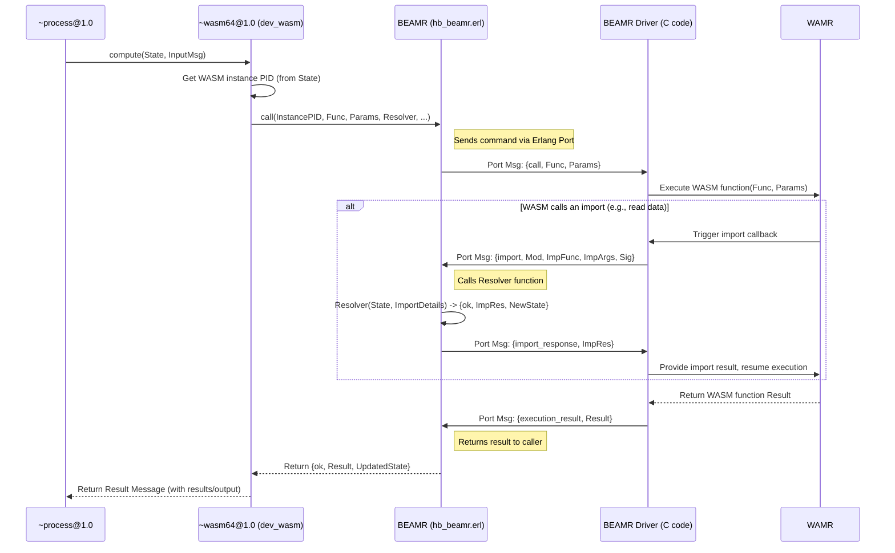

# Chapter 6: WASM Execution (BEAMR)

In [Chapter 5: Process](05_process_.md), we learned how Processes allow us to build stateful, shared applications like smart contracts, remembering information across interactions. We saw that Processes often rely on other [Device](04_device_.md)s to handle their core logic.

But what if the logic needed is really complex? What if we want to run sophisticated algorithms, physics simulations, complex financial models, or even parts of applications written in popular languages like Rust, C++, Go, or Lua? Building all that directly into HyperBEAM's core Erlang code might be difficult or inefficient.

**Use Case:** Imagine we want to build a "Scientific Calculator" [Process](05_process_.md). Users should be able to send it mathematical expressions as text (like `"sqrt(9) * (10 / 2)"`) and get back the numerical result. Parsing and evaluating such expressions requires non-trivial logic, which might already exist in a library written in, say, Rust. How can our [HyperBEAM Node](03_hyperbeam_node_.md) run this Rust code securely and efficiently?

The answer lies in **WebAssembly (WASM)** and HyperBEAM's mechanism for executing it: **BEAMR**.

## What is WebAssembly (WASM)? The Universal Translator for Code

Think of WebAssembly, or **WASM**, as a universal translator for computer code. You can write programs in languages like Rust, C++, Go, C#, and many others, and then use special tools (compilers) to translate that code not into a specific `.exe` file for Windows or an app for macOS, but into a standard, portable `.wasm` file.

*   **Analogy:** Imagine writing a book in Spanish and then translating it into Esperanto (a universal language). Anyone who understands Esperanto can read your book, regardless of their native language. WASM is like Esperanto for code.

Key features of WASM:

1.  **Portable:** `.wasm` files can run on different types of computers and operating systems without changes.
2.  **Fast:** WASM is designed to be executed nearly as fast as the computer's native code.
3.  **Secure:** WASM code runs inside a "sandbox." This means it can't randomly access files on your computer or interfere with other programs unless explicitly allowed. It's like putting the code in a secure room where it can only do its assigned job.

For HyperBEAM and AO, WASM is incredibly useful because it allows developers to write complex computational logic in their preferred high-performance language and run it safely within the decentralized network.

## The `~wasm64@1.0` Device: The WASM Engine Driver

So, how does a [HyperBEAM Node](03_hyperbeam_node_.md) actually run these `.wasm` files? It uses a specialized tool, a [Device](04_device_.md), called `~wasm64@1.0`.

Think of the `~wasm64@1.0` device as the node's built-in WASM player or engine driver. When a [Process](05_process_.md) needs to execute some WASM code, it tells the `~wasm64@1.0` device: "Load this `.wasm` file and run this specific function inside it with these inputs."

*   **Analogy:** You have a music file (`.wasm` code) and a music player app (`~wasm64@1.0` device) on your phone ([HyperBEAM Node](03_hyperbeam_node_.md)). You tell the player app to play a specific song (function) from the file.

The "64" in `~wasm64@1.0` indicates that this device supports the WASM Memory64 standard, allowing WASM programs to use more memory (up to 64-bit address space) if needed for very large computations.

## WAMR and BEAMR: The Engine Under the Hood

The `~wasm64@1.0` device doesn't execute the WASM code all by itself. It relies on two underlying components:

1.  **WAMR (WebAssembly Micro Runtime):** This is the actual, high-performance engine that understands and runs the low-level WASM bytecode. It's an open-source project developed by the Bytecode Alliance. Think of WAMR as the core engine block of a car – the part that does the real work of burning fuel (executing instructions). WAMR is typically written in C for speed.

2.  **BEAMR (`hb_beamr` module + C driver):** Since HyperBEAM is written in Erlang (which runs on the BEAM virtual machine), and WAMR is written in C, we need a bridge to connect them. That's **BEAMR**. It consists of:
    *   An Erlang module (`hb_beamr.erl`): Provides the Erlang API for controlling the WASM runtime.
    *   A C "Linked-In Driver" (`hb_beamr.c`, `hb_wasm.c`, etc.): This C code runs alongside the Erlang VM and directly uses the WAMR C library. It communicates with the Erlang module through a special, efficient channel called an "Erlang Port."

*   **Analogy:** BEAMR is like the steering wheel, pedals, and dashboard of the car. It allows the driver (HyperBEAM's Erlang code, specifically `dev_wasm.erl`) to control the engine (WAMR) and get feedback (results, errors).

So, the flow is: `~wasm64@1.0` (Erlang) -> `hb_beamr` (Erlang API) -> BEAMR Port -> BEAMR Driver (C) -> WAMR (C Runtime) -> Executes WASM bytecode.

## Solving the Use Case: The Scientific Calculator

Let's build our Scientific Calculator [Process](05_process_.md) using WASM.

**1. Write Calculator Logic (e.g., Rust - Conceptual)**

First, a developer would write the calculator logic in a language like Rust. This code would contain a function, let's call it `evaluate_expression`, that takes a string (like `"sqrt(9) * (10 / 2)"`) and returns the calculated floating-point number (e.g., `15.0`).

**2. Compile to WASM**

The developer uses the Rust compiler with a WASM target to produce a `calculator.wasm` file. This file is then typically uploaded and registered within the AO system, getting a unique ID (like `CalculatorWasmID`).

**3. Create the Process**

We create the calculator [Process](05_process_.md) by sending a message like this (simplified):

```json
{
  "Device": "~process@1.0",
  "Path": "/init",
  "Execution-Device": "~wasm64@1.0",    // Use the WASM device for logic
  "Wasm-Image-ID": "CalculatorWasmID", // Tell it which WASM code to load
  "Initial-State": {}                 // No initial state needed
}
```

This creates a process, let's call it `SciCalcProcessID`. The `~process@1.0` device, when initializing, will ask the `~wasm64@1.0` device to load the `CalculatorWasmID` code using its `init` function. The `~wasm64@1.0` device uses BEAMR to start a WAMR instance with this code loaded. A handle (reference) to this running WASM instance is stored securely within the Process's state (in its private data).

**4. Interact with the Process**

A user wants to calculate `"sqrt(9) * (10 / 2)"`. They send a message:

```json
{
  "Target": "SciCalcProcessID",
  "Action": "Compute", // Standard action to trigger process execution
  "Function": "evaluate_expression", // Tell WASM which function to run
  "Parameters": ["sqrt(9) * (10 / 2)"] // The input for the WASM function
}
```

**5. Execution Flow**

*   The [HyperBEAM Node](03_hyperbeam_node_.md) routes the message to the `~process@1.0` device.
*   `~process@1.0` loads the state for `SciCalcProcessID`. It sees the `Execution-Device` is `~wasm64@1.0`.
*   It calls the `compute` function of the `~wasm64@1.0` device (`dev_wasm.erl`), passing the Process state and the user's message.
*   `dev_wasm.erl` retrieves the handle to the running WASM instance (the BEAMR port/PID) from the Process's private state.
*   It extracts the `Function` ("evaluate\_expression") and `Parameters` (`["sqrt(9) * (10 / 2)"]`) from the user's message.
*   It calls `hb_beamr:call(InstanceHandle, "evaluate_expression", ["sqrt(9) * (10 / 2)"], ...)`.
*   `hb_beamr` sends this request through the port to the BEAMR C driver.
*   The C driver tells WAMR to execute the `evaluate_expression` function with the input string.
*   The compiled Rust code runs inside the WAMR sandbox and calculates the result: `15.0`.
*   WAMR returns `15.0` to the BEAMR C driver.
*   The C driver sends the result back through the port to `hb_beamr`.
*   `hb_beamr:call` returns `{ok, [15.0], UpdatedProcessState}` to `dev_wasm.erl`.
*   `dev_wasm.erl` packages this result into an AO message, including `results/output: [15.0]`.
*   This result message is passed back to `~process@1.0`, which then sends it back to the user.

Success! We used WASM to perform the complex calculation within our AO Process.

## Internal Implementation: `dev_wasm`, `hb_beamr`, and the C Driver

Let's peek under the hood at how `dev_wasm` interacts with `hb_beamr` and the C driver.

**High-Level Walkthrough:**

When `~process@1.0` delegates computation to `~wasm64@1.0` by calling `dev_wasm:compute`:

1.  **Get Instance:** `dev_wasm` retrieves the `Instance` (which is actually the PID of the `hb_beamr` worker process managing the WASM instance) from the Process's private state. This handle was stored there when `dev_wasm:init` was called.
2.  **Prepare Call:** It extracts the target WASM function name and parameters from the incoming message.
3.  **Call BEAMR API:** It calls `hb_beamr:call(InstancePID, FunctionName, Parameters, ImportResolver, ...)`. The `ImportResolver` is a function (often `dev_wasm:default_import_resolver`) that `hb_beamr` will use if the WASM code tries to call *back* into the HyperBEAM system (an "import").
4.  **Send to C Driver:** `hb_beamr` sends a message like `{call, FunctionName, Parameters}` through the Erlang Port connected to the C driver.
5.  **C Driver & WAMR:** The C driver receives the message. It uses the WAMR C library functions (like `wasm_runtime_call_wasm_a`) to execute the specified function in the WASM instance.
6.  **Import Handling (if needed):** If the WASM code calls an imported function (e.g., `ao_get_data(...)`), WAMR pauses execution and triggers a C callback registered by the BEAMR driver (`wasm_handle_import` in `hb_wasm.c`). This C callback sends an `{import, Module, Func, Args, Sig}` message back through the Port to `hb_beamr`. `hb_beamr` receives this, calls the `ImportResolver` Erlang function provided earlier, gets the result, sends it back (`{import_response, ResultList}`) to the C driver, which gives it to WAMR, resuming WASM execution.
7.  **Get Result:** Once the WASM function finishes, WAMR returns the result to the C driver.
8.  **Send Result Back:** The C driver sends a message like `{execution_result, ResultList}` back through the Port to `hb_beamr`.
9.  **Return to Caller:** `hb_beamr` receives the result and returns it to the original caller (`dev_wasm:compute`).
10. **Package AO Message:** `dev_wasm` puts the result into the `results/output` field of the outgoing AO [Message](01_message_.md).

**Sequence Diagram:**



**Code Snippets (Simplified Concepts):**

*   **`src/dev_wasm.erl` (`init` function):** Handles loading the WASM code.

    ```erlang
    %% Simplified Concept: dev_wasm:init/3
    init(M1, _M2, Opts) ->
        % ... get WASM binary (ImageBin) from M1/image ...
        ImageBin = ...,
        % ... get Mode (wasm/aot) ...
        Mode = ...,

        % Start the WASM instance via BEAMR
        {ok, InstancePID, _Imports, _Exports} = hb_beamr:start(ImageBin, Mode),

        % Store the Instance PID and the import resolver function in private state
        Prefix = dev_stack:prefix(M1, _M2, Opts), % e.g., "wasm"
        UpdatedMsg1 = hb_private:set(M1, #{
            <<Prefix/binary, "/instance">> => InstancePID,
            <<Prefix/binary, "/import-resolver">> => fun default_import_resolver/3
        }, Opts),
        {ok, UpdatedMsg1}.
    ```
    This shows `init` calling `hb_beamr:start` and saving the returned `InstancePID` (the handle to the running WASM instance) into the message's private state, ready for `compute` to use later.

*   **`src/dev_wasm.erl` (`compute` function):** Handles executing a function.

    ```erlang
    %% Simplified Concept: dev_wasm:compute/3
    compute(RawM1, M2, Opts) ->
        % ... normalize RawM1 to get M1 with instance loaded ...
        {ok, M1} = normalize(RawM1, M2, Opts),
        Prefix = dev_stack:prefix(M1, M2, Opts),

        % Get the WASM instance PID from private state
        InstancePID = instance(M1, M2, Opts), % Helper calls hb_private:get

        % Get function name and parameters from M1/M2
        WASMFunction = ...,
        WASMParams = ...,
        ImportResolver = hb_private:get(<<Prefix/binary, "/import-resolver">>, M1),

        % Call the WASM function via BEAMR
        {ResType, ResList, MsgAfterExec} = hb_beamr:call(
            InstancePID, WASMFunction, WASMParams, ImportResolver, M1, Opts
        ),

        % Put results into the outgoing message
        {ok, hb_ao:set(MsgAfterExec, #{
            <<"results/", Prefix/binary, "/type">> => ResType,
            <<"results/", Prefix/binary, "/output">> => ResList
        })}.
    ```
    This shows `compute` retrieving the `InstancePID`, getting the function/parameters, and making the call to `hb_beamr:call`.

*   **`src/hb_beamr.erl` (`call` function):** Sends the request to the C driver.

    ```erlang
    %% Simplified Concept: hb_beamr:call/6
    call(WASM_PID, FuncRef, Args, ImportFun, StateMsg, Opts) ->
        % Send the command {call, FuncRef, Args} to the worker process (WASM_PID)
        % term_to_binary converts the Erlang term into bytes for the C driver
        CommandBinary = term_to_binary({call, FuncRef, Args}),
        WASM_PID ! {wasm_send, self(), {command, CommandBinary}},

        % Wait for the result (or imports)
        monitor_call(WASM_PID, ImportFun, StateMsg, Opts).
    ```
    This sends the actual command to the Erlang process managing the C driver Port.

*   **`src/hb_beamr.erl` (`monitor_call` function):** Handles responses from the C driver.

    ```erlang
    %% Simplified Concept: hb_beamr:monitor_call/4 (inside receive loop)
    receive
        {execution_result, ResultList} -> % Got the final result
            {ok, ResultList, StateMsg};

        {import, Module, Func, Args, Signature} -> % WASM called an import
            % Call the provided ImportResolver function (ImportFun)
            {ok, ImportResult, NewStateMsg} = ImportFun(StateMsg, #{
                instance => WASM_PID, module => Module, func => Func, ...
            }, Opts),
            % Send the result of the import back to the C driver
            ResponseBinary = term_to_binary({import_response, ImportResult}),
            WASM_PID ! {wasm_send, self(), {command, ResponseBinary}},
            % Continue waiting for the final result (or more imports)
            monitor_call(WASM_PID, ImportFun, NewStateMsg, Opts);

        {error, Error} -> % Something went wrong in WASM/C driver
            {error, Error, StateMsg}
    end.
    ```
    This shows the core loop waiting for messages back from the C driver – either the final result or an import request that needs handling in Erlang.

*   **C Driver (`native/hb_beamr/hb_beamr.c` - `wasm_driver_output`):** Receives commands from Erlang.

    ```c
    // Simplified Concept: wasm_driver_output in hb_beamr.c
    static void wasm_driver_output(ErlDrvData raw, char *buff, ErlDrvSizeT bufflen) {
        Proc* proc = (Proc*)raw; // Contains WAMR instance, etc.
        // ... decode the incoming Erlang term from buff ...
        ei_decode_atom(buff, &index, command); // e.g., "call", "init"

        if (strcmp(command, "call") == 0) {
            // ... decode function_name and args ...
            // Schedule async execution
            driver_async(proc->port, NULL, wasm_execute_function, proc, NULL);
        } else if (strcmp(command, "init") == 0) {
            // ... decode wasm_binary and mode ...
            driver_async(proc->port, NULL, wasm_initialize_runtime, load_req, NULL);
        } else if (strcmp(command, "import_response") == 0) {
            // ... decode result_terms for the pending import ...
            proc->current_import->result_terms = decode_list(buff, &index);
            // Signal the waiting C thread (in wasm_handle_import)
            drv_signal(proc->current_import->response_ready, ...);
        } // ... other commands like read/write/size ...
    }
    ```
    This C function acts as the entry point for commands coming from Erlang via the Port. It decodes the command and often schedules the actual WAMR work asynchronously.

*   **C Driver (`native/hb_beamr/hb_wasm.c` - `wasm_execute_function`):** Calls WAMR.

    ```c
    // Simplified Concept: wasm_execute_function in hb_wasm.c (async task)
    void wasm_execute_function(void* raw) {
        Proc* proc = (Proc*)raw;
        // ... find the WASM function_t* func from proc->current_function name ...
        // ... convert Erlang args (proc->current_args) to wasm_val_vec_t args ...
        // ... prepare wasm_val_vec_t results vector ...

        // *** Call WAMR to execute the function ***
        wasm_trap_t* trap = wasm_func_call(func, &args, &results);

        if (trap) {
            // ... handle execution error (trap), send {error, ...} back to Erlang ...
        } else {
            // ... convert wasm_val_vec_t results back to Erlang terms ...
            // Send {execution_result, ResultList} back to Erlang
            erl_drv_output_term(proc->port_term, msg, msg_index);
        }
        // ... cleanup ...
    }
    ```
    This C function (running asynchronously) does the core work of preparing arguments for WAMR, calling the WASM function via `wasm_func_call`, handling potential errors (traps), and sending the results back to Erlang.

*   **C Driver (`native/hb_beamr/hb_wasm.c` - `wasm_handle_import`):** Handles callbacks *from* WASM.

    ```c
    // Simplified Concept: wasm_handle_import in hb_wasm.c (callback from WAMR)
    wasm_trap_t* wasm_handle_import(void* env, const wasm_val_vec_t* args, wasm_val_vec_t* results) {
        ImportHook* import_hook = (ImportHook*)env;
        Proc* proc = import_hook->proc;
        // ... prepare Erlang term message {import, ModuleName, FieldName, Args, Sig} ...

        // Send import request back to Erlang
        erl_drv_output_term(proc->port_term, msg, msg_index);

        // Wait for Erlang to send back the import_response via wasm_driver_output
        proc->current_import = driver_alloc(sizeof(ImportResponse));
        // ... setup mutex/condition variable ...
        drv_wait(proc->current_import->response_ready, ...); // Blocks here

        if (proc->current_import->error_message) { // Erlang signaled an error
            // ... create and return a wasm_trap_t* ...
        }

        // Convert Erlang result terms (proc->current_import->result_terms)
        // into the WASM results vector for WAMR
        erl_terms_to_wasm_vals(results, proc->current_import->result_terms);

        // ... cleanup proc->current_import ...
        return NULL; // No trap, success
    }
    ```
    This C function is called *by* WAMR when WASM code executes an imported function. It sends the details to Erlang, waits for the response, converts the response back into WASM values, and returns control to WAMR.

## Conclusion

You've learned how HyperBEAM executes complex computations using WebAssembly (WASM), a portable and secure code format.

Key takeaways:

*   WASM allows running code written in languages like Rust, C++, etc., within AO.
*   The `~wasm64@1.0` [Device](04_device_.md) is the primary tool for managing WASM execution.
*   It uses BEAMR (`hb_beamr` Erlang module + C driver) as a bridge to the underlying WAMR (WebAssembly Micro Runtime) engine.
*   Processes can designate `~wasm64@1.0` as their execution engine, enabling powerful, stateful applications built with diverse languages.
*   BEAMR handles the communication details, including function calls, results, and handling imports (calls from WASM back into the AO system).

This mechanism provides immense flexibility, allowing AO to leverage existing codebases and high-performance languages for decentralized computation. Now that we understand how computation (especially complex WASM computation) happens, how do we reliably track and reference the results of these computations in a verifiable way?

Next up: [Chapter 7: Hashpath](07_hashpath_.md)

---

Generated by [AI Codebase Knowledge Builder](https://github.com/The-Pocket/Tutorial-Codebase-Knowledge)