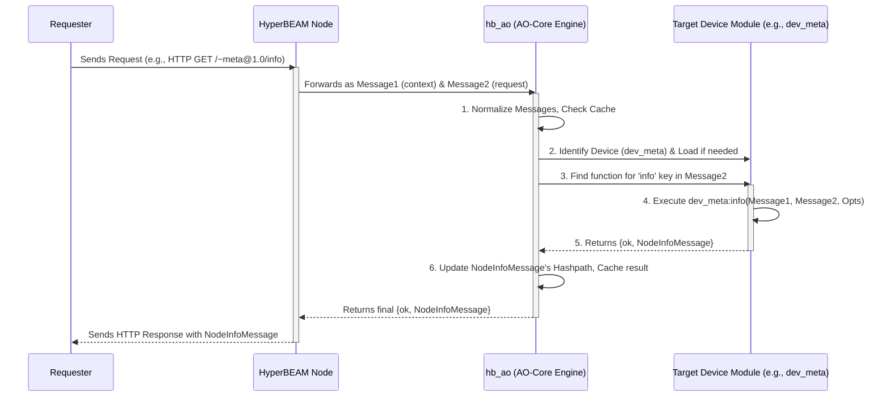

# Chapter 7: AO-Core Resolution Engine (`hb_ao`)

Welcome to the final chapter of our beginner's tour through HyperBEAM! In [Chapter 6: AO Processes (`~process@1.0`)](06_ao_processes____process_1_0___.md), we explored how to build persistent, stateful applications on the AO network. We saw how [Messages](03_messages_.md) are sent to Processes, which then use their defined logic (often via [Devices](04_devices_.md) like `~wasm64@1.0`) to update their state and produce results.

But as these [Messages](03_messages_.md) and requests (like those coming through [HTTP Layer & HyperPATHs](05_http_layer___hyperpaths_.md)) arrive at a [HyperBEAM Node](01_hyperbeam_node_.md), what is the central component that actually *understands* what to do? How does the node know which [Device's](04_devices_.md) specific logic to run, and how does it make sure everything happens according to the rules of the [AO-Core Protocol](02_ao_core_protocol_.md)?

This is where the **AO-Core Resolution Engine**, implemented in the `hb_ao` module, steps in. It's the brain of your HyperBEAM node's computation capabilities.

## The Problem: Orchestrating Computation

Imagine you're a chef in a busy kitchen (your [HyperBEAM Node](01_hyperbeam_node_.md)). Orders (incoming [Messages](03_messages_.md) or requests) are constantly arriving. Each order might require a different cooking technique (a specific [Device](04_devices_.md)) and different ingredients ([Message](03_messages_.md) data).

You, as the head chef, need to:
1.  Read each order.
2.  Figure out which cooking station (e.g., grill, oven, fryer – these are like [Devices](04_devices_.md)) is needed.
3.  Ensure the station has the right recipe (the [Device's](04_devices_.md) logic).
4.  Tell the station cook what to do with the ingredients.
5.  Make sure the final dish (the result [Message](03_messages_.md)) is prepared correctly and according to the restaurant's standards (the [AO-Core Protocol](02_ao_core_protocol_.md)).

The **AO-Core Resolution Engine (`hb_ao`)** is this head chef for your HyperBEAM node.

## What is the AO-Core Resolution Engine (`hb_ao`)?

The `hb_ao` module is the central processing unit for AO-Core computations within a [HyperBEAM Node](01_hyperbeam_node_.md). When a computational request arrives (typically as a pair of [Messages](03_messages_.md) which we'll call `Message1` for context/state and `Message2` for the action/input), `hb_ao` acts as the main dispatcher and orchestrator.

Its key responsibilities are:

*   **Understanding the Request:** It takes the incoming [Messages](03_messages_.md) and figures out what computation is being asked for.
*   **Identifying the Target [Device](04_devices_.md):** It determines which specific [Device](04_devices_.md) (e.g., `~wasm64@1.0`, `~meta@1.0`, `~process@1.0`) is designated to handle this type of request.
*   **Loading [Device](04_devices_.md) Logic:** If the [Device's](04_devices_.md) programming logic isn't already active, `hb_ao` ensures it's loaded (e.g., from the node's local `dev_*.erl` files or even securely from the network if configured).
*   **Instructing the [Device](04_devices_.md):** It then "calls" or instructs the chosen [Device](04_devices_.md) to process the input [Messages](03_messages_.md).
*   **Managing Computation Flow:** It oversees the entire journey from receiving the request to producing a final result [Message](03_messages_.md).
*   **Enforcing [AO-Core Protocol](02_ao_core_protocol_.md) Rules:** Crucially, it makes sure that all computations adhere to the foundational rules of AO-Core, such as how Hashpaths are updated to maintain a verifiable trail of computation.

As the `hb_ao.erl` module's documentation (`docs/resources/source-code/hb_ao.md`) states:
> This module is the root of the device call logic of the AO-Core protocol in HyperBEAM.
> ...
> Under-the-hood, `AO-Core(Message1, Message2)` leads to the evaluation of `DeviceMod:PathPart(Message1, Message2)`, which defines the user compute to be performed.

This tells us `hb_ao` takes two [Messages](03_messages_.md) (`Message1` as the base/current state, `Message2` as the operation/input) and uses the specified `DeviceMod` (Device Module, like `dev_meta.erl`) and a `PathPart` (a key or function name from `Message2`) to execute the computation.

## A Familiar Use Case: `curl ... /~meta@1.0/info`

Let's revisit the command from [Chapter 1: HyperBEAM Node](01_hyperbeam_node_.md) that we've used to check if our node is running:
```bash
curl http://localhost:10000/~meta@1.0/info
```
We know this HTTP request hits the node's [HTTP Layer & HyperPATHs](05_http_layer___hyperpaths_.md), which translates it into an internal representation. Then, `hb_ao` takes center stage.

1.  **Request Package Arrives at `hb_ao`:**
    The HyperPATH `~meta@1.0/info` is transformed into something `hb_ao` can work with. Conceptually, `hb_ao` might receive:
    *   `Message1`: Represents the current context. For a simple `~meta@1.0` call, this might be a basic or empty message.
    *   `Message2`: Represents the request. It would effectively contain:
        *   Target [Device](04_devices_.md): `~meta@1.0`
        *   Action/Key: `info`

2.  **`hb_ao` Takes Action:**
    *   **Device Identification:** `hb_ao` looks at `Message1` (or `Message2` for HyperPATHs like this one) and sees that the `~meta@1.0` [Device](04_devices_.md) is specified. (The function `hb_ao:message_to_device/2` helps with this).
    *   **Device Loading:** It knows that the logic for `~meta@1.0` is in the `dev_meta.erl` module. If this module wasn't already active (unlikely for core devices), `hb_ao` would ensure it's loaded. (The function `hb_ao:load_device/2` handles this).
    *   **Function Identification:** `hb_ao` determines that the `info` key from `Message2` corresponds to a specific function within the `dev_meta` module (e.g., `dev_meta:info/X`). (The function `hb_ao:message_to_fun/3` figures this out).
    *   **Execution:** `hb_ao` then calls (applies) this `info` function from `dev_meta.erl`, passing it `Message1`, `Message2`, and any relevant options.
    *   **Result Management:** The `dev_meta:info` function executes, gathers the node's details, and returns a new [Message](03_messages_.md) (the JSON output) along with a status (e.g., `ok`).
    *   **Protocol Adherence:** `hb_ao` ensures this process aligns with AO-Core. For instance, it would update the `Hashpath` of the resulting [Message](03_messages_.md) to cryptographically link it to `Message1` and `Message2`. (This is fundamental to AO-Core's verifiability, as described in `docs/misc/ao-core-protocol.md` under "Paths, Hashpaths, and Commitments").
    *   **Response Forwarding:** The final result [Message](03_messages_.md) is then passed back up the chain, eventually becoming the HTTP response `curl` displays.

The `hb_ao` engine didn't perform the "info gathering" itself, but it masterfully directed the `~meta@1.0` [Device](04_devices_.md) to do it correctly.

## Under the Hood: The `resolve` Lifecycle

The primary function that kicks off this orchestration in `hb_ao` is often `resolve/2` or `resolve/3`. When a request needs processing, `hb_ao:resolve` goes through several stages (simplified):

1.  **Normalization & Preparation:**
    *   The incoming `Message1` (base state) and `Message2` (request/operation) are normalized into a standard internal format. (e.g., using `hb_ao:normalize_keys/1`).
    *   If `Message2` is just a path (like from a HyperPATH), it's expanded into a full [Message](03_messages_.md) structure.

2.  **Cache Lookup (Optimization):**
    *   `hb_ao` checks if this exact computation (`Message1` + `Message2`) has been done recently and if its result is cached (`hb_cache_control:maybe_lookup/3`). If so, it can return the cached result, saving computation time.

3.  **Persistent Resolver Lookup (Concurrency Management):**
    *   If not cached, `hb_ao` checks if another part of the system is *already* working on this exact same computation (`hb_persistent:find_or_register/3`).
    *   If yes (someone else is the "leader"), `hb_ao` might wait for that result.
    *   If no (this instance becomes the "leader"), it proceeds.

4.  **Device and Function Determination:**
    *   It determines the target [Device](04_devices_.md) module from `Message1` (e.g., by looking for a `<<"device">>` tag). If no device is specified, it defaults to `dev_message`. (`hb_ao:message_to_device/2`).
    *   It then identifies the specific Erlang function within that [Device](04_devices_.md) module that corresponds to the "key" or "path" requested in `Message2`. (`hb_ao:message_to_fun/3`). This involves checking the [Device's](04_devices_.md) `info` settings, exported functions, and default handlers.

5.  **Execution:**
    *   The identified Erlang function from the [Device](04_devices_.md) module is executed (using `apply`) with `Message1`, `Message2`, and runtime options as arguments.
    *   The [Device's](04_devices_.md) function performs its specialized logic.

6.  **Result Processing & Cryptographic Linking:**
    *   The [Device's](04_devices_.md) function returns a result, typically `{Status, NewMessage}`.
    *   `hb_ao` takes this `NewMessage`. If the status is `ok` and Hashpath updates are enabled, it calculates a new `Hashpath` for `NewMessage`. This `Hashpath` is a cryptographic fingerprint derived from `Message1`'s `Hashpath` and an ID of `Message2`. This is a cornerstone of AO-Core, making the chain of computations verifiable.
        > `Message3/Hashpath :: Converve.apply(Message3/Hashpath-Alg, Message1/Hashpath, id(Message2))`
        (From `docs/misc/ao-core-protocol.md`)

7.  **Caching and Notification:**
    *   The `NewMessage` (with its updated `Hashpath`) might be stored in the cache (`hb_cache_control:maybe_store/4`).
    *   If other parts of the system were waiting for this result, they are notified (`hb_persistent:unregister_notify/4`).

8.  **Return:** The final `{Status, NewMessage}` is returned.

Here's a simplified sequence diagram illustrating this flow:



## Key Functions in `hb_ao.erl`

The `src/hb_ao.erl` file is where this magic happens. Here's a peek at the conceptual structure of some key functions (aggressively simplified for clarity):

```erlang
% Simplified concepts from src/hb_ao.erl

%% Main entry point for resolving a computation.
%% Msg1 is the base message/state.
%% Path is the operation to perform (often from a HyperPATH, part of Message2).
%% Opts are runtime options.
resolve(Msg1, Path, Opts) ->
    % 1. Convert Path into a full Message2 if needed.
    Message2 = create_internal_message_from_path(Path, Opts),

    % Stages roughly follow:
    % - Normalize Msg1 and Message2
    NormalizedMsg1 = normalize_keys(Msg1),
    NormalizedMsg2 = normalize_keys(Message2),

    % - Cache lookup for (NormalizedMsg1, NormalizedMsg2)
    % - If not cached, and not already being processed:
    %   - Determine Device module from NormalizedMsg1
    DeviceModule = message_to_device(NormalizedMsg1, Opts),
    %   - Determine Function to call from DeviceModule based on Key in NormalizedMsg2
    {_Status, _ActualModule, FunctionToCall} = message_to_fun(NormalizedMsg1, get_key(NormalizedMsg2), Opts),
    %   - Execute the function
    {ExecStatus, ResultingMessage} = apply(FunctionToCall, [NormalizedMsg1, NormalizedMsg2, Opts]),
    %   - If ExecStatus is ok, update ResultingMessage's Hashpath
    FinalMessage = update_hashpath_if_needed(ResultingMessage, NormalizedMsg1, NormalizedMsg2, Opts),
    %   - Cache FinalMessage
    %   - Return {ExecStatus, FinalMessage}
    % ... (actual implementation involves many detailed steps and error handling)
    handle_all_stages(NormalizedMsg1, NormalizedMsg2, Opts).

%% Determines the Device module (e.g., dev_meta, dev_wasm64) for a Message.
message_to_device(Msg, Opts) ->
    case maps:get(<<"device">>, Msg, default_device_atom) of
        DeviceName when is_atom(DeviceName) ->
            % Load the Erlang module for this device
            {ok, LoadedModule} = load_device(DeviceName, Opts),
            LoadedModule;
        DeviceID when is_binary(DeviceID) -> % e.g., an Arweave TX ID for a remote device
            % Securely load remote device code if allowed by Opts
            {ok, LoadedModule} = load_device(DeviceID, Opts),
            LoadedModule;
        _ -> dev_message % Default device
    end.

%% Determines the specific Erlang function to call on a Device for a given Key.
message_to_fun(Msg, Key, Opts) ->
    DeviceModule = message_to_device(Msg, Opts),
    DeviceInfo = get_device_info(DeviceModule, Msg, Opts), % Check 'info' map from device

    % Logic to find the function:
    % 1. Does DeviceInfo specify a 'handler' for all keys?
    % 2. Is Key an exported function in DeviceModule and allowed by DeviceInfo.exports?
    % 3. Does DeviceInfo specify a 'default' function for unhandled keys?
    % 4. If all else fails, try the default_module (dev_message).
    % ... returns {status, module_to_call, function_to_call}
    find_actual_function_for_key(DeviceModule, DeviceInfo, Key, Opts).
```
This simplified Erlang code illustrates the core logic: `resolve` orchestrates the process, `message_to_device` figures out *which* [Device](04_devices_.md) module to use, and `message_to_fun` figures out *what specific function* within that module to call for the given `Key` (action).

## The Engine's Guiding Principle: Message In, Message Out

A fundamental concept in AO-Core, and thus central to `hb_ao`'s operation, is that any computation starts with one or more [Messages](03_messages_.md) and results in a new [Message](03_messages_.md).
The `hb_ao.erl` documentation summarizes this pattern:
> `ao(Message1, Message2) -> {Status, Message3}`

`Message1` provides the context or current state. `Message2` provides the operation or new input. `hb_ao` ensures that applying `Message2` to `Message1` via the correct [Device](04_devices_.md) produces a `Message3` (the result), along with a `Status`. This "message in, message out" paradigm is consistently applied, forming the basis of all computations.

## Conclusion: The Heart of HyperBEAM's Computations

The AO-Core Resolution Engine, embodied in the `hb_ao` module, is truly the heart of a [HyperBEAM Node's](01_hyperbeam_node_.md) ability to perform computations. It's the intelligent dispatcher that interprets requests, identifies and invokes the correct [Devices](04_devices_.md), manages the flow of execution, and diligently ensures that every step adheres to the [AO-Core Protocol](02_ao_core_protocol_.md).

While users and developers might interact more directly with [Messages](03_messages_.md), [Devices](04_devices_.md), [HTTP Layer & HyperPATHs](05_http_layer___hyperpaths_.md), and [AO Processes (`~process@1.0`)](06_ao_processes____process_1_0___.md), it's the `hb_ao` engine working tirelessly behind the scenes that makes all these higher-level abstractions function seamlessly and correctly.

Congratulations on completing this beginner's journey through the core concepts of HyperBEAM! You now have a foundational understanding of how a HyperBEAM node operates, from receiving requests to executing complex, decentralized applications. There's much more to explore in the HyperBEAM documentation and the wider AO ecosystem, but hopefully, this series has given you a solid map to start your adventure. Happy building on the permaweb!

---

Generated by [AI Codebase Knowledge Builder](https://github.com/The-Pocket/Tutorial-Codebase-Knowledge)