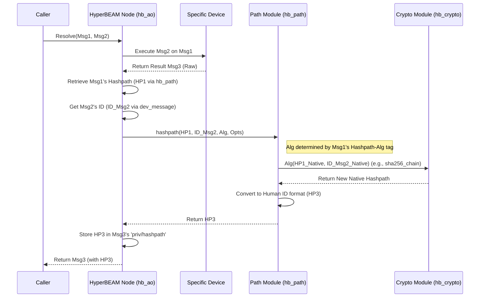

# Chapter 7: Hashpath

In [Chapter 6: WASM Execution (BEAMR)](06_wasm_execution__beamr__.md), we saw how HyperBEAM can run complex computations using WebAssembly. Whether it's a simple calculation or a sophisticated WASM execution, these computations often happen in sequence, building upon previous results, especially within a [Process](05_process_.md).

But how do we keep track of this sequence? If a [Process](05_process_.md) has gone through many state changes, how can we be sure about the exact steps that led to its current state? How can we get a unique "fingerprint" that represents not just the final result, but the entire journey taken to get there?

This is where the **Hashpath** primitive comes into play.

## The Problem: Trusting Computation History

Imagine you have a shared digital whiteboard [Process](05_process_.md).

1.  Alice draws a circle (Message A). The whiteboard now shows a circle.
2.  Bob draws a square next to it (Message B). The whiteboard now shows a circle and a square.
3.  Carol draws a triangle inside the circle (Message C). The whiteboard shows the final image.

Now, David comes along and sees the final image. He trusts the whiteboard is showing *a* valid state, but how can he be certain that this state was reached by exactly Alice's circle, then Bob's square, then Carol's triangle, in that specific order? Maybe someone sneakily inserted another step, or reordered them.

David needs a way to verify the *history* of the computation without having to store or re-run every single drawing step himself. He needs a unique identifier for the final state that also implicitly confirms the sequence of operations that created it.

## What is a Hashpath? The Computation's Fingerprint

A **Hashpath** is a core concept in HyperBEAM and the [AO-Core Protocol](02_ao_core_protocol_.md) that acts like a unique, cryptographic fingerprint for the state of a computation resulting from a specific sequence of operations.

Think of it like a **Git commit hash**. In Git, each commit hash uniquely identifies the state of your code files *and* points back to the previous commit, forming a chain of history. Similarly, a Hashpath identifies a specific state in HyperBEAM and encodes the sequence of messages that led to it.

**Key Ideas:**

1.  **Cryptographic:** It uses strong mathematical functions (hashes) to ensure that it's virtually impossible to fake or alter the history without changing the final Hashpath.
2.  **References State:** A Hashpath corresponds to a specific state achieved after a sequence of computations.
3.  **Tracks History:** It's built iteratively. Each time a message is applied to a state, a new Hashpath is generated by combining the *previous* state's Hashpath and the unique identifier (ID) of the *applied* message.
4.  **Merkle-like Tree:** This step-by-step combination creates a chain (or potentially a tree if computations branch) where the final Hashpath implicitly contains information about all preceding steps, similar to how a Merkle root summarizes all the data in a Merkle tree.
5.  **Verifiable:** Anyone can recalculate the Hashpath for a given sequence of message IDs and starting state. If their calculated Hashpath matches the one provided, they can be confident that the claimed sequence of operations is correct, without needing to see every intermediate state.

## How Hashpaths are Generated: Chaining the Steps

The magic of Hashpaths comes from how they link computations together. Let's visualize the process:

1.  **Initial State:** A [Process](05_process_.md) or computation starts with an initial state (let's call it `State 0`). This state has an initial Hashpath (`HP0`), often derived directly from its own unique Message ID.
    ```
    State 0  (Hashpath HP0)
    ```
2.  **Apply Message A:** A message `Msg A` (with a unique ID `ID_A`) is applied to `State 0`. This results in a new state, `State 1`.
    ```
       apply(State 0, Msg A)  -->  State 1
    ```
3.  **Generate New Hashpath:** A new Hashpath (`HP1`) is generated for `State 1`. This is done by cryptographically combining the previous Hashpath (`HP0`) and the ID of the applied message (`ID_A`).
    ```
       HP1 = Hash(HP0, ID_A)
    ```
    So now we have:
    ```
    State 0 (HP0) --[Msg A (ID_A)]--> State 1 (HP1)
    ```
4.  **Apply Message B:** Another message `Msg B` (with ID `ID_B`) is applied to `State 1`. This produces `State 2`.
    ```
       apply(State 1, Msg B)  -->  State 2
    ```
5.  **Generate Next Hashpath:** A new Hashpath (`HP2`) is generated for `State 2` by combining the Hashpath of the state it came from (`HP1`) and the ID of the message applied (`ID_B`).
    ```
       HP2 = Hash(HP1, ID_B)
    ```
    Our chain now looks like this:
    ```mermaid
    graph LR
        S0[State 0 HP0] -- Msg A ID_A --> S1[State 1 HP1]
        S1 -- Msg B ID_B --> S2[State 2 HP2]

        style S0 fill:#f9f
        style S1 fill:#ccf
        style S2 fill:#9cf
    ```

Each step extends the chain, and the final Hashpath (`HP2` in this case) acts as a compact summary of the entire sequence (`HP0`, `ID_A`, `ID_B`).

**The `Hash` Function:** The actual `Hash` function used depends on the configuration (the `Hashpath-Alg` tag on the message being executed upon). A common one is `sha-256-chain`, which uses the standard SHA-256 hashing algorithm in a specific way to combine the previous Hashpath and the message ID.

## Solving the Use Case: Verifying the Whiteboard History

Let's apply this to our shared whiteboard example:

1.  **Start:** The whiteboard [Process](05_process_.md) starts. `State 0` (empty board), `Hashpath HP0`.
2.  **Alice:** Alice sends `Msg A` (draw circle), with `ID_A`. The node computes `State 1` (board with circle) and `HP1 = Hash(HP0, ID_A)`.
3.  **Bob:** Bob sends `Msg B` (draw square), with `ID_B`. The node computes `State 2` (board with circle + square) and `HP2 = Hash(HP1, ID_B)`.
4.  **Carol:** Carol sends `Msg C` (draw triangle), with `ID_C`. The node computes `State 3` (final board) and `HP3 = Hash(HP2, ID_C)`.

Now, David sees `State 3` and is given its Hashpath `HP3`. How does he verify the history (A -> B -> C)?

*   David needs: The initial Hashpath (`HP0`) and the IDs of the messages (`ID_A`, `ID_B`, `ID_C`). He *doesn't* need the actual content of the messages or the intermediate states (`State 1`, `State 2`).
*   **Verification Step 1:** David calculates `TempHP1 = Hash(HP0, ID_A)`.
*   **Verification Step 2:** David calculates `TempHP2 = Hash(TempHP1, ID_B)`.
*   **Verification Step 3:** David calculates `TempHP3 = Hash(TempHP2, ID_C)`.
*   **Check:** David compares his calculated `TempHP3` with the provided `HP3`.

If `TempHP3 == HP3`, David can be cryptographically confident that `State 3` was indeed reached by applying `Msg A`, then `Msg B`, then `Msg C` to the initial state, in that exact order. The Hashpath provides this **verifiability**.

## Internal Implementation: Updating the Hashpath During Resolution

How does HyperBEAM actually calculate and store these Hashpaths during computation? This happens as part of the core message resolution logic handled by `hb_ao.erl`.

**Walkthrough:**

1.  **Request:** A [HyperBEAM Node](03_hyperbeam_node_.md) receives a request to apply `Msg2` to `Msg1`.
2.  **Execution:** The core logic (`hb_ao.erl`) identifies the correct [Device](04_device_.md) and function based on `Msg1` and `Msg2`, and executes it (Stage 6 of `resolve_stage`). Let's say this produces a raw result message, `RawMsg3`.
3.  **Hashpath Calculation (Stage 7):** Before finalizing, `hb_ao.erl` enters the cryptographic linking stage.
    *   It checks the options to see if the Hashpath should be updated (usually yes, unless explicitly ignored or reset).
    *   It gets the *current* Hashpath of `Msg1` (let's call it `HP1`). This might be stored in `Msg1`'s private data (`priv/hashpath`) or calculated from `Msg1`'s ID if it's the start of a chain. The `hb_path:hashpath/2` function handles retrieving this.
    *   It gets the unique ID of the message being applied, `Msg2` (let's call it `ID_Msg2`). The `dev_message:id/3` function is typically used to calculate this ID based on the content and signature of `Msg2`.
    *   It determines which Hashpath algorithm to use, usually specified by the `Hashpath-Alg` tag in `Msg1`. The `hb_path:hashpath_alg/1` function finds the corresponding Erlang function (e.g., `fun hb_crypto:sha256_chain/2`).
    *   It calls the main Hashpath generation function: `hb_path:hashpath(HP1, ID_Msg2, AlgorithmFunction, Opts)`.
4.  **Cryptographic Mixing:** Inside `hb_path:hashpath/4`, the chosen `AlgorithmFunction` (e.g., `hb_crypto:sha256_chain/2`) is called with `HP1` and `ID_Msg2`. This function performs the actual cryptographic hashing (e.g., `crypto:hash(sha256, <<HP1_Native/binary, ID_Msg2_Native/binary>>)`).
5.  **New Hashpath:** The result is the new Hashpath, `HP3`.
6.  **Store Hashpath:** `hb_ao.erl` takes `RawMsg3` and stores the newly calculated `HP3` within its private data, typically under the key `priv/hashpath`. The final message is now `Msg3`.
7.  **Caching & Response (Stages 8-11):** `Msg3` (containing `HP3`) is potentially cached via [Storage & Cache](08_storage___cache_.md) and then returned to the caller.

**Sequence Diagram:**



**Code Snippets (Simplified Concepts):**

*   **`src/hb_ao.erl` (Stage 7 - Hashpath Update):** This is where the Hashpath is calculated and added to the result message.

    ```erlang
    %% Simplified Concept: resolve_stage/7 in hb_ao.erl (Stage 7)
    resolve_stage(7, Msg1, Msg2, {ok, RawMsg3}, ExecName, Opts) when is_map(RawMsg3) ->
        ?event(ao_core, {stage, 7, ExecName, generate_hashpath}, Opts),
        resolve_stage(8, Msg1, Msg2,
            case hb_opts:get(hashpath, update, Opts) of % Check if update is needed
                update ->
                    Priv = hb_private:from_message(RawMsg3),
                    % ---> Call hb_path to calculate the new hashpath <---
                    HP3 = hb_path:hashpath(Msg1, Msg2, Opts),
                    if not is_binary(HP3) -> throw({invalid_hashpath, HP3}); true -> ok end,
                    % Store the new hashpath in the private data
                    {ok, RawMsg3#{ <<"priv">> => Priv#{ <<"hashpath">> => HP3 } }};
                reset -> % Option to reset hashpath
                    Priv = hb_private:from_message(RawMsg3),
                    {ok, RawMsg3#{ <<"priv">> => maps:without([<<"hashpath">>], Priv) }};
                ignore -> % Option to ignore hashpath update
                    {ok, RawMsg3}
            end,
            ExecName, Opts);
    ```
    This snippet shows the core logic checking the `hashpath` option. If `update`, it calls `hb_path:hashpath/3` to get the new Hashpath (`HP3`) and stores it in the result message's (`RawMsg3`) private data under the key `<<"hashpath">>` before proceeding to the next stage (8).

*   **`src/hb_path.erl` (`hashpath/3` and `hashpath/4`):** Orchestrates getting the previous Hashpath, the message ID, and calling the algorithm.

    ```erlang
    %% Simplified Concept: hashpath/3 in hb_path.erl
    hashpath(Msg1, Msg2, Opts) when is_map(Msg1) ->
        % 1. Get Msg1's current hashpath (HP1)
        HP1 = hashpath(Msg1, Opts), % Calls hashpath/2 to retrieve/calculate
        % 2. Determine the algorithm function from Msg1
        Alg = hashpath_alg(Msg1),
        % 3. Call hashpath/4 with all components
        hashpath(HP1, Msg2, Alg, Opts).

    %% Simplified Concept: hashpath/4 in hb_path.erl
    hashpath(HP1, Msg2, Alg, Opts) when is_map(Msg2) ->
        % 1. Calculate Msg2's ID (using dev_message:id/3)
        {ok, Msg2ID_Native} = dev_message:id(Msg2, #{commitments => all}, Opts),
        % 2. Convert Msg2's Native ID to Human-readable format for consistency
        Msg2ID_Human = hb_util:human_id(Msg2ID_Native),
        % 3. Call the actual hashpath calculation with HP1 and Msg2's Human ID
        hashpath(HP1, Msg2ID_Human, Alg, Opts);
    hashpath(HP1_Human, Msg2ID_Human, Alg, _Opts) ->
        % --> Core cryptographic mixing happens here <--
        HP1_Native = hb_util:native_id(HP1_Human),
        % Call the algorithm function (e.g., hb_crypto:sha256_chain)
        HP3_Native = Alg(HP1_Native, hb_util:native_id(Msg2ID_Human)),
        % Convert the resulting native hashpath back to human format
        HP3_Human = hb_util:human_id(HP3_Native),
        ?event({generated_hashpath, HP3_Human, ...}),
        HP3_Human. % Return the new human-readable hashpath
    ```
    These functions show the flow: get `Msg1`'s Hashpath, find the algorithm, calculate `Msg2`'s ID, call the specific algorithm function (`Alg`), and return the result. Note the conversion between native binary IDs and human-readable IDs (Base64URL).

*   **`src/hb_path.erl` (`hashpath_alg/1`):** Selects the cryptographic function.

    ```erlang
    %% Simplified Concept: hashpath_alg/1 in hb_path.erl
    hashpath_alg(Msg) ->
        case dev_message:get(<<"hashpath-alg">>, Msg) of % Read the tag from Msg
            {ok, <<"sha-256-chain">>} ->
                fun hb_crypto:sha256_chain/2; % Return the function itself
            {ok, <<"accumulate-256">>} ->
                fun hb_crypto:accumulate/2; % Return the function itself
            {error, not_found} ->
                fun hb_crypto:sha256_chain/2 % Default if tag not found
        end.
    ```
    This function reads the `Hashpath-Alg` tag from the message (`Msg1`) and returns the corresponding Erlang function reference based on the value.

*   **`src/hb_crypto.erl` (`sha256_chain/2`):** Performs the actual cryptographic mixing.

    ```erlang
    %% Simplified Concept: sha256_chain/2 in hb_crypto.erl
    sha256_chain(ID1_Native, ID2_Native) when is_binary(ID1_Native) and is_binary(ID2_Native) ->
        % Concatenate the native binary representations of the
        % previous hashpath (ID1_Native) and the applied message ID (ID2_Native)
        CombinedData = <<ID1_Native/binary, ID2_Native/binary>>,
        % Calculate the SHA-256 hash of the combined data
        crypto:hash(sha256, CombinedData). % Returns the new native hashpath
    ```
    This function demonstrates the simplicity of the `sha-256-chain` algorithm: it just concatenates the two binary inputs and computes their SHA-256 hash.

## Conclusion

You've learned about the **Hashpath**, a crucial primitive in HyperBEAM for creating verifiable histories of computation.

Key Takeaways:

*   A Hashpath is like a unique fingerprint (or Git commit hash) for a specific state reached through a sequence of message applications.
*   It's built iteratively: `NewHashpath = Hash(PreviousHashpath, ID_of_Applied_Message)`.
*   This creates a cryptographic chain, allowing anyone to verify the sequence of operations without needing intermediate states, just the initial Hashpath and the IDs of the applied messages.
*   The calculation is handled automatically by the core resolution logic (`hb_ao.erl`) using functions from `hb_path.erl` and `hb_crypto.erl`.
*   The resulting Hashpath is stored in the message's private data (`priv/hashpath`).

Hashpaths provide the foundation for trust and auditability in AO's decentralized computation model. Now that we understand how computations are performed ([WASM Execution (BEAMR)](06_wasm_execution__beamr__.md)), how stateful applications are built ([Process](05_process_.md)), and how their history is tracked ([Hashpath]()), let's look at how all this data – the states, the messages, the WASM code – is actually stored and retrieved efficiently.

Next up: [Chapter 8: Storage & Cache](08_storage___cache_.md)

---

Generated by [AI Codebase Knowledge Builder](https://github.com/The-Pocket/Tutorial-Codebase-Knowledge)