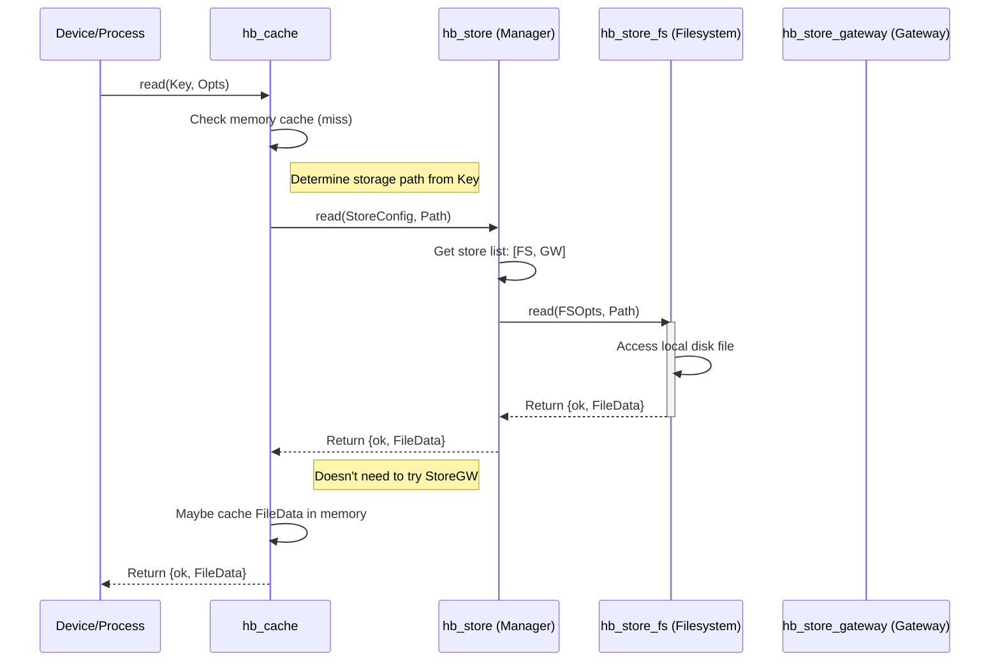

# Chapter 8: Storage & Cache

In [Chapter 7: Hashpath](07_hashpath_.md), we saw how HyperBEAM uses Hashpaths to create a verifiable, linked history of computations. Each step in a [Process](05_process_.md) creates a new state, linked to the previous one.

But where do all these states, the original [Message](01_message_.md)s, and the results of computations actually *live*? When you turn off your [HyperBEAM Node](03_hyperbeam_node_.md) and turn it back on, how does it remember the state of all the Processes it was managing? And when it needs to execute some [WASM Execution (BEAMR)](06_wasm_execution__beamr__.md) code or look up an old message, how does it find it quickly?

This is where HyperBEAM's **Storage & Cache** system comes in.

## The Problem: Remembering and Finding Data

Imagine you're running a busy library. People are constantly checking books out (running computations), returning them with notes added (new states), and requesting specific books (messages or data). You need a system to:

1.  **Persist Data:** Store the books (messages, states, WASM code) safely so they aren't lost.
2.  **Retrieve Data:** Quickly find a specific book when someone asks for it using its title or ID (Message ID or Hashpath).
3.  **Optimize Access:** Keep popular books readily available to speed things up (caching).

**Use Case:** Alice runs a HyperBEAM node. Her node is part of a popular chat application built on AO.

*   **Saving:** When a user sends a new chat message to a chatroom [Process](05_process_.md) running on Alice's node, her node computes the new state of the chatroom (including the new message) and needs to *save* this new state durably.
*   **Retrieving:** When another user wants to view the latest messages in that chatroom, Alice's node needs to efficiently *retrieve* the saved state.
*   **Fetching Code:** If the chatroom [Process](05_process_.md) uses a special [WASM Execution (BEAMR)](06_wasm_execution__beamr__.md) module for filtering spam, Alice's node might need to *fetch* that WASM code if it doesn't already have it locally.

HyperBEAM's Storage & Cache system handles all these needs.

## The Layered Approach: Librarian and Bookshelves

HyperBEAM uses a clever layered system for managing data storage and retrieval. Think of it like our library analogy:

1.  **`hb_cache` (The Librarian):** This is the smart, organized part you usually interact with. It provides a single, unified way to ask for data (`read`) or save data (`write`), often using standard identifiers like Message IDs or [Hashpath](07_hashpath_.md)s. The librarian knows *how* to find things and keeps track of frequently accessed items (in an internal memory cache) for quick retrieval. You tell the librarian what you need, and they figure out where to get it. (`hb_cache.erl`)
2.  **`hb_store` (The Bookshelves / Storage Systems):** This layer represents the actual *places* where data can be physically stored. Just like a library might have local bookshelves, a basement archive, or even access to books from other libraries, `hb_store` manages different *backends*. (`hb_store.erl` and specific `hb_store_*.erl` modules).

```mermaid
graph TD
    subgraph You / Devices / Processes
        direction LR
        A[Your Code / Device Logic]
    end

    subgraph Cache Layer
        B(hb_cache: read/write)
    end

    subgraph Storage Abstraction
        C(hb_store: manages backends)
    end

    subgraph Physical Storage Backends
        D[Local Filesystem<br/>(hb_store_fs)]
        E[Local Database<br/>(hb_store_rocksdb)]
        F[Remote Node<br/>(hb_store_remote_node)]
        G[Arweave Gateway<br/>(hb_store_gateway)]
    end

    A -- Uses ID/Hashpath --> B;
    B -- Decides where to look --> C;
    C -- Tries each backend --> D;
    C -- Tries each backend --> E;
    C -- Tries each backend --> F;
    C -- Tries each backend --> G;

    D -- Data --> C;
    E -- Data --> C;
    F -- Data --> C;
    G -- Data --> C;

    C -- Returns data --> B;
    B -- Returns data --> A;

    style B fill:#f9f,stroke:#333,stroke-width:2px
    style C fill:#ccf,stroke:#333,stroke-width:2px
```

## Key Concepts Explained

*   **`hb_cache` - The Unified Interface:**
    *   You typically call functions like `hb_cache:read(Identifier, Opts)` or `hb_cache:write(Message, Opts)`.
    *   It handles resolving identifiers (like a Message ID) to storage paths.
    *   It often maintains an *in-memory cache* for recently used items, making subsequent reads super fast. If data is in the memory cache, it doesn't even need to ask `hb_store`.
    *   It orchestrates calls to the underlying `hb_store` layer if data isn't in the memory cache.

*   **`hb_store` - The Storage Backend Manager:**
    *   Doesn't store data itself, but acts as an abstraction layer.
    *   It knows about the different available storage *backends* (the actual "bookshelves").
    *   When `hb_cache` asks for data, `hb_store` tries each configured backend in a specific order until one finds the data.
    *   This allows for flexible *fallback* strategies.

*   **Storage Backends (`hb_store_*`):** These are the modules that actually interact with storage:
    *   `hb_store_fs`: Stores data as files and directories on the node's local disk. Simple, but maybe not the fastest for many small items.
    *   `hb_store_rocksdb`: Uses RocksDB, an efficient key-value database, on the local disk. Often faster than `hb_store_fs` for typical AO workloads. (*Requires special compilation flags to enable*).
    *   `hb_store_remote_node`: Doesn't store data locally but knows how to *ask another HyperBEAM node* for data over the network.
    *   `hb_store_gateway`: Knows how to fetch data directly from the public Arweave network via a gateway. This is crucial for accessing permanently stored data or code that might not be on the local node.

*   **Configuration & Fallback:** The node operator configures which `hb_store` backends to use and in what order. A common setup is:
    1.  Try `hb_store_fs` (or `hb_store_rocksdb`) first (check local disk).
    2.  If not found locally, try `hb_store_gateway` (check Arweave).
    This way, the node uses local data when available (fast) but can still access anything on Arweave if needed (slower, but comprehensive). Writes typically only go to the *first* configured writable store (usually the local one).

## Solving the Use Case: Storing and Retrieving Chat Data

Let's see how Alice's node uses this system for the chat application:

1.  **Saving New Chat State:**
    *   The chatroom [Process](05_process_.md) finishes processing a new message, resulting in `NewChatStateMessage`.
    *   The `~process@1.0` [Device](04_device_.md) needs to save this. It calls `hb_cache:write(NewChatStateMessage, Opts)`.
    *   `hb_cache` calculates the ID (or Hashpath) for `NewChatStateMessage`.
    *   It converts the message into an efficient storage format (TABM).
    *   It tells `hb_store` to write the data using the calculated ID/path.
    *   `hb_store` looks at Alice's configuration. It sees `hb_store_fs` is the first (writable) backend.
    *   It calls `hb_store_fs:write(StoreOpts, Path, Data)`, which saves the message data to Alice's local disk.

2.  **Retrieving Chat State:**
    *   Another user requests the latest state of the chatroom (identified by `ChatroomProcessID`).
    *   The `~process@1.0` device needs the state. It calls `hb_cache:read(ChatroomProcessID, Opts)`.
    *   `hb_cache` first checks its fast *in-memory* cache. Let's say it's not there this time.
    *   It asks `hb_store` to read the data for `ChatroomProcessID`.
    *   `hb_store` tries the first backend in Alice's config: `hb_store_fs`.
    *   It calls `hb_store_fs:read(StoreOpts, Path)`. `hb_store_fs` finds the corresponding file on disk and returns `{ok, ChatStateData}`.
    *   `hb_store` passes this result back to `hb_cache`.
    *   `hb_cache` might load this data into its memory cache for next time.
    *   `hb_cache` returns `{ok, ChatStateData}` to the `~process@1.0` device.

3.  **Fetching WASM Code:**
    *   The chatroom needs the spam filter WASM code (`SpamFilterWasmID`).
    *   The `~wasm64@1.0` [Device](04_device_.md) calls `hb_cache:read(SpamFilterWasmID, Opts)`.
    *   `hb_cache` checks memory cache (miss).
    *   It asks `hb_store` to read `SpamFilterWasmID`.
    *   `hb_store` tries `hb_store_fs` (miss - Alice hasn't used this code locally before).
    *   `hb_store` tries the next backend: `hb_store_gateway`.
    *   It calls `hb_store_gateway:read(StoreOpts, SpamFilterWasmID)`.
    *   `hb_store_gateway` makes an HTTP request to an Arweave gateway to fetch the data for that ID. The gateway responds with the WASM code. `hb_store_gateway` returns `{ok, WasmCode}`.
    *   `hb_store` passes this back to `hb_cache`.
    *   `hb_cache` might cache it in memory *and* potentially trigger a write to Alice's *local* store (`hb_store_fs`) via `hb_cache:write` so it's available locally next time (this caching behavior can depend on gateway store options).
    *   `hb_cache` returns `{ok, WasmCode}` to the `~wasm64@1.0` device.

This layered approach provides both speed (local cache, local storage) and completeness (fallback to Arweave).

## Internal Implementation: A Peek Inside

Let's trace a read request that misses the memory cache but hits the local filesystem.

**Walkthrough (`hb_cache:read` miss, `hb_store_fs` hit):**

1.  **Cache Request:** A device calls `hb_cache:read(Key, Opts)`.
2.  **Memory Cache Check:** `hb_cache` checks its internal Erlang process dictionary or ETS table for `Key`. It's not found (cache miss).
3.  **Store Lookup:** `hb_cache` calls `store_read(Key, StoreConfig, Opts, [])` (internal function).
4.  **Resolve Path:** `store_read` determines the actual storage path (`ResolvedFullPath`) based on `Key`. This might involve following links using `hb_store:resolve`.
5.  **Get Store Type:** It calls `hb_store:type(StoreConfig, ResolvedFullPath)` to see if the path corresponds to a single item (`simple`) or a group/directory (`composite`). Let's assume `simple`.
6.  **Read from Store:** It calls `hb_store:read(StoreConfig, ResolvedFullPath)`.
7.  **Store Iteration (`hb_store:read`):** `hb_store.erl` gets the list of configured store modules from `StoreConfig` (e.g., `[{hb_store_fs, FSOpts}, {hb_store_gateway, GWOpts}]`). It calls the `read` function on the first module: `hb_store_fs:read(FSOpts, ResolvedFullPath)`.
8.  **Filesystem Read (`hb_store_fs:read`):** `hb_store_fs.erl` interacts with the operating system's file functions (`file:read_file/1`) to read the data from the corresponding file path on disk. It finds the file and returns `{ok, FileData}`.
9.  **Return Success:** `hb_store.erl` receives `{ok, FileData}` from `hb_store_fs` and immediately returns it to `hb_cache.erl`.
10. **Cache Result:** `hb_cache.erl` receives `{ok, FileData}`. It might insert `FileData` into its memory cache associated with `Key`.
11. **Final Result:** `hb_cache.erl` returns `{ok, FileData}` to the original caller.

**Sequence Diagram (`hb_cache:read` miss, `hb_store_fs` hit):**



**Code Snippets (Simplified Concepts):**

*   **`src/hb_cache.erl` (`read/2`):** Orchestrates the read operation.

    ```erlang
    %% Simplified Concept: hb_cache:read/2
    read(Path, Opts) ->
        % 1. Check internal memory cache (e.g., using ets:lookup)
        case memory_cache_lookup(Path) of
            {ok, CachedData} ->
                ?event(cache_hit, memory),
                {ok, CachedData};
            not_found ->
                % 2. Not in memory, ask the hb_store layer
                StoreConfig = hb_opts:get(store, no_viable_store, Opts),
                case store_read(Path, StoreConfig, Opts, []) of % Calls internal recursive reader
                    not_found ->
                        not_found;
                    {ok, Res} ->
                        % 3. Maybe put result in memory cache
                        maybe_memory_cache_insert(Path, Res),
                        % 4. Convert from storage format (TABM) to structured map if needed
                        Structured = dev_codec_structured:to(Res),
                        {ok, Structured}
                end
        end.
    ```
    This shows the basic logic: check memory cache first, then call the internal `store_read` which interacts with `hb_store`, potentially cache the result, and return it.

*   **`src/hb_store.erl` (`read/2`):** Tries configured store modules.

    ```erlang
    %% Simplified Concept: hb_store:read/2 - uses call_function internally
    read(Modules, Key) -> call_function(Modules, read, [Key]).

    %% Simplified Concept: hb_store:call_function/3
    call_function(StoreList, Function, Args) ->
        case StoreList of
            [] -> no_viable_store; % Tried all, none worked
            [Store = #{<<"store-module">> := Mod} | Rest] ->
                try apply(Mod, Function, [Store | Args]) of % Call the module (e.g., hb_store_fs:read)
                    not_found ->
                        call_function(Rest, Function, Args); % Try next store
                    Result ->
                        Result % Found it! Return the result.
                catch _:_:_ ->
                    call_function(Rest, Function, Args) % Error, try next store
                end
        end.
    ```
    This shows how `hb_store` iterates through the list of configured stores (`StoreList`), calling the requested function (`read`) on each one until it gets a successful result (not `not_found` or an error).

*   **`src/hb_store_fs.erl` (`read/2`):** Reads from the filesystem.

    ```erlang
    %% Simplified Concept: hb_store_fs:read/2
    read(Opts, Key) ->
        % 1. Construct the full file path (prefix + key)
        FullPath = add_prefix(Opts, resolve(Opts, Key)), % resolve handles links
        % 2. Try reading the file
        case file:read_file(FullPath) of
            {ok, FileData} ->
                {ok, FileData}; % Success!
            {error, enoent} ->
                not_found; % File doesn't exist
            {error, eislnk} ->
                % It's a symbolic link, try reading the link target recursively
                case file:read_link(FullPath) of
                    {ok, LinkTarget} -> read(Opts, remove_prefix(Opts, LinkTarget));
                    _ -> not_found
                end;
            {error, OtherReason} ->
                ?event(error, {fs_read_error, OtherReason}),
                not_found % Other file error
        end.
    ```
    This shows the filesystem backend constructing the path, trying to read the file, and handling common cases like the file not existing or being a symbolic link.

*   **`src/hb_store_gateway.erl` (`read/2`):** Reads from an Arweave gateway.

    ```erlang
    %% Simplified Concept: hb_store_gateway:read/2
    read(StoreOpts, Key) ->
        case hb_path:term_to_path_parts(Key) of
            [ID] when ?IS_ID(ID) -> % Only try reading if Key looks like an Arweave ID
                ?event({gateway_read, {key, Key}}),
                % 1. Make HTTP GET request to the configured gateway
                case hb_gateway_client:read(ID, StoreOpts) of
                    {ok, Message} ->
                        ?event(remote_read, {got_message_from_gateway, Message}),
                        % 2. Optionally cache the result locally
                        maybe_cache(StoreOpts, Message),
                        {ok, Message};
                    {error, _} ->
                        not_found % Gateway request failed or returned error
                end;
            _ ->
                not_found % Key is not a simple Arweave ID, gateway can't handle it
        end.

    %% Simplified Concept: maybe_cache/2
    maybe_cache(StoreOpts, Data) ->
        % Check if local caching is enabled in StoreOpts (e.g., store => LocalStoreDef)
        case maps:get(<<"store">>, StoreOpts, false) of
            false -> ok; % Caching disabled
            LocalStoreConfig ->
                % Write the fetched data to the configured local store
                hb_cache:write(Data, #{ store => LocalStoreConfig})
        end.
    ```
    This shows the gateway backend checking if the key is an ID, making an HTTP call using `hb_gateway_client`, and optionally caching the result locally using `hb_cache:write`.

## Configuring Storage

Node operators define their storage strategy in the node configuration. While detailed setup is covered elsewhere (`docs/hyperbeam/configuration/storage-configuration.md`), a typical configuration might conceptually look like this:

```erlang
% Conceptual representation of storage config (often set via hb:start_mainnet/1)
NodeOpts = #{
    % ... other options ...
    http_extra_opts => #{
        store => [ % List of stores to try, in order
            % 1. Try local filesystem first
            {hb_store_fs, #{ prefix => "mainnet-cache" }},
            % 2. If not found locally, try Arweave gateway
            {hb_store_gateway, #{
                % Option: Also write gateway results to the local FS cache
                store => {hb_store_fs, #{ prefix => "mainnet-cache" }}
            }}
        ],
        % Default caching behavior: try to cache lookups, always store results
        cache_control => [<<"cache">>, <<"store">>]
    }
}.
```

This config tells the node: try reading from the `mainnet-cache` directory first. If that fails, ask the Arweave gateway. If you get data from the gateway, also save it to the `mainnet-cache` directory for next time. Always try to store the results of computations locally.

## Conclusion

You've now learned about HyperBEAM's layered **Storage & Cache** system.

Key Takeaways:

*   It separates the *interface* (`hb_cache`) from the *implementation* (`hb_store` and its backends).
*   `hb_cache` provides a unified way to read/write data using IDs/Hashpaths and includes memory caching.
*   `hb_store` manages multiple storage backends (filesystem, database, remote nodes, Arweave gateway).
*   Configuration allows flexible fallback strategies (e.g., local first, then Arweave).
*   This system ensures data persistence and efficient retrieval for messages, states, and code.

This storage system is fundamental to the node's operation. One special [Device](04_device_.md) uses it extensively to manage the node's own settings and information.

Next up: [Chapter 9: Meta Device (~meta@1.0)](09_meta_device___meta_1_0__.md)

---

Generated by [AI Codebase Knowledge Builder](https://github.com/The-Pocket/Tutorial-Codebase-Knowledge)