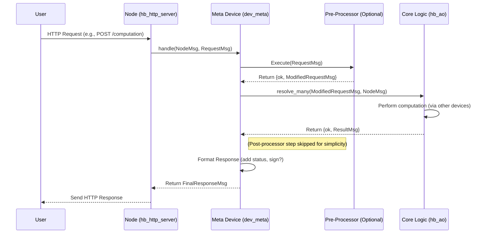

# Chapter 9: Meta Device (~meta@1.0)

Welcome back! In [Chapter 8: Storage & Cache](08_storage___cache_.md), we learned how a [HyperBEAM Node](03_hyperbeam_node_.md) efficiently stores and retrieves all the data it needs, from message results to executable code, using a layered system.

But how do we actually *control* the node itself? How do we tell it which network port to listen on, what our wallet address is for payments, or which fancy features (like payment processing or special computations) it should offer? And how can other computers on the network find out this information about our node?

**Use Case:** Imagine you've just installed the HyperBEAM software on your server. Before it can really do anything useful, you need to configure it. You want to:

1.  Tell it to listen for connections on port `9001` instead of the default.
2.  Tell it where your Arweave wallet key file is located, so it can identify itself and potentially receive payments.
3.  Later, you want to check if your changes were saved correctly.

How do you perform these basic administrative tasks on your node? You need a control panel or settings menu. That's exactly the role of the **Meta Device (`~meta@1.0`)**.

## What is the Meta Device? The Node's Control Panel

Think of the **Meta Device (`~meta@1.0`)** as the central control panel or settings application for your [HyperBEAM Node](03_hyperbeam_node_.md). It's the primary way node operators (the people running the node software) configure and manage their node.

*   **Analogy:** It's like the "Settings" app on your smartphone or the main configuration dashboard for a website. It lets you see the current status and change how the system operates.

Key functions of the Meta Device:

1.  **Configuration Hub:** It holds and provides access to the node's settings (often called the "Node Message" or "Node Options"). This includes things like:
    *   Network port (`port`)
    *   Operator's wallet address (`operator` or derived from `priv_key_location`)
    *   List of supported [Device](04_device_.md)s (`preloaded_devices`)
    *   Pricing information (if using payment devices like `p4@1.0`)
    *   Routing rules (`routes`)
    *   Storage backend settings (`store`)
2.  **HTTP Entry Point:** It's usually the *first* device that handles incoming HTTP requests to the node. When you send a command to your node via HTTP, the `hb_http_server` often passes it directly to the Meta Device's `handle` function.
3.  **Information Provider:** External clients (other nodes or users) can query the Meta Device (usually its `/info` endpoint) to discover the node's capabilities, address, and other public configuration details.
4.  **Processor Coordinator:** It can manage *pre-processors* (which run *before* the main computation) and *post-processors* (which run *after*). This is often used for things like payment checks (`p4@1.0`) before allowing a computation, or signing results afterwards.

## Using the Meta Device: Configuring Your Node

Let's solve our use case: configuring the port and key file location.

**Method 1: Configuration File (at Startup)**

The easiest way is often using a configuration file (like `config.flat`) when you first start the node. The node reads this file, and the Meta Device uses it to set its initial state.

1.  Create a file named `config.flat` in your HyperBEAM directory.
2.  Add your settings:
    ```
    port: 9001
    priv_key_location: /path/to/my/wallet.json
    ```
3.  Start the node: `rebar3 shell`
    *   The node boots up, reads `config.flat`, and the Meta Device now knows these settings.

**Method 2: HTTP Request (While Running)**

You can also update *some* configuration settings on a running node by sending a specially signed HTTP message directly to the Meta Device. This requires the message to be signed by the node's operator key.

1.  **Craft the Request:** Create an HTTP POST request targeting `/~meta@1.0/info`. Add headers for the settings you want to change. (This requires a client capable of RFC-9421 HTTP Message Signatures).
    ```http
    POST /~meta@1.0/info HTTP/1.1
    Host: your-node-address:9001
    Content-Type: application/octet-stream
    New-Setting: some-value
    Signature: ... (cryptographic signature proving you are the operator)
    Signature-Input: ...

    (empty body)
    ```
2.  **Send the Request:** Send this signed request to your node.
3.  **Meta Device Processes:** The Meta Device receives the request.
    *   It verifies the signature using the node's operator key.
    *   If valid, it updates its internal configuration with `New-Setting: some-value`.
    *   It sends back a confirmation response.

**Checking the Configuration**

How do you check the current settings? Send a simple HTTP GET request to the `/info` endpoint of the Meta Device:

```bash
curl http://your-node-address:9001/~meta@1.0/info
```

The Meta Device will respond with a message (often JSON or similar) containing its *public* configuration details.

**(Simplified Example Output):**

```json
{
  "address": "NODE_OPERATOR_ARWEAVE_ADDRESS",
  "port": 9001,
  "preloaded_devices": [
    {"name": "~meta@1.0", "module": "dev_meta"},
    {"name": "~relay@1.0", "module": "dev_relay"},
    // ... other devices ...
  ],
  "store": [
    // ... storage backend config ...
  ]
  // ... other public settings ...
}
```

Notice that sensitive information like the `priv_key_location` is *not* included in the public info response. The Meta Device filters out private keys.

## How the Meta Device Works Internally

Let's trace what happens when an HTTP request arrives at the node and is handled by the Meta Device.

**Walkthrough (Simplified):**

1.  **HTTP Request Arrives:** A user sends an HTTP request (e.g., `GET /~meta@1.0/info` or `POST /some/computation` targeting another device).
2.  **HTTP Server (`hb_http_server.erl`):** The server receives the raw HTTP request, parses it into an AO [Message](01_message_.md) format (usually a TABM singleton).
3.  **Call Meta Device:** The HTTP server calls `dev_meta:handle(NodeMsg, RequestMsg)`. `NodeMsg` contains the node's current configuration, and `RequestMsg` is the parsed incoming request.
4.  **Meta Device (`dev_meta.erl` - `handle`):**
    *   Checks if the node is initialized. If not, it might only allow specific actions like setting the configuration via `/info`.
    *   Identifies if a *pre-processor* is configured (e.g., `p4@1.0` for payments, defined in `NodeMsg`).
5.  **Pre-processor Execution (Optional):** If a pre-processor exists, `dev_meta` calls it, passing the `RequestMsg`.
    *   The pre-processor runs (e.g., checks if payment is sufficient).
    *   It returns either `{ok, ModifiedRequestMsg}` (allowing execution, maybe with changes) or `{error, Reason}` (halting execution).
6.  **Handle Request or Core Logic:**
    *   **If Pre-processor Error:** `dev_meta` immediately formats the error and prepares to send it back.
    *   **If Pre-processor OK (or no pre-processor):**
        *   **If Target is `/~meta@1.0/info`:** `dev_meta` handles the request directly (reading or updating config via its `info/3` function, checking signatures for POST).
        *   **If Target is another Device/Process:** `dev_meta` calls the core AO resolution logic: `hb_ao:resolve_many(ModifiedRequestMsg, NodeMsg)`. This is where the actual computation happens, involving other [Device](04_device_.md)s or [Process](05_process_.md)es.
7.  **Receive Result:** `dev_meta` gets the result back from `info/3` or `hb_ao:resolve_many`. This could be `{ok, ResultMsg}` or `{error, ErrorMsg}`.
8.  **Post-processor Execution (Optional):** If a *post-processor* is configured, `dev_meta` calls it with the result.
    *   The post-processor runs (e.g., signs the result).
    *   It returns the final result, `{ok, FinalResultMsg}`.
9.  **Format Response:** `dev_meta` takes the `FinalResultMsg`, ensures it has an HTTP status code, potentially adds a signature if configured (`maybe_sign`), and prepares the final message to be sent back.
10. **Return to HTTP Server:** `dev_meta:handle` returns the final response message to `hb_http_server`.
11. **Send HTTP Response:** The HTTP server converts the AO message back into an HTTP response and sends it to the original user.

**Sequence Diagram (Simplified - Request targeting another device):**



**Code Snippets (Simplified Concepts):**

*   **`src/hb_http_server.erl` (`handle_request`):** Shows the HTTP server parsing the request and calling the Meta device.

    ```erlang
    %% Simplified Concept: hb_http_server:handle_request/3
    handle_request(RawReq, Body, ServerID) ->
        NodeMsg = get_opts(#{ http_server => ServerID }),
        % Parse HTTP into an AO Message
        ReqSingleton = hb_http:req_to_tabm_singleton(RawReq, Body, NodeMsg),
        CommitmentCodec = hb_http:accept_to_codec(ReqSingleton, NodeMsg),

        % --- Call the Meta Device's handle function ---
        {ok, Res} = dev_meta:handle(
                        NodeMsg#{ commitment_device => CommitmentCodec },
                        ReqSingleton
                    ),
        % --- Send the result back ---
        hb_http:reply(RawReq, ReqSingleton, Res, NodeMsg).
    ```
    This highlights how the HTTP server prepares the message (`ReqSingleton`) and passes control to `dev_meta:handle`.

*   **`src/dev_meta.erl` (`handle`):** The main entry point for the Meta device.

    ```erlang
    %% Simplified Concept: dev_meta:handle/2
    handle(NodeMsg, RawRequest) ->
        NormRequest = hb_singleton:from(RawRequest), % Normalize request format
        case hb_opts:get(initialized, false, NodeMsg) of
            false ->
                % Special handling for uninitialized nodes (e.g., only allow /info POST)
                handle_initialize(NormRequest, NodeMsg);
            true ->
                % Handle normally for initialized nodes
                handle_resolve(RawRequest, NormRequest, NodeMsg)
        end.
    ```
    This shows the initial check for node initialization before calling the main `handle_resolve` logic.

*   **`src/dev_meta.erl` (`handle_resolve`):** Orchestrates pre-processing, core execution, and post-processing.

    ```erlang
    %% Simplified Concept: dev_meta:handle_resolve/3
    handle_resolve(Req, Msgs, NodeMsg) ->
        % 1. Apply the pre-processor (if configured)
        case resolve_processor(<<"preprocess">>, preprocessor, Req, Msgs, NodeMsg) of
            {ok, PreProcessedMsg} ->
                % Pre-processing OK, continue
                AfterPreprocOpts = hb_http_server:get_opts(NodeMsg), % Get latest opts

                % 2. Resolve the actual request (call core AO logic or handle /info)
                Result =
                    case is_meta_info_request(PreProcessedMsg) of % Check if it's for /~meta@1.0/info
                        true -> info(PreProcessedMsg, Req, AfterPreprocOpts); % Handle locally
                        false -> hb_ao:resolve_many(PreProcessedMsg, AfterPreprocOpts) % Call core logic
                    end,
                {ok, StatusEmbeddedRes} = embed_status(Result), % Ensure HTTP status code

                AfterResolveOpts = hb_http_server:get_opts(NodeMsg), % Get latest opts again

                % 3. Apply the post-processor (if configured)
                FinalResult = resolve_processor(
                                <<"postprocess">>, postprocessor, Req,
                                StatusEmbeddedRes, AfterResolveOpts
                              ),

                % 4. Maybe sign the result and return
                maybe_sign(embed_status(FinalResult), AfterResolveOpts);
            ErrorResult ->
                % Pre-processor returned an error, return it directly
                embed_status(hb_ao:force_message(ErrorResult, NodeMsg))
        end.
    ```
    This function shows the sequence: call `resolve_processor` for the pre-processor, then call `hb_ao:resolve_many` (or `info/3`), then call `resolve_processor` for the post-processor, and finally sign the result.

*   **`src/dev_meta.erl` (`resolve_processor`):** Helper to execute a pre/post-processor.

    ```erlang
    %% Simplified Concept: dev_meta:resolve_processor/5
    resolve_processor(PathKey, ProcessorKey, Req, Query, NodeMsg) ->
        case hb_opts:get(ProcessorKey, undefined, NodeMsg) of % Check NodeMsg for processor config
            undefined -> {ok, Query}; % No processor configured, pass through
            ProcessorMsg -> % Found a processor definition
                % Call the processor device via standard AO resolution
                hb_ao:resolve(
                    ProcessorMsg,
                    #{ <<"path">> => PathKey, <<"body">> => Query, <<"request">> => Req },
                    NodeMsg#{ hashpath => ignore } % Don't update hashpath for processors
                )
        end.
    ```
    This helper function looks up the processor's definition in the node configuration (`NodeMsg`) and, if found, executes it using `hb_ao:resolve`.

*   **`src/dev_meta.erl` (`info/3`):** Handles GET/POST requests to `/~meta@1.0/info`.

    ```erlang
    %% Simplified Concept: dev_meta:info/3
    info(_, Request, NodeMsg) ->
        case hb_ao:get(<<"method">>, Request, NodeMsg) of
            <<"GET">> ->
                % Return public node info (filtered)
                PublicInfo = filter_node_msg(add_dynamic_keys(NodeMsg)),
                embed_status({ok, PublicInfo});
            <<"POST">> ->
                % Attempt to update node message (checks signature internally)
                update_node_message(Request, NodeMsg);
            _ ->
                embed_status({error, <<"Unsupported Meta/info method.">>})
        end.
    ```
    This function handles reading configuration on GET and attempting updates (with signature checks) on POST.

## Conclusion

You've now learned about the **Meta Device (`~meta@1.0`)**, the essential control panel for your [HyperBEAM Node](03_hyperbeam_node_.md).

Key Takeaways:

*   It acts as the node's settings menu, holding configuration like port, keys, and supported devices.
*   It's the primary entry point for incoming HTTP requests.
*   It allows operators to configure the node (via files or signed HTTP requests) and lets clients query public information (`/~meta@1.0/info`).
*   It orchestrates pre-processors (like payment checks) and post-processors around the core computation logic.
*   It's implemented in `dev_meta.erl` and works closely with `hb_http_server.erl` and `hb_ao.erl`.

Understanding the Meta Device is key to managing your node and understanding how requests flow through the system. So far, we've mostly dealt with messages in HyperBEAM's internal format (TABM). But how do we convert data between this internal format and common external formats like JSON or Arweave transactions?

Next up: [Chapter 10: Codec Devices (e.g., dev_codec_*)](10_codec_devices__e_g___dev_codec____.md)

---

Generated by [AI Codebase Knowledge Builder](https://github.com/The-Pocket/Tutorial-Codebase-Knowledge)