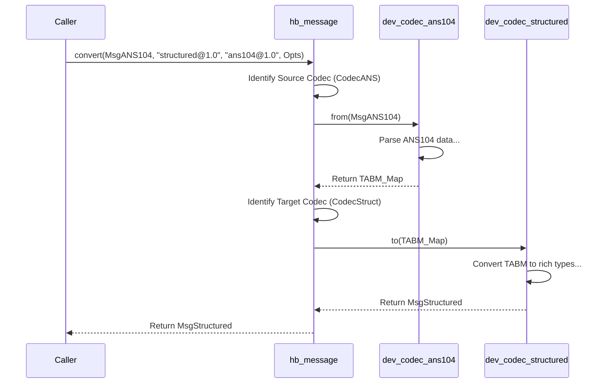

# Chapter 10: Codec Devices (e.g., dev_codec_*)

In [Chapter 9: Meta Device (~meta@1.0)](09_meta_device___meta_1_0__.md), we saw how the Meta Device acts as the control panel for a [HyperBEAM Node](03_hyperbeam_node_.md), managing its configuration. We've also learned that HyperBEAM uses an internal message format called **TABM (Type Annotated Binary Messages)** for efficient processing, as mentioned in [Chapter 1: Message](01_message_.md).

But the world outside HyperBEAM uses many different languages and formats! How does HyperBEAM talk to systems like Arweave, understand standard web requests (like HTTP), or even read simple configuration files? It needs translators!

## The Problem: Speaking Different Languages

Imagine HyperBEAM speaks its own efficient internal language (TABM). Now, it needs to interact with other systems:

*   **Arweave:** Speaks the language of Arweave transactions (also known as ANS-104 data items).
*   **Web Services:** Often speak the language of HTTP requests, sometimes with special signatures (like RFC-9421 HTTP Message Signatures).
*   **Configuration:** Might use simple text formats or JSON.

If HyperBEAM only understands TABM, it can't directly communicate or exchange data with these external systems. It needs a way to translate messages *from* their external format *into* TABM, and translate messages *from* TABM *into* the required external format.

**Use Case:**

Let's say you're building a decentralized blogging platform on AO.

1.  **Posting:** Your [Process](05_process_.md) wants to permanently store a new blog post on Arweave. Your Process generates the post data as a standard AO [Message](01_message_.md). To store it on Arweave, this message needs to be converted into a valid Arweave data item (ANS-104 format).
2.  **Reading:** Someone else wants to read a blog post that's stored on Arweave. They send a request to your Process. Your Process needs to fetch the data item from Arweave. The data arrives in Arweave's ANS-104 format, but your Process needs it as a standard AO [Message](01_message_.md) to work with it (e.g., display it, check permissions).

How does this translation happen seamlessly?

## What are Codec Devices? HyperBEAM's Translators

The solution lies in **Codec Devices**. "Codec" is short for **Co**der-**Dec**oder. These are specialized [Device](04_device_.md)s within HyperBEAM whose sole purpose is to translate messages between HyperBEAM's internal TABM format and various external or "wire" formats.

*   **Analogy:** Think of language translators at the United Nations. You have an English-to-French translator, a French-to-Spanish translator, etc. Each translator is specialized for a specific language pair. Codec Devices are specialized translators for specific data format pairs, always involving TABM as one side of the translation.

Examples of Codec Devices:

*   `dev_codec_ans104`: Translates between TABM and the Arweave ANS-104 transaction/data item format. (Solves our use case!)
*   `dev_codec_httpsig` / `dev_codec_httpsig_conv`: Translates between TABM and the format needed for HTTP Message Signatures (RFC-9421). This is often used for secure communication between nodes or with web services.
*   `dev_codec_flat`: Translates between TABM and a simple "flat" format where keys are paths (like `user/name` or `config/port`) and values are simple binaries. Often used for configuration.
*   `dev_codec_json`: Translates between TABM and standard JSON format.
*   `dev_codec_structured`: Translates between TABM and HyperBEAM's "rich" internal message format (which uses native Erlang types like integers, atoms, lists alongside binaries). This is often the format developers interact with conceptually, and it's converted to/from TABM internally.

These devices ensure **interoperability** – the ability of HyperBEAM to work smoothly with different systems and standards.

## How Codec Devices Work: The Translation Process

Codec devices usually implement a standard interface, often orchestrated by the `hb_message.erl` module. The two key functions are typically:

1.  **`from/1`:** Takes a message in the *external* format (e.g., an Arweave transaction binary) and converts it *into* the internal TABM format (an Erlang map with binary values).
2.  **`to/1`:** Takes an internal TABM message and converts it *into* the *external* format (e.g., producing an Arweave transaction binary or record).

Often, you don't call these codec devices directly. Instead, you use higher-level functions like `hb_message:convert/3` or rely on other parts of the system (like [Storage & Cache](08_storage___cache_.md) or signing mechanisms) that use codecs automatically based on context or configuration.

The core idea of `hb_message:convert/4(Msg, TargetFormat, SourceFormat, Opts)` is:

1.  Use the `SourceFormat` codec's `from/1` function to convert `Msg` -> TABM.
2.  Use the `TargetFormat` codec's `to/1` function to convert TABM -> Final `TargetFormat`.

```mermaid
graph LR
    subgraph External World
        A[Arweave TX (ANS-104)]
        B[HTTP Signed Message]
        C[Flat Config / JSON]
    end

    subgraph HyperBEAM / AO
        D{TABM (Internal Format)}
        E(AO Process / Computation)
    end

    A -- dev_codec_ans104:from/1 --> D;
    B -- dev_codec_httpsig_conv:from/1 --> D;
    C -- dev_codec_flat:from/1 / dev_codec_json:from/1 --> D;

    D -- dev_codec_ans104:to/1 --> A;
    D -- dev_codec_httpsig_conv:to/1 --> B;
    D -- dev_codec_flat:to/1 / dev_codec_json:to/1 --> C;

    D -- dev_codec_structured:to/1 --> F[Rich AO Message];
    F -- dev_codec_structured:from/1 --> D;

    E <--> F; % Process interacts with Rich AO Message

    style D fill:#f9f,stroke:#333,stroke-width:2px
```

TABM acts as the central "hub" format.

## Solving the Use Case: Translating Blog Posts

Let's see how codec devices help our decentralized blogging platform:

1.  **Posting (Process -> Arweave):**
    *   Our blogging [Process](05_process_.md) generates the post as a standard AO [Message](01_message_.md) (conceptually, a "structured" message).
    *   To send it to Arweave, the system needs to convert it. It might call `hb_message:convert(BlogPostMsg, <<"ans104@1.0">>, <<"structured@1.0">>, Opts)`.
    *   `hb_message` first calls `dev_codec_structured:from(BlogPostMsg)` to get the TABM representation.
    *   Then, it calls `dev_codec_ans104:to(TABM)` which reads the TABM map and constructs the corresponding Arweave data item binary/record.
    *   This Arweave-formatted data can now be sent to the Arweave network.

2.  **Reading (Arweave -> Process):**
    *   The Process requests the blog post from Arweave (maybe via the [Storage & Cache](08_storage___cache_.md) layer using the Arweave gateway backend).
    *   The data arrives as an Arweave data item binary (`ArweaveData`).
    *   The system needs to convert it for the Process. It might call `hb_message:convert(ArweaveData, <<"structured@1.0">>, <<"ans104@1.0">>, Opts)`.
    *   `hb_message` first calls `dev_codec_ans104:from(ArweaveData)` which parses the Arweave data item and creates the TABM representation.
    *   Then, it calls `dev_codec_structured:to(TABM)` which converts the TABM map into the rich AO [Message](01_message_.md) format with native Erlang types that the Process can easily use.

Codec devices handle these translations behind the scenes, allowing the Process to work with standard AO messages while still interacting correctly with Arweave.

## Internal Implementation: How `hb_message` Uses Codecs

The `hb_message.erl` module acts as the central dispatcher for message conversions.

**Walkthrough (`hb_message:convert/4`):**

1.  **Input:** `hb_message:convert(Msg, TargetFormat, SourceFormat, Opts)` is called.
2.  **Get Source Codec:** It identifies the Erlang module for `SourceFormat` (e.g., `ans104@1.0` -> `dev_codec_ans104`).
3.  **Convert to TABM:** It calls the `SourceCodec:from(Msg)` function. This function reads the input `Msg` (which is in `SourceFormat`) and returns its representation as a TABM map.
4.  **Handle Intermediate:** If `TargetFormat` is `tabm`, the process stops here, and the TABM is returned.
5.  **Get Target Codec:** If `TargetFormat` is something else, it identifies the Erlang module for `TargetFormat` (e.g., `structured@1.0` -> `dev_codec_structured`).
6.  **Convert from TABM:** It calls the `TargetCodec:to(TABM)` function. This function reads the intermediate TABM map and returns the final message in the desired `TargetFormat`.
7.  **Output:** The final message in `TargetFormat` is returned.

**Sequence Diagram (Example: ANS104 -> Structured):**



**Code Snippets (Simplified Concepts):**

*   **`src/hb_message.erl` (`convert/4`):** The main conversion orchestrator.

    ```erlang
    %% Simplified Concept: hb_message:convert/4
    convert(Msg, TargetFormat, SourceFormat, Opts) ->
        % Preserve private data if Msg is a map
        OldPriv = if is_map(Msg) -> maps:get(<<"priv">>, Msg, #{}); true -> #{} end,

        % 1. Convert Source -> TABM
        TABM = to_tabm(
            if is_map(Msg) -> maps:without([<<"priv">>], Msg); true -> Msg end, % Remove priv before conversion
            SourceFormat,
            Opts
        ),

        % 2. Convert TABM -> Target (or return TABM if target is tabm)
        FinalMsg = case TargetFormat of
            tabm -> TABM;
            _ -> from_tabm(TABM, TargetFormat, #{}/*Temp empty priv*/, Opts)
        end,

        % 3. Restore original private data
        restore_priv(FinalMsg, OldPriv).
    ```
    This shows the two main steps: calling `to_tabm` (Source -> TABM) and `from_tabm` (TABM -> Target), while carefully handling the private data (`priv`) section of the message.

*   **`src/hb_message.erl` (`to_tabm/3`):** Helper to convert *to* TABM.

    ```erlang
    %% Simplified Concept: hb_message:to_tabm/3
    to_tabm(Msg, SourceFormat, Opts) ->
        % Find the Erlang module for the SourceFormat codec
        SourceCodecMod = get_codec(SourceFormat, Opts),
        % Call its 'from' function
        SourceCodecMod:from(Msg). % External Format -> TABM
    ```
    This finds the correct source codec module and calls its `from/1` function.

*   **`src/hb_message.erl` (`from_tabm/4`):** Helper to convert *from* TABM.

    ```erlang
    %% Simplified Concept: hb_message:from_tabm/4
    from_tabm(TABM, TargetFormat, _OldPriv, Opts) ->
        % Find the Erlang module for the TargetFormat codec
        TargetCodecMod = get_codec(TargetFormat, Opts),
        % Call its 'to' function
        TargetCodecMod:to(TABM). % TABM -> External Format
    ```
    This finds the correct target codec module and calls its `to/1` function.

*   **`src/dev_codec_ans104.erl` (`from/1`):** Converts Arweave TX -> TABM (Conceptual).

    ```erlang
    %% Simplified Concept: dev_codec_ans104:from/1
    from(TX) when is_record(TX, tx) ->
        % Read fields from the Arweave #tx{} record
        TXOwner = TX#tx.owner,
        TXTarget = TX#tx.target,
        TXData = TX#tx.data,
        TXTags = TX#tx.tags, % List of {Key, Value} pairs

        % Create a basic TABM map (all values should be binary)
        BaseMap = #{
            <<"owner">> => TXOwner,
            <<"target">> => TXTarget
            % ... other standard TX fields ...
        },

        % Convert tags list into map entries
        TagsMap = maps:from_list([ {TagKey, TagValue} || {TagKey, TagValue} <- TXTags ]),

        % Add data if it's not default
        DataMap = if TXData =/= ?DEFAULT_DATA -> #{ <<"data">> => from(TXData) }; % Recursively convert data if it's complex
                     true -> #{}
                  end,

        % Merge everything (handle potential tag/field name collisions carefully)
        maps:merge(maps:merge(BaseMap, TagsMap), DataMap).
        % NOTE: Real implementation handles signatures ('commitments') and nested structures.
    ```
    This simplified example shows reading fields and tags from an Arweave transaction record (`#tx{}`) and building the corresponding TABM map.

*   **`src/dev_codec_ans104.erl` (`to/1`):** Converts TABM -> Arweave TX (Conceptual).

    ```erlang
    %% Simplified Concept: dev_codec_ans104:to/1
    to(TABM) when is_map(TABM) ->
        % Read fields from the TABM map
        Owner = maps:get(<<"owner">>, TABM, ?DEFAULT_OWNER),
        Target = maps:get(<<"target">>, TABM, ?DEFAULT_TARGET),
        DataFieldValue = maps:get(<<"data">>, TABM, ?DEFAULT_DATA),

        % Separate standard TX fields from tags
        StandardKeys = ?TX_KEYS ++ [<<"data">>],
        TagsMap = maps:without(StandardKeys, maps:without([<<"commitments">>, <<"priv">>], TABM)),

        % Convert the tags map back into a list of {Key, Value} pairs
        TagsList = maps:to_list(TagsMap),

        % Convert complex data field recursively if needed
        FinalData = to(DataFieldValue), % Recursively call 'to'

        % Build the Arweave #tx{} record
        #tx{
            owner = Owner,
            target = Target,
            data = FinalData,
            tags = TagsList
            % ... other fields (last_tx, signature might be set based on 'commitments') ...
        }.
        % NOTE: Real implementation handles signatures, nested structures, large tags.
    ```
    This simplified example shows reading fields from the TABM map, separating tags, and constructing the Arweave transaction record (`#tx{}`).

## Conclusion

You've learned about **Codec Devices**, the crucial translators within HyperBEAM.

Key Takeaways:

*   They bridge the gap between HyperBEAM's internal TABM format and various external formats (Arweave ANS-104, HTTP Signatures, JSON, Flat Maps, etc.).
*   They typically implement `from/1` (External -> TABM) and `to/1` (TABM -> External).
*   Examples include `dev_codec_ans104`, `dev_codec_httpsig`, `dev_codec_flat`, `dev_codec_json`, and `dev_codec_structured`.
*   The `hb_message.erl` module often uses these codecs to perform conversions, enabling interoperability between HyperBEAM and the wider world.

These translators are fundamental, allowing HyperBEAM nodes and processes to seamlessly interact with diverse data formats and systems across the decentralized web. This concludes our core tutorial chapters on HyperBEAM concepts!

---

Generated by [AI Codebase Knowledge Builder](https://github.com/The-Pocket/Tutorial-Codebase-Knowledge)