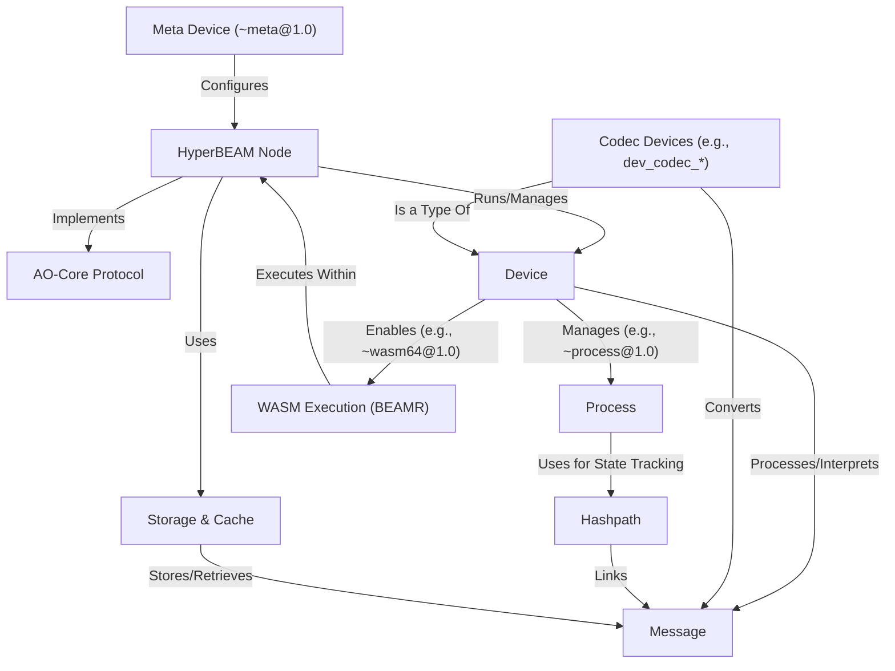

docs for [HyperBEAM](https://github.com/permaweb/HyperBEAM) made using [Gemini 2.5 Pro](https://deepmind.google/technologies/gemini/pro/) by [PocketFlow](https://github.com/The-Pocket/PocketFlow) via [AI Codebase Knowledge Builder](https://github.com/The-Pocket/PocketFlow-Tutorial-Codebase-Knowledge).

---

# Tutorial: HyperBEAM

HyperBEAM is the software that runs *decentralized computations* based on the **AO-Core protocol**. It acts as a node in the AO network, processing *messages* using modular components called *devices*. These messages trigger computations, potentially including **WASM Execution**, and their results are linked together cryptographically using *Hashpaths*, forming verifiable computational histories. Nodes use **Storage & Cache** mechanisms to efficiently manage data and computations.

**Source Repository:** [HyperBEAM](https://github.com/permaweb/HyperBEAM)

## Chapters

1. [Message
](01_message_.md)
2. [AO-Core Protocol
](02_ao_core_protocol_.md)
3. [HyperBEAM Node
](03_hyperbeam_node_.md)
4. [Device
](04_device_.md)
5. [Process
](05_process_.md)
6. [WASM Execution (BEAMR)
](06_wasm_execution__beamr__.md)
7. [Hashpath
](07_hashpath_.md)
8. [Storage & Cache
](08_storage___cache_.md)
9. [Meta Device (~meta@1.0)
](09_meta_device___meta_1_0__.md)
10. [Codec Devices (e.g., dev_codec_*)
](10_codec_devices__e_g___dev_codec____.md)

---

Generated by [AI Codebase Knowledge Builder](https://github.com/The-Pocket/Tutorial-Codebase-Knowledge)