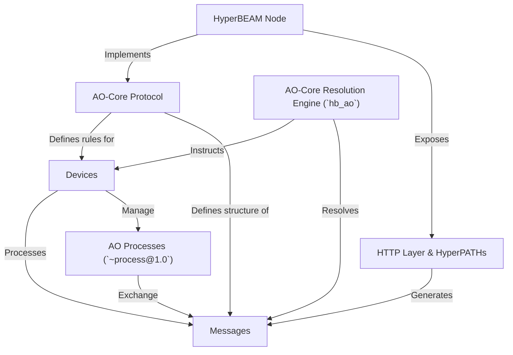

# Tutorial: HyperBEAM

HyperBEAM is software that lets computers join a network for **decentralized computing**, following the rules of the *AO-Core protocol*.
Think of it as building a global, shared supercomputer where *Messages* carry tasks and data, and specialized mini-applications called *Devices* perform the computational work.
This allows for flexible, scalable, and autonomous applications to run without a central authority.

**Source Repository:** [None](None)

## Chapters

1. [HyperBEAM Node
](01_hyperbeam_node_.md)
2. [AO-Core Protocol
](02_ao_core_protocol_.md)
3. [Messages
](03_messages_.md)
4. [Devices
](04_devices_.md)
5. [HTTP Layer & HyperPATHs
](05_http_layer___hyperpaths_.md)
6. [AO Processes (`~process@1.0`)
](06_ao_processes____process_1_0___.md)
7. [AO-Core Resolution Engine (`hb_ao`)
](07_ao_core_resolution_engine___hb_ao___.md)

---

Generated by [AI Codebase Knowledge Builder](https://github.com/The-Pocket/Tutorial-Codebase-Knowledge)